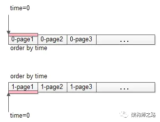
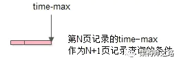
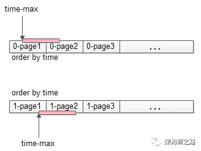
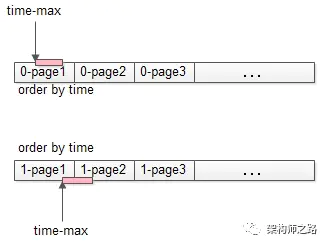

ES的搜索是分2个阶段进行的，即Query阶段和Fetch阶段。 Query阶段比较轻量级，通过查询倒排索引，获取满足查询结果的文档ID列表。 而Fetch阶段比较重，需要将每个shard的结果取回，在协调结点进行**全局**排序。 通过From+size这种方式分批获取数据的时候，随着from加大，需要全局排序并丢弃的结果数量随之上升，性能越来越差。

而Scroll查询，先做轻量级的Query阶段以后，免去了繁重的全局排序过程。 它只是将查询结果集，也就是doc id列表保留在一个上下文里， 之后每次分批取回的时候，只需根据设置的size，在每个shard内部按照一定顺序（默认doc_id续)， 取回这个size数量的文档即可。 

由此也可以看出scroll不适合支持那种实时的和用户交互的前端分页工作，其主要用途用于从ES集群分批拉取大量结果集的情况，一般都是offline的应用场景。 比如需要将非常大的结果集拉取出来，存放到其他系统处理，或者需要做大索引的reindex。

## 游标查询 *Scroll*

`scroll` 查询 可以用来对 Elasticsearch 有效地执行大批量的文档查询，而又不用付出深度分页那种代价。

游标查询允许我们 先做查询初始化，然后再批量地拉取结果。 这有点儿像传统数据库中的 *cursor* 。

游标查询会取某个时间点的快照数据。 查询初始化之后索引上的任何变化会被它忽略。 它通过保存旧的数据文件来实现这个特性，结果就像保留初始化时的索引 *视图* 一样。

深度分页的代价根源是结果集全局排序，如果去掉全局排序的特性的话查询结果的成本就会很低。 游标查询用字段 `_doc` 来排序。 这个指令让 Elasticsearch 仅仅从还有结果的分片返回下一批结果。

启用游标查询可以通过在查询的时候设置参数 `scroll` 的值为我们期望的游标查询的过期时间。 游标查询的过期时间会在每次做查询的时候刷新，所以这个时间只需要足够处理当前批的结果就可以了，而不是处理查询结果的所有文档的所需时间。 这个过期时间的参数很重要，因为保持这个游标查询窗口需要消耗资源，所以我们期望如果不再需要维护这种资源就该早点儿释放掉。 设置这个超时能够让 Elasticsearch 在稍后空闲的时候自动释放这部分资源。

```js
GET /old_index/_search?scroll=1m 
{
    "query": { "match_all": {}},
    "sort" : ["_doc"], 
    "size":  1000
}
```


|      | 保持游标查询窗口一分钟。           |
| ---- | ---------------------------------- |
|      | 关键字 `_doc` 是最有效的排序顺序。 |

这个查询的返回结果包括一个字段 `_scroll_id`， 它是一个base64编码的长字符串 。 现在我们能传递字段 `_scroll_id` 到 `_search/scroll` 查询接口获取下一批结果：

```js
GET /_search/scroll
{
    "scroll": "1m", 
    "scroll_id" : "cXVlcnlUaGVuRmV0Y2g7NTsxMDk5NDpkUmpiR2FjOFNhNnlCM1ZDMWpWYnRROzEwOTk1OmRSamJHYWM4U2E2eUIzVkMxalZidFE7MTA5OTM6ZFJqYkdhYzhTYTZ5QjNWQzFqVmJ0UTsxMTE5MDpBVUtwN2lxc1FLZV8yRGVjWlI2QUVBOzEwOTk2OmRSamJHYWM4U2E2eUIzVkMxalZidFE7MDs="
}
```


|      | 注意再次设置游标查询过期时间为一分钟。 |
| ---- | -------------------------------------- |
|      |                                        |

这个游标查询返回的下一批结果。 尽管我们指定字段 `size` 的值为1000，我们有可能取到超过这个值数量的文档。 当查询的时候， 字段 `size` 作用于单个分片，所以每个批次实际返回的文档数量最大为 `size * number_of_primary_shards` 。


## search after

这是Elasticsearch 5 新引入的一种分页查询机制，其实原理几乎就是和scroll一样，因此代码也是几乎一样的， 简单三句话介绍search after怎么用就是：

- 它必须先要指定排序（因为一定要按排序记住坐标）
- 必须从第一页开始搜起（你可以随便指定一个坐标让它返回结果，只是你不知道会在全量结果的何处）
- 从第一页开始以后每次都带上`search_after=lastEmittedDocFieldValue` 从而为无状态实现一个状态，说白了就是把每次固定的from size偏移变成一个确定值`lastEmittedDocFieldValue`，而查询则从这个偏移量开始获取size个doc（每个shard 获取size个，coordinate node最后汇总
   shards*size 个。

最后一点非常重要，也就是说，无论去到多少页，coordinate node向其它node发送的请求始终就是请求size个docs，是个常量，而不再是from size那样，越往后，你要请求的docs就越多，而要丢弃的垃圾结果也就越多
 也就是，**如果我要做非常多页的查询时，最起码search after是一个常量查询延迟和开销，并无什么副作用**。
 有人就会问，为啥每次提供一个search_after值就可以找到确定的那一页的内容呢，Elasticsearch 不是分布式的么，每个shard只维护一部分的离散的文档，其实这个我之前也没搞懂，自从群上一小伙扔我一干货后就秒懂了，这里也推荐大家先做做功课，看看目前一些分库分表的数据查询的方式方法：
 [业界难题-“跨库分页”的四种方案](https://link.jianshu.com?t=https://mp.weixin.qq.com/s?srcid=05313jMsVT3zyHFn2DcX4PLU&scene=23&mid=2651959942&sn=e9d3fe111b8a1d44335f798bbb6b9eea&idx=1&__biz=MjM5ODYxMDA5OQ%3D%3D&chksm=bd2d075a8a5a8e4cad985b847778aa83056e22931767bb835132c04571b66d5434020fd4147f&mpshare=1#rd&appinstall=0)
 如果你实在懒得看完，我就贴出search_after 的实现原理吧，如下：

> **三、业务折衷法**
>  “全局视野法”虽然性能较差，但其业务无损，数据精准，不失为一种方案，有没有性能更优的方案呢？
>  “**任何脱离业务的架构设计都是耍流氓**”，技术方案需要折衷，在技术难度较大的情况下，业务需求的折衷能够极大的简化技术方案。
>  **业务折衷一：禁止跳页查询**
>  在数据量很大，翻页数很多的时候，很多产品并不提供“直接跳到指定页面”的功能，而只提供“下一页”的功能，这一个小小的业务折衷，就能极大的降低技术方案的复杂度。
>
> 
>
> 如上图，不够跳页，那么第一次只能够查第一页：
>
> （1）将查询order by time offset 0 limit 100，改写成order by time where time>0 limit 100
>
> （2）上述改写和offset 0 limit 100的效果相同，都是每个分库返回了一页数据（上图中粉色部分）；
>
> 
>
> （3）服务层得到2页数据，内存排序，取出前100条数据，作为最终的第一页数据，这个全局的第一页数据，一般来说每个分库都包含一部分数据（如上图粉色部分）；
>
> 咦，这个方案也需要服务器内存排序，岂不是和“全局视野法”一样么？第一页数据的拉取确实一样，但每一次“下一页”拉取的方案就不一样了。
>
> 点击“下一页”时，需要拉取第二页数据，在第一页数据的基础之上，能够找到第一页数据time的最大值：
>
> 
>
> 这个上一页记录的time_max，会作为第二页数据拉取的查询条件：
>
> （1）将查询order by time offset 100 limit 100，改写成order by time where time>$time_max limit 100
>
> 
>
> （2）这下不是返回2页数据了（“全局视野法，会改写成offset 0 limit 200”），每个分库还是返回一页数据（如上图中粉色部分）；
>
> 
>
> （3）服务层得到2页数据，内存排序，取出前100条数据，作为最终的第2页数据，这个全局的第2页数据，一般来说也是每个分库都包含一部分数据（如上图粉色部分）；
>
> 如此往复，查询全局视野第100页数据时，不是将查询条件改写为offset 0 limit 9900+100（
>
> 返回100页数据
>
> ），而是改写为time>$time_max99 limit 100（
>
> 仍返回一页数据
>
> ），以保证数据的传输量和排序的数据量不会随着不断翻页而导致性能下降。


## Scroll

上面有说到search after的总结就是**如果我要做非常多页的查询时，最起码search after是一个常量查询延迟和开销，并无什么副作用**，可是，就像要查询结果全量导出那样，要在短时间内不断重复同一查询成百甚至上千次，效率就显得非常低了。scroll就是把一次的查询结果缓存一定的时间，如`scroll=1m`则把查询结果在下一次请求上来时暂存1分钟，response比传统的返回多了一个`scroll_id`，下次带上这个scroll_id即可找回这个缓存的结果。这里就scroll完成的逻辑去看看源代码。