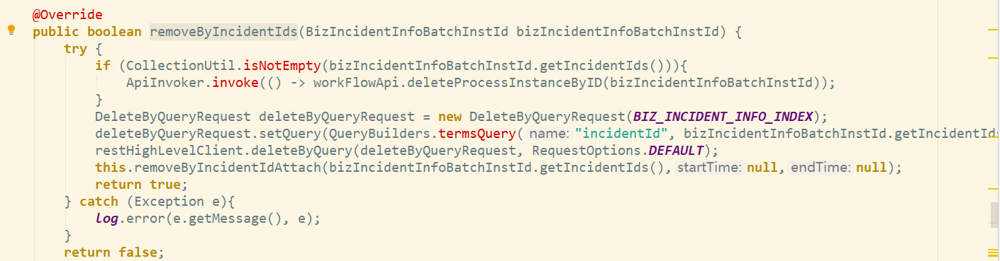
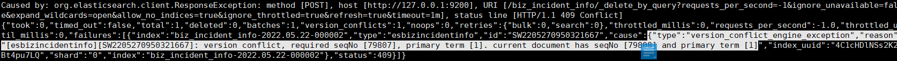

## Elasticsearch解决数据版本冲突问题的策略

### 一、主要请求流程（索引和删除等操作的基本流程）

1、集群中某节点接收到请求。
2、请求转发到文档的主分片。
3、在主分片上执行操作，同时将操作请求并行转发到其它节点。
4、事务日志（translog ）在主分片和复制分片上同步，这使得它能够持久化。此时，新文档无法搜索。
5、主碎片节点等待来自副本节点的响应，然后将响应发送到最初接收请求的节点。
6、将响应发送回客户端。
7、刷新间隔触发每个碎片的刷新，刷新将执行Lucene提交（启动一个新的translog ），生成一个新分段。新数据现在可以搜索。这在主碎片和复制碎片之间不做协调同步。

### 二、数据版本冲突的原因

案件删除时，先调引擎，引擎会把案件更新为关闭状态，然后web这边会把案件删除，由于es有1秒的refresh时间，案件删除时会先去搜索，这个时候是老的版本，真正要删除时，引擎又把案件更新了新版本，这样就会有版本冲突。

数据版本冲突的时机：

#### 1、refresh的执行

_delete_by_query基本上是搜索要删除的文档，然后一个一个地删除它们。如果一个或多个文档在搜索完成和删除操作开始之间进行refresh，则会发生版本冲突（elasticsearch默认每秒refresh）。

#### 2、文档发生更改

删除接口是先搜索要删除的对象，然后通过版本冲突检查删除它们。如果中间没有_refresh，那么由_delete_by_query执行的搜索可能返回文档的旧版本，从而在尝试删除时导致版本冲突。（如果在捕获快照和处理删除请求之间的文档发生更改，您将会得到版本冲突。当版本匹配时，删除文档。）

### 三、结论

因此，根据数据版本冲突的原因分析可以得出结论，只有当数据没有发生改变，并且执行删除过程中没有refresh操作，删除才可以正常进行。否则就会发生数据版本冲突。想要解决这种冲突：1、关闭refresh，使用完全手动的refresh；2、在第一次调用_delete_by_query接口发生数据版本冲突之后，重复调用删除接口；3、如果文档需要更改，则更改操作结束之后执行删除。在实际环境下可以发现，refresh和文档更改操作其实是经常一起出现的，所以在业务场景下解决这个问题还需要对删除策略做进一步优化。以便于整体权衡搜索、索引、删除等这些的性能问题。