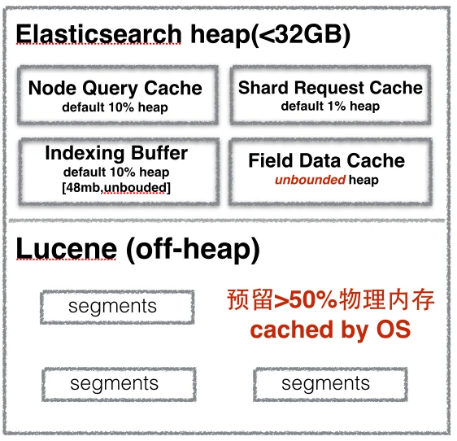
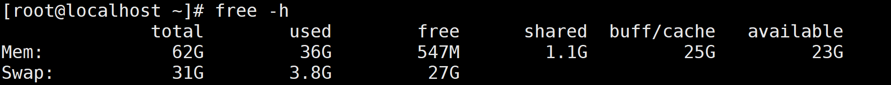
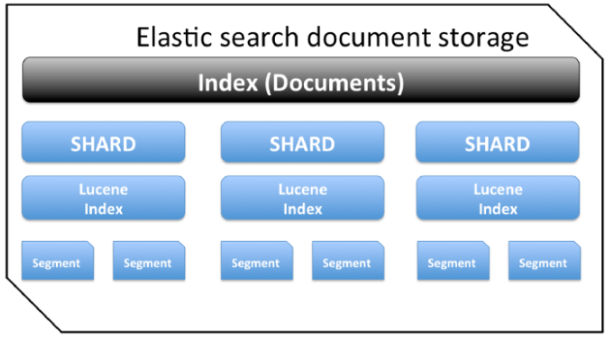
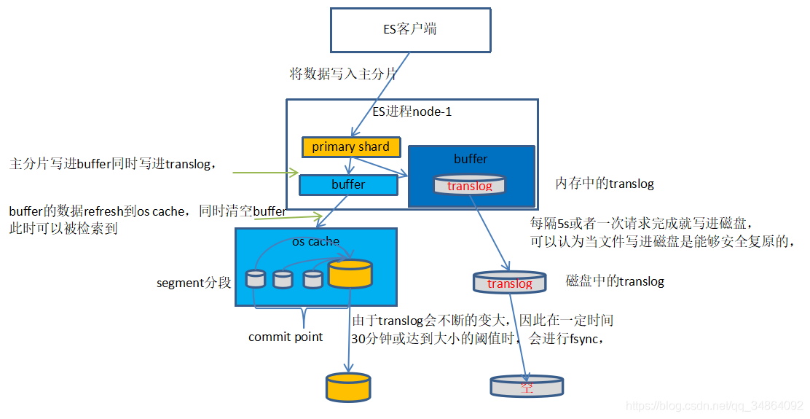

### ES内存

Elasticsearch 和 Lucene 对内存使用情况:



Elasticsearch 限制的内存大小是 JAVA 堆空间的大小，不包括Lucene 缓存倒排索引数据空间。

- Lucene 中的 倒排索引 segments 存储在文件中，为提高访问速度，都会把它加载到内存中，从而提高 Lucene 性能。所以建议至少留系统一半内存给Lucene。
- [Node Query Cache](https://link.segmentfault.com/?enc=RGyqhaHuA3eVTH9hnezGQA%3D%3D.2htS1BbXri50SzlFivhTLOGXqZ5RV%2FX8t2%2ByPfV%2FZXz%2FHg1OZp4Fstu%2FPJowG3KvltTfnckIv5JzJq7o5HqxC2pn84wCELXXs8pPkBQS8tImNEa7pP2%2FD%2BfmUwB96sMd) (负责缓存f ilter 查询结果)，每个节点有一个，被所有 shard 共享，filter query查询结果要么是 yes 要么是no，不涉及 scores 的计算。
  集群中每个节点都要配置，默认为：`indices.queries.cache.size:10%`
- [Indexing Buffer](https://link.segmentfault.com/?enc=ZpGuxWG4XxrqJzafE6OFCA%3D%3D.tBkBB3xGeCATRur1zjUPj20e72ym64tR%2Fa4EYnyI12koYXy10lMLBhnXJKj0vclDbIQymSN%2Fnl81LwVtkjrJRkS43mlM0i6PLabbwS1PoxtDy%2FNiJmbzFiP%2FuClSbrVn) 索引缓冲区，用于存储新索引的文档，当其被填满时，缓冲区中的文档被写入磁盘中的 segments 中。节点上所有 shard 共享。
  缓冲区默认大小： `indices.memory.index_buffer_size: 10%`
  如果缓冲区大小设置了百分百则 `indices.memory.min_index_buffer_size` 用于这是最小值，默认为 48mb。`indices.memory.max_index_buffer_size` 用于最大大小，无默认值。
- [Shard Request Cache](https://link.segmentfault.com/?enc=bIKOfmpU%2Fnj3lfZVuf40JA%3D%3D.KB0J%2Fcc%2FR9HTLpvlxMrX2nxpDTrIyK2brWMi1dPjne0PmbIQjuJs4ioHjMeAIMlCcbo7D9ufHm29QfR40b6AN%2FpHrbwSjgvgv%2F%2Bz0Nx1qwFgikc2LKTsf49U8LQQMCTJbGXaI9TG%2Fo97eKpydmcdJg%3D%3D) 用于缓存请求结果，但之缓存request size为0的。比如说 hits.total, aggregations 和 suggestions.
  默认最大为`indices.requests.cache.size:1%`
- [Field Data Cache](https://link.segmentfault.com/?enc=cMZhMRR0cskT9A5hv%2FKRMg%3D%3D.CMQgi0tIHqdOMGofNwe6OZ8p1M4AMnisHSp54w6w2h%2B6oek5057K1TCmgRA%2BwNiruin%2FcfWszzzXcA5sjr90Su9YutElarXvrzQttILKhTsmSJOX2or6svGKbjF8mqFfnc55WYqZD6fnI5cWVnH6pg%3D%3D) 字段缓存重要用于对字段进行排序、聚合是使用。因为构建字段数据缓存代价昂贵，所以建议有足够的内训来存储。
  Fielddata 是 延迟 加载。如果你从来没有聚合一个分析字符串，就不会加载 fielddata 到内存中，也就不会使用大量的内存，所以可以考虑分配较小的heap给Elasticsearch。因为heap越小意味着Elasticsearch的GC会比较快，并且预留给Lucene的内存也会比较大。。
  如果没有足够的内存保存fielddata时，Elastisearch会不断地从磁盘加载数据到内存，并剔除掉旧的内存数据。剔除操作会造成严重的磁盘I/O，并且引发大量的GC，会严重影响Elastisearch的性能。

Elasticsearch默认安装后设置的内存是1GB，这是远远不够用于生产环境的。
有两种方式修改Elasticsearch的堆内存：

- 设置环境变量：`export ES_HEAP_SIZE=10g` 在es启动时会读取该变量；
- 启动时作为参数传递给es： `./bin/elasticsearch -Xmx10g -Xms10g`

给es分配内存时要注意，至少要分配一半儿内存留给 Lucene。

- **将Xmx设置为不超过物理内存的50％，以确保有足够的物理内存留给内核文件系统缓存。**

分配给 es 的内存最好不要超过 32G ，因为如果堆大小小于 32 GB，JVM 可以利用指针压缩，这可以大大降低内存的使用：每个指针 4 字节而不是 8 字节。如果大于32G 每个指针占用 8字节，并且会占用更多的内存带宽，降低了cpu性能。

还有一点， 要关闭 swap 内存交换空间，禁用swapping。频繁的swapping 对服务器来说是致命的。
总结：给es JVM栈的内存最好不要超过32G，留给Lucene的内存越大越好，Lucene把所有的segment都缓存起来，会加快全文检索。

### 首次查询慢问题

因为你只有一个结点，那么每次查询要hit 100个索引。 即使你每个索引一个分片，也要hit 100个shard。 每个shard可能有几个到几十个segment ，这意味着你第一次查询，在没有文件系统缓存的情况下，会产生非常多的随机磁盘IO，慢就是正常的了。 第二次查询快，是因为利用到了os page cache，文件系统缓存帮忙省掉了随机磁盘IO，自然就很快了。

如果不能提升硬件（采用更多的结点·、使用ssd、磁盘阵列etc），那么就只能尽量控制segment file的数量。 比如增大refresh和flush周期。 在没有写入的时候，定期将所有索引force merge成1个segment。


The `index.store.preload` is a static setting that can either be set in the `config/elasticsearch.yml`:

```yaml
index.store.preload: ["nvd", "dvd"]
```

 so a better option might be to set it to `["nvd", "dvd", "tim", "doc", "dim"]`, which will preload norms, doc values, terms dictionaries, postings lists and points, which are the most important parts of the index for search and aggregations.

or in the index settings at index creation time:

```console
PUT /my_index
{
  "settings": {
    "index.store.preload": ["nvd", "dvd"]
  }
}
```

### es数据优化

#### **（1）性能优化的杀手锏——filesystem cache （即 os cache，操作系统的缓存）**

es的搜索引擎严重依赖于底层的filesystem cache，

你如果给filesystem cache更多的内存，尽量让内存可以容纳所有的indx segment file索引数据文件，那么你搜索的时候就基本都是走内存的，性能会非常高。

 

比如说，你一共要在es中存储1T的数据，那么你的多台机器留个filesystem cache的内存加起来综合，至少要到512G，

至少半数的情况下，搜索是走内存的，性能一般可以到几秒钟，2秒，3秒，5秒

如果最佳的情况下，filesystem cache 的大小 大于 ES所需要搜索的数据大小。

 

ES中只写入需要索引的那几个字段，不要把整条记录都写到 ES中。

比如说，ES就写入 id name age三个字段就可以了，然后你可以把其他的字段数据存在hbase或mysql中，建议是HBase。

hbase的特点是适用于海量数据的在线存储，就是对hbase可以写入海量数据，不要做复杂的搜索，就是做很简单的一些根据id或者范围进行查询的这么一个操作就可以了

从es中根据name和age去搜索，拿到的结果可能就20个doc id，然后根据doc id到hbase里去查询每个doc id对应的完整的数据，给查出来，再返回给前端。

 

#### **（2）数据预热**

es集群中每个机器写入的数据量还是超过了filesystem cache一倍，

最好做一个专门的缓存预热子系统，

就是将系统经常会被搜索的数据，每隔一段时间，你就提前访问一下，让数据进入filesystem cache里面去。

 

#### **（3）冷热分离**

假设你有6台机器，2个索引，一个放冷数据，一个放热数据，每个索引3个shard

3台机器放热数据index；另外3台机器放冷数据index。

 

你大量的时候是在访问热数据index，热数据可能就占总数据量的10%，此时数据量很少，几乎全都保留在filesystem cache里面了，就可以确保热数据的访问性能是很高的。

 

但是对于冷数据而言，是在别的index里的，跟热数据index都不再相同的机器上。

如果有人访问冷数据，可能大量数据是在磁盘上的，此时性能差点，就10%的人去访问冷数据；90%的人在访问热数据。

 

#### **（4）document模型设计**

es里面的复杂的关联查询，复杂的查询语法，尽量别用，一旦用了性能一般都不太好。

 

document模型设计是非常重要的，很多操作，不要在搜索的时候才想去执行各种复杂的乱七八糟的操作。

es能支持的操作就是那么多，不要考虑用es做一些它不好操作的事情。

如果真的有那种操作，尽量在document模型设计的时候，写入的时候就完成。

另外对于一些太复杂的操作，比如join，nested，parent-child搜索都要尽量避免，性能都很差的。

 

比如：如果要做order 与 orderItem的join操作，

最好在写入es的java系统里，就完成关联，将关联好的数据直接写入es中，

搜索的时候，就不需要利用es的搜索语法去完成join来搜索了。

 

总之，两点：

1）在写入数据的时候，就设计好模型，加几个字段，把处理好的数据写入加的字段里面

 

2）自己用java程序封装，es能做的，用es来做，搜索出来的数据，在java程序里面去做，比如说我们，基于es，用java封装一些特别复杂的操作

 

#### **（5）分页性能优化**

es的分页是较坑的，为啥呢？

假如你每页是10条数据，你现在要查询第100页，实际上是会把每个shard上存储的前1000条数据都查到一个协调节点上，如果你有个5个shard，那么就有5000条数据，接着协调节点对这5000条数据进行一些合并、处理，再获取到最终第100页的10条数据。

你翻页的时候，翻的越深，每个shard返回的数据就越多，而且协调节点处理的时间越长。

用es作分页，很可能会发生这种现象：前几页就几十毫秒，翻到10页之后，几十页的时候，基本上就要5~10秒才能查出来一页数据了。

解决方法：

　　a、不允许深度分页

　　b、如果不是那种允许随意跳转到某页的那种分页，而是手机上那种（下拉刷微博）只能往下一页翻的那种分页，可以用scroll api。

​      无论翻多少页，性能基本上都是毫秒级的。

​      scroll的原理实际上是保留一个数据快照，然后在一定时间内，你如果不断的滑动往后翻页的时候，类似于你现在在浏览微博，不断往下刷新翻页。

​      那么就用scroll不断通过游标获取下一页数据，这个性能是很高的，比es实际翻页要好的多的多。

​      scroll是要保留一段时间内的数据快照的，你需要确保用户不会持续不断翻页翻几个小时。

### Linux文件系统缓存filesystem cache

理解“free”命令



对于如上的命令输出，我们看下Mem 节，total列显示我们一共有62G内存。used列显示我们使用了约36G内存。

total——总物理内存 
used——已使用内存，一般情况这个值会比较大，因为这个值包括了cache+应用程序使用的内存 
free——完全未被使用的内存 
shared——应用程序共享内存 
buffers——缓存，主要用于目录方面,inode值等（ls大目录可看到这个值增加） 
cached——缓存，用于已打开的文件 

**1、什么是buffer/cache ？**

   buffer/cache 其实是作为服务器系统的文件数据缓存使用的，尤其是针对进程对文件存在 read/write 操作的时候，所以当你的服务进程在对文件进行读写的时候，Linux内核为了提高服务的读写速度，则将会把文件放在此处的 buffer/cache 中进行缓存使用，由于 Linux服务的特点便是任何事物都会以文件的形式进行存在，所以你会发现不管你是否对文件做了大规模的读写，机器的 buffer/cache 是一直都存在的，并且持续的增高不下，这是因为服务器所产生的网络连接也好，用户协议的（UDP）套接字也好，这部分的数据系统都会为应用程序创建对应的文件描述符，而这些文件描述符的使用，则又都会重新进入 buffer/cache 中做读写使用，所以这也是你的机器始终都会存在较高 buffer/cache 的原因，（因为所有的文件读写都会用到 buffer/cache，在内存合理的情况下）

**2、buffer/cache 需要注意的一些特点**

  在服务内存够用的情况下，Linux内核为了加快对文件的读写效率会将文件放入之 buffer/cache 中 以保证读写效率，但其实，尽管当你的应用程序对文件的读写运行结束后，buffer/cache 也不会自动释放该部分内存，而是作为缓冲进行保留，等到你的服务进程在下一次进行相同文件的读写时就可以直接使用，省去了各种重新进行内存初始化的操作；所以这将会导致，当你的应用进程频繁对不同的文件进行读写时，你会发现服务所可以直接使用的free内存将会越来越少的一个重要原因；难道 buffer/cache 在这样无休止的缓存当中就不会自动释放？当然不是，当服务器在内存压力较大的情况下时，则将会自动进行内存的回收，作为free空间分给其它进程使用，这其中主要回收的一个内存则是 buffer/cache 的缓冲区内存块；

**3、如何进行手动 buffer/cache 回收？**

  除了在系统进程内存使用较大压力的情况下进行内存的回收外，我们也可以进行手动的buffer/cache回收，但由于buffer/cache主要是用于文件的读写使用，所以进行文件回收时，一般常伴随系统的IO彪高，因为系统内核也对比cache中的数据与硬盘中的数据是否一致，如果不一致需要写会，然后才能进行内存的回收；

在linux系统的缺省配置中，内存足够的情况下，linux不回收buffer 和cache，但在2种情况下， 会使用LRU（least recently used 最近最少使用）算法进行页面的回收：
1、由后台运行的守护进程 kswapd周期性的检查，发现系统内空闲的物理页面数目少于特定的阈值时；
2、要为用户进程分配一大块内存，但系统中没有足够多的物理内存时，操作系统会启动内存回收。

/proc/sys/vm/drop_caches

其中 drop_caches的值可以是0-3之间的数字，代表不同的含义：

0：不释放（系统默认值）
1：释放页缓存
2：释放dentries和inodes
3：释放所有缓存

echo 3 > /proc/sys/vm/drop_caches 表示清除pagecache和slab分配器中的缓存对象

echo 1 > /proc/sys/vm/drop_caches:表示清除pagecache。

echo 2 > /proc/sys/vm/drop_caches:表示清除回收slab分配器中的对象（包括目录项缓存和inode缓存）。slab分配器是内核中管理内存的一种机制，其中很多缓存数据实现都是用的pagecache。

### ES段

#### **1、什么是段？** 



如图所示，自顶向下看，

- 一个集群包含1个或多个节点；
- 一个节点包含1个或多个索引；
- 一个索引：类似 Mysql 中的[数据库](https://cloud.tencent.com/solution/database?from=10680)；
- 每个索引又由一个或多个分片组成；
- 每个分片都是一个 Lucene 索引实例，您可以将其视作一个独立的搜索引擎，它能够对 Elasticsearch 集群中的数据子集进行索引并处理相关查询；
- 每个分片包含多个segment（段），每一个segment都是一个倒排索引。

在查询的时，会把所有的segment查询结果汇总归并为最终的分片查询结果返回。

#### **2、为什么 段是不可变的？** 

在 lucene 中，为了实现高索引速度，故使用了segment 分段架构存储。

一批写入数据保存在一个段中，其中每个段是磁盘中的单个文件。

由于两次写入之间的文件操作非常繁重，因此将一个段设为不可变的，以便所有后续写入都转到New段。

#### **3、什么是段合并？** 

由于自动刷新流程每秒会创建一个新的段（由动态配置参数：refresh_interval 决定），这样会导致短时间内的段数量暴增。

而段数目太多会带来较大的麻烦。

- 消耗资源：每一个段都会消耗文件句柄、内存和cpu运行周期；
- 搜索变慢：每个搜索请求都必须轮流检查每个段；所以段越多，搜索也就越慢。

Elasticsearch 通过在后台进行段合并来解决这个问题。

小的段被合并到大的段，然后这些大的段再被合并到更大的段。

#### **4、段合并做了什么？** 

段合并的时候会将那些旧的已删除文档从文件系统中清除。

被删除的文档（或被更新文档的旧版本）不会被拷贝到新的大段中。

启动段合并不需要你做任何事。进行索引和搜索时会自动进行。

- 当索引的时候，刷新（refresh）操作会创建新的段并将段打开以供搜索使用。
- 合并进程选择一小部分大小相似的段，并且在后台将它们合并到更大的段中。这并不会中断索引和搜索。

#### **5、为什么要进行段合并？** 

- 索引段的个数越多，搜索性能越低并且消耗更多的内存。
- 索引段是不可变的，你并不能物理上从中删除信息。

可以物理上删除document，但只是做了删除标记，物理上并没有删除。

- 当段合并时，这些被标记为删除的文档并没有被拷贝至新的索引段中，这样，减少了最终的索引段中的 document 数目。

#### **6、段合并的好处是什么？** 

- 减少索引段的数量并提高检索速度；
- 减少索引的容量（文档数）

原因：段合并会移除被标记为已删除的那些文档。

#### **7、段合并可能带来的问题？** 

- 磁盘IO操作的代价；
- 速度慢的系统中，段合并会显著影响性能。

#### **8、关于合并段的大小（通常为1个）——针对问题1** 

早期版本的文档有说明如下：

optimize API（现在已废弃，原理一致）

optimize API大可看做是 强制合并 API。它会将一个分片强制合并到 max_num_segments 参数指定大小的段数目。

这样做的意图是减少段的数量（通常减少到一个），来提升搜索性能。

#### **9、关于段合并资源消耗——针对问题2** 

资源消耗的官方解读

orce merge should only be called against an index after you have finished writing to it. Force merge can cause very large (>5GB) segments to be produced, and if you continue to write to such an index then the automatic merge policy will never consider these segments for future merges until they mostly consist of deleted documents. This can cause very large segments to remain in the index which can result in increased disk usage and worse search performance.

一句话：导致磁盘io消耗和影响检索性能。

Force merge API

https://www.elastic.co/guide/en/elasticsearch/reference/current/indices-forcemerge.html

以下是老版本文档解读，原理一致可参考，api已过时。

段合并

https://www.elastic.co/guide/cn/elasticsearch/guide/current/merge-process.html

请注意，使用 optimize API 触发段合并的操作不会受到任何资源上的限制。

这可能会消耗掉你节点上全部的 I/O 资源, 使其没有“富裕”资源来处理搜索请求，从而有可能使集群失去响应。

如果你想要对索引执行 optimize，你需要先使用分片分配（查看 迁移旧索引）把索引移到一个安全的节点，再执行。

是的，非常耗费资源，建议在非业务密集实践操作。

我的线上环境，我都是凌晨1点段合并（脚本控制，晚上没人操作系统）

#### **10、可推荐的参数——针对问题3** 

- 减少段的产生频率，修改refresh_inteval:默认1s，如果时效性要求不高，建议改成30s。
- index.merge.scheduler.max_thread_count：根据cpu核数修改

推荐：

https://www.elastic.co/guide/en/elasticsearch/reference/current/index-modules-merge.html

- 老版本参数修改参考价值不大，也建议看一下：

索引性能技巧

https://www.elastic.co/guide/cn/elasticsearch/guide/current/indexing-performance.html#segments-and-merging


### Elasticsearch的写底层原理以及删除更新的原理

#### 一、写数据的底层原理

数据写入的底层流程原理



1、数据先被写进内存buffer，同时这一操作也写进translog中，这时的数据还不可被检索到。
2、每隔1s(这个时间可以调整)进行一次refresh，将buffer内1s的数据写进os cache中，构成一个segment分段，同时清空buffer，这时数据可以被检索到，但由于数据仍然在内存中，若发生故障，数据是可以丢失的。
3、不断地重复上面的步骤，不断产生新的segment，translog也不断的变大。
4、当时间达到30分钟或者translog足够大的时候，进行一次fsync，将内存中所有的segment都写进磁盘中，并删除translog，重新生成新的translog。
由上面可以看得出来，文件存储在内存以及os cache中是不安全的，因此ES引入translog来记录两次fsync之间的操作，以便发生故障，也能恢复数据。
但translog也是存在内存中的，发生故障依然会丢失数据，因此每隔5s或一次请求完成后，translog就会写进磁盘，被写进磁盘后就可以认为是安全复原的，因此只有当translog写入磁盘后，ES才能向客户端反馈成功的信息。
另外每隔1s就产生一个segment，很快分片内就有大量的segment，而搜索时会搜索所有的segment，影响性能，因此ES会自动合并大小相似的segment，同时删除合并的旧segment

#### 二、删除/更新的底层原理

ES的索引是不能改的，删除和更新都不是直接在原索引中执行
每一个segment都会维护一个del文件，用来记录删除的文档。用户发出删除请求后，文档并没有真正被删除，而是del文件中记录被删除的文档，但该文档依然能被检索到，只是在最后过滤掉，当segment合并时，才会真正地删除del标志的文档。
更新文档，首先获取原文档的版本号，然后将修改后的文档和版本号一起写进，这过程和新增相同，同时旧文档也被标志成删除文档，同样能被检索到，只不过最终被过滤掉而已