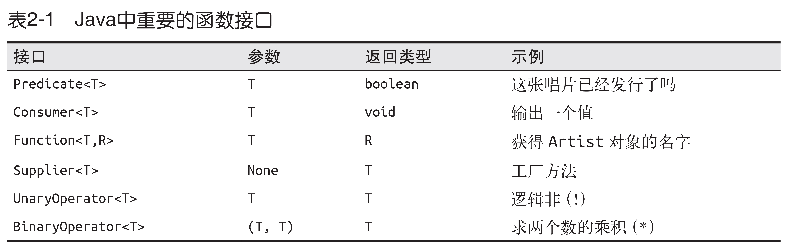

 

## 第一章 简介


面向对象编程是对数据进行抽象，而函数式编程是对行为进行抽象。

现实世界中，数据和行为并存，程序也是如此。因此，这两种编程方式都值得我们学习。

Lambda中，使用的变量只能赋值一次。

## 第二章 Lambda表达式

### 函数接口

函数接口是只有一个抽象方法的接口，用作Lambda表达式的类型。




### 类型推断

例 2-11 

```java
Predicate<Integer> atLeast5 = x -> x > 5;
```

Predicate 也是一个 Lambda 表达式， 和前文中 ActionListener 不同的是， 它还返回一个值。 在例 2-11 中， 表达式 x > 5 是 Lambda 表达式的主体。 这样的情况下， 返回值就是Lambda 表达式主体的值。

例 2-12 

```java
public interface Predicate<T> {
boolean test(T t);
}
```

从例 2-12 中可以看出， Predicate 只有一个泛型类型的参数， Integer 用于其中。 Lambda表达式实现了 Predicate 接口， 因此它的单一参数被推断为 Integer 类型。 javac 还可检查Lambda 表达式的返回值是不是 boolean， 这正是 Predicate 方法的返回类型 （图2-2）。

图 2-2


例 2-13 是一个略显复杂的函数接口： BinaryOperator。 该接口接受两个参数， 返回一个
值， 参数和值的类型均相同。 实例中所用的类型是 Long。
例 2-13 略显复杂的类型推断

```java
BinaryOperator<Long> addLongs = (x, y) -> x + y;  
```

## 第三章 流

例 3-3 使用内部迭代计算来自伦敦的艺术家人数

```java
long count = allArtists.stream()
.filter(artist -> artist.isFrom("London"))
.count();  
```

filter 只刻画出了 Stream， 但没有产生新的集合。 像filter 这样只描述 Stream， 最终不产生新集合的方法叫作惰性求值方法； 而像 count 这样最终会从 Stream 产生值的方法叫作及早求值方法。  

### 3.3 常用的流操作

#### 3.3.1 collect(toList())

collect(toList()) 方法由 Stream 里的值生成一个列表， 是一个及早求值操作。
Stream 的 of 方法使用一组初始值生成新的 Stream。 事实上， collect 的用法不仅限于此，它是一个非常通用的强大结构， 第 5 章将详细介绍它的其他用途。 下面是使用 collect 方法的一个例子：

```java
List<String> collected = Stream.of("a", "b", "c")
.collect(Collectors.toList()); 
assertEquals(Arrays.asList("a", "b", "c"), collected);   
```

map

filter

#### 3.3.4 flatMap

flatMap 方法可用 Stream 替换值， 然后将多个 Stream 连接成一个 Stream  。

```java
List<Integer> together = Stream.of(asList(1, 2), asList(3, 4))
.flatMap(numbers -> numbers.stream())
.collect(toList());
assertEquals(asList(1, 2, 3, 4), together);  
```

#### 3.3.5 max 和 min

#### reduce

reduce操作可以实现从一组值中生成一个值。

#### 重构遗留代码

```java
public Set<String> findLongTracks(List<Album> albums) {
	Set<String> trackNames = new HashSet<>();
	for(Album album : albums) {
		for (Track track : album.getTrackList()) {
			if (track.getLength() > 60) {
				String name = track.getName();
				trackNames.add(name);
			}
		}
	} return trackNames;
}
```

重构后

```java
public Set<String> findLongTracks(List<Album> albums) {
	return albums.stream()
				.flatMap(album -> album.getTracks())
				.filter(track -> track.getLength() > 60)
				.map(track -> track.getName())
				.collect(toSet());
}
```

## 第四章 类库

### 4.1 在代码中使用Lambda表达式

例 4-2 使用 Lambda 表达式简化日志代码

```java
Logger logger = new Logger();
logger.debug(() -> "Look at this: " + expensiveOperation());
```


那么在 Logger 类中该方法是如何实现的呢？ 从类库的角度看， 我们可以使用内置的Supplier 函数接口， 它只有一个 get 方法。 然后通过调用 isDebugEnabled 判断是否需要记录日志， 是否需要调用 get 方法， 如果需要， 就调用 get 方法并将结果传给 debug 方法。
由此产生的代码如例 4-3 所示。
例 4-3 启用 Lambda 表达式实现的日志记录器

```java
public void debug(Supplier<String> message) {
	if (isDebugEnabled()) {
		debug(message.get());
	}
}  
```

相当于传递了一个行为，参数是函数

### 基本类型

如有可能， 应尽可能多地使用对基本类型做过特殊处理的方法， 进而改善性能  。

例 4-4 使用 summaryStatistics 方法统计曲目长度  

```java
public static void printTrackLengthStatistics(Album album) {
	IntSummaryStatistics trackLengthStats = album.getTracks()
		.mapToInt(track -> track.getLength())
		.summaryStatistics();
	System.out.printf("Max: %d, Min: %d, Ave: %f, Sum: %d",
		trackLengthStats.getMax(),
		trackLengthStats.getMin(),
		trackLengthStats.getAverage(),
		trackLengthStats.getSum());
}
```

因为该方法返回一个
IntStream 对象， 它包含一个 summaryStatistics 方法， 这个方法能计算出各种各样的统计值， 如 IntStream 对象内所有元素中的最小值、 最大值、 平均值以及数值总和。
这些统计值在所有特殊处理的 Stream， 如 DoubleStream、 LongStream 中都可以得出。 如无需全部的统计值， 也可分别调用 min、 max、 average 或 sum 方法获得单个的统计值， 同样，三种基本类型对应的特殊 Stream 也都包含这些方法。

### 重载

例 4-7 另外一个重载方法调用

```java
overloadedMethod((x, y) -> x + y);
```

例 4-8 两个重载方法可供选择  

```java
private interface IntegerBiFunction extends BinaryOperator<Integer> {
}

private void overloadedMethod(BinaryOperator<Integer> Lambda) {
	System.out.print("BinaryOperator");
}

private void overloadedMethod(IntegerBiFunction Lambda) {
	System.out.print("IntegerBinaryOperator");
}
```

### Optional

在一个值可能为空的建模情况下， 使用 Optional 对象能替代使用 null 值。  

例 4-22 创建某个值的 Optional 对象

```java
Optional<String> a = Optional.of("a");
assertEquals("a", a.get());  
```

例 4-23 创建一个空的 Optional 对象， 并检查其是否有值

```java
Optional emptyOptional = Optional.empty();
Optional alsoEmpty = Optional.ofNullable(null);
assertFalse(emptyOptional.isPresent());
// 例 4-22 中定义了变量 a
assertTrue(a.isPresent());  
```

例 4-24 使用 orElse 和 orElseGet 方法  

```java
assertEquals("b", emptyOptional.orElse("b"));
assertEquals("c", emptyOptional.orElseGet(() -> "c"));
```

## 第五章 高级集合类和收集器

### 方法引用

读者可能已经发现， Lambda 表达式有一个常见的用法： Lambda 表达式经常调用参数。 比
如想得到艺术家的姓名， Lambda 的表达式如下：

```java
artist -> artist.getName()
```

这种用法如此普遍， 因此 Java 8 为其提供了一个简写语法， 叫作方法引用， 帮助程序员重
用已有方法。 用方法引用重写上面的 Lambda 表达式， 代码如下：

```java
Artist::getName
```

标准语法为

```
 Classname::methodName
```

 需要注意的是， 虽然这是一个方法， 但不需要在后面加括号， 因为这里并不调用该方法。 我们只是提供了和 Lambda 表达式等价的一种结构，在需要时才会调用。 凡是使用 Lambda 表达式的地方， 就可以使用方法引用。

## 第七章 测试、调试和重构

1. 重构遗留代码时考虑如何使用 Lambda 表达式， 有一些通用的模式。
2. 如果想要对复杂一点的 Lambda 表达式编写单元测试， 将其抽取成一个常规的方法。
3. peek 方法能记录中间值， 在调试时非常有用  

## 第八章 设计和架构的原则


