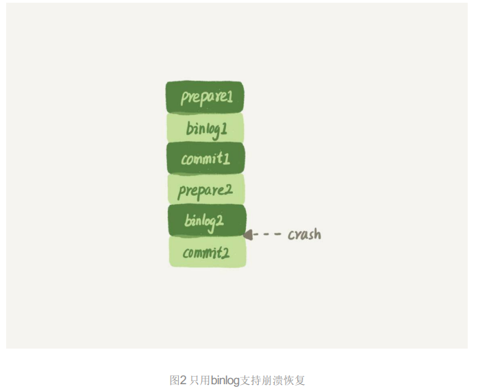

### 01 基础架构

查询缓存功能基本不用，Mysql8.0已经没有此功能。

分析器先做词法分析，再做语法分析。

### 02 日志系统

redo log（重做日志），binlog（归档日志）。

这两种日志有以下三点不同。 

1. redo log是InnoDB引擎特有的；binlog是MySQL的Server层实现的，所有引擎都可以使用。 
2.  redo log是物理日志，记录的是“在某个数据页上做了什么修改”；binlog是逻辑日志，记录的 是这个语句的原始逻辑，比如“给ID=2这一行的c字段加1 ”。 
3.  redo log是循环写的，空间固定会用完；binlog是可以追加写入的。“追加写”是指binlog文件 写到一定大小后会切换到下一个，并不会覆盖以前的日志。

可以看到，InnoDB在写redo log时，并不是一次性写完的，而有两个阶段，Prepare与Commit阶段，这就是"两阶段提交"的含义。

binlog并不具备crash-safe的能力，需要redo log来实现crash-safe能力。

### 03 事务隔离

隔离级别：

读未提交（read uncommitted）、 读提交（read committed）、可重复读（repeatable read）和串行化（serializable ）。

1. 读未提交是指，一个事务还没提交时，它做的变更就能被别的事务看到。 

2. 读提交是指，一个事务提交之后，它做的变更才会被其他事务看到。 

3. 可重复读是指，一个事务执行过程中看到的数据，总是跟这个事务在启动时看到的数据是一 致的。当然在可重复读隔离级别下，未提交变更对其他事务也是不可见的。 

4. 串行化，顾名思义是对于同一行记录，“写”会加“写锁”，“读”会加“读锁”。当出现读写锁冲突 的时候，后访问的事务必须等前一个事务执行完成，才能继续执行。

### 04 深入浅出索引（上）

InnoDB采用的B+树结构，以及为什么 InnoDB要这么选择。B+树能够很好地配合磁盘的读写特性，减少单次查询的磁盘访问次数。

### 05 深入浅出索引（下）

回到主键索引树搜索的过程，我们称为回表。

覆盖索引 

如果执行的语句是select ID fromTwhere k between 3 and 5，这时只需要查ID的值，而ID的值 已经在k索引树上了，因此可以直接提供查询结果，不需要回表。也就是说，在这个查询里面， 索引k已经“覆盖了”我们的查询需求，我们称为覆盖索引。 由于覆盖索引可以减少树的搜索次数，显著提升查询性能，所以使用覆盖索引是一个常用 的性能优化手段。

在建立联合索引的时候，如何安排索 引内的字段顺序。 这里我们的评估标准是，索引的复用能力。因为可以支持最左前缀，所以当已经有了(a,b)这个联 合索引后，一般就不需要单独在a上建立索引了。因此，第一原则是，如果通过调整顺序，可 以少维护一个索引，那么这个顺序往往就是需要优先考虑采用的。

### 06全局锁和表锁

#### 全局锁

就是对整个数据库实例加锁。

典型使用场景，做全局逻辑备份。

#### 表级锁

Mysql里面的表级锁分为两种：一种是表锁，一种是元数据锁（meta data lock, MDL）。

表锁的语法是lock table ...read/write

另一类表级的锁是MDL。MDL不需要显式调用，在访问一个表的时候会被自动加上。分为MDL读锁，MDL写锁。

### 07 行锁功过

如果你的事务中需要锁多个行，要把最可能造成锁冲突、最可能影响并发度的锁的申请时机尽量往后放。但是，调整语句顺序并不能完全避免死锁。所以我们引入了死锁和死锁检测的概念，以及提供了三个方案，来减少死锁对数据库的影响。减少死锁的主要方向，就是控制访问相同资源的并发事务量。

### 08 事务到底是隔离的还是不隔离的

InnoDB的行数据有多个版本，每个数据版本有自己的rowtrx_id，每个事务或者语句有自己的一 致性视图。普通查询语句是一致性读，一致性读会根据rowtrx_id和一致性视图确定数据版本的 可见性。

1. 对于可重复读，查询只承认在事务启动前就已经提交完成的数据； 更新数据都是先读后写的，而这个读，只能读当前的值，称为“当前读”（current read）；除了更新，查询语句如果加锁，也是当前读，读锁（lock in share mode），写锁（for update，没用索引/主键的话就是表锁，否则就是是行锁。）。
2. 对于读提交，查询只承认在语句启动前就已经提交完成的数据； 而当前读，总是读取已经提交完成的最新版本。

读提交的逻辑和可重复读的逻辑类似，它们最主要的区别是：

 	在可重复读隔离级别下，只需要在事务开始的时候创建一致性视图，之后事务里的其他查询 都共用这个一致性视图； 

​	在读提交隔离级别下，每一个语句执行前都会重新算出一个新的视图。

### 09 普通索引和唯一索引

普通索引和唯一索引应该怎么选择。其实，这两类索引在查询能力上 是没差别的，主要考虑的是对更新性能的影响。所以，我建议你尽量选择普通索引。 如果所有的更新后面，都马上伴随着对这个记录的查询，那么你应该关闭change buffer。而在 其他情况下，change buffer都能提升更新性能。

### 10 mysql 为什么有时候会选错索引

索引统计的更新机制，并提到了优化器存在选错索引的可能性。 对于由于索引统计信息不准确导致的问题，你可以用analyze table来解决。 而对于其他优化器误判的情况，你可以在应用端用force index来强行指定索引，也可以通过修改 语句来引导优化器，还可以通过增加或者删除索引来绕过这个问题。

### 11 怎么给字符串增加索引

在今天这篇文章中，我跟你聊了聊字符串字段创建索引的场景。我们来回顾一下，你可以使用的 方式有： 

1. 直接创建完整索引，这样可能比较占用空间； 
2. 创建前缀索引，节省空间，但会增加查询扫描次数，并且不能使用覆盖索引；
3.  倒序存储，再创建前缀索引，用于绕过字符串本身前缀的区分度不够的问题； 
4.  创建hash字段索引，查询性能稳定，有额外的存储和计算消耗，跟第三种方式一样，都不支 持范围扫描。

### 12 为什么我的MYSQL 会抖一下

介绍的WAL（Write-Ahead Logging ，预写日志系统）的概念，和你解释了这个机制后续需要的刷脏页操作 和执行时机。利用WAL技术，数据库将随机写转换成了顺序写，大大提升了数据库的性能。 但是，由此也带来了内存脏页的问题。脏页会被后台线程自动flush，也会由于数据页淘汰而触 发flush，而刷脏页的过程由于会占用资源，可能会让你的更新和查询语句的响应时间长一些。 在文章里，我也给你介绍了控制刷脏页的方法和对应的监控方式。

### 13 为什么表数据删一半，表文件大小不变

如果要收缩一个表，只是delete掉表里面不用的数据的话（用delete命令删除），表文件的大小是 不会变的（会有数据页空洞，插入数据也可能会数据空洞，比如会有数据页分裂），你还要通过alter table命令重建表，才能达到表文件变小的目的。我跟你介绍了重建 表的两种实现方式，Online DDL的方式是可以考虑在业务低峰期使用的，而MySQL 5.5及之前的 版本，这个命令是会阻塞DML的，这个你需要特别小心。

### 14 count（*）这么慢，我该怎么办？

今天，我和你聊了聊MySQL中获得表行数的两种方法。我们提到了在不同引擎中count(*)的实现 方式是不一样的，也分析了用缓存系统来存储计数值存在的问题。

MyISAM引擎把一个表的总行数存在了磁盘上，因此执行count(*)的时候会直接返回这个数， 效率很高，因为MyISAM不支持事务，可以这么做； 而 InnoDB 引擎就麻烦了，它执行count(*)的时候，需要把数据一行一行地从引擎里面读出 来，然后累积计数。可重复读是 InnoDB 引擎默认的隔离级别，在代码上就是通过多版本并发 控制，也就是MVCC来实现的。每一行记录都要判断自己是否对这个会话可见，因此对于 count(*)请求来说，InnoDB只好把数据一行一行地读出依次判断，可见的行才能够用于计算“基 于这个查询”的表的总行数。

 其实，把计数放在Redis里面，不能够保证计数和MySQL表里的数据精确一致的原因，是这两个 不同的存储构成的系统，不支持分布式事务，无法拿到精确一致的视图。而把计数值也放在 MySQL中，就解决了一致性视图的问题。 InnoDB引擎支持事务，我们利用好事务的原子性和隔离性，就可以简化在业务开发时的逻辑。 这也是InnoDB引擎备受青睐的原因之一。

### 15 答疑文章（一）：日志和索引相关问题

这样的流程下，binlog还是不能支持崩溃恢复的。我说一个不支持的点吧：binlog没有能力恢 复“数据页”。 

如果在图中标的位置，也就是binlog2写完了，但是整个事务还没有commit的时候，MySQL发生 了crash。 重启后，引擎内部事务2会回滚，然后应用binlog2可以补回来；但是对于事务1来说，系统已经 认为提交完成了，不会再应用一次binlog1。 

但是，InnoDB引擎使用的是WAL技术，执行事务的时候，写完内存和日志，事务就算完成了。 如果之后崩溃，要依赖于日志来恢复数据页。 

也就是说在图中这个位置发生崩溃的话，事务1也是可能丢失了的，而且是数据页级的丢失。此 时，binlog里面并没有记录数据页的更新细节，是补不回来的。

### 16 order by 是怎么工作的

全字段排序

1. 初始化sort_buffer，确定放入name、city、age这三个字段； 
2. 从索引city找到第一个满足city='杭州’条件的主键id，也就是图中的ID_X； 
3. 到主键id索引取出整行，取name、city、age三个字段的值，存入sort_buffer中；
4. 索引city取下一个记录的主键id； 
5. 重复步骤3、4直到city的值不满足查询条件为止，对应的主键id也就是图中的ID_Y； 
6.  对sort_buffer中的数据按照字段name做快速排序； 
7.  按照排序结果取前1000行返回给客户端。

rowId排序

rowid排序多访问了一次表t的主键索引，不再把数据都放在sort_buffer中，数据可能很大，放不下。对于InnoDB表来说，执行全字段排序会减少磁盘访问，因此会被 优先选。

图中“按name排序”这个动作，可能在内存中完成，也可能需要使用外部排序，这取决于排序所 需的内存和参数sort_buffer_size。 sort_buffer_size，就是MySQL为排序开辟的内存（sort_buffer）的大小。如果要排序的数据量 小于sort_buffer_size，排序就在内存中完成。但如果排序数据量太大，内存放不下，则不得不 利用磁盘临时文件辅助排序。

### 17 如何正确地显示随机消息

如果你直接使用order by rand()，这个语句需要Using temporary和 Using filesort，查询的执行代 价往往是比较大的。所以，在设计的时候你要量避开这种写法。 今天的例子里面，我们不是仅仅在数据库内部解决问题，还会让应用代码配合拼接SQL语句。在 实际应用的过程中，比较规范的用法就是：尽量将业务逻辑写在业务代码中，让数据库只做“读 写数据”的事情。因此，这类方法的应用还是比较广泛的。

### 18 为什么这些SQL语句逻辑相同性能却差异巨大

对索引字段做函数操作，可能会破坏索引值的有序性，因此优化器就决定放弃走树搜索功能。

隐式类型转换

隐式字符编码转换

### 19 为什么我只查一行的语句也执行这么慢

可能原因，等待表锁，行锁，

1. 表锁

有一个线程正在表t上请求或者持有MDL写锁，把select语句 堵住了。

2. 行锁

等待行锁。

3. 一致性读

另一个session 更新了若干次，产生了很多回滚日志（undo log），一致性读的话会依次执行undo log，会慢。如果是带 lock in share mode的SQL 语句，是当前读，是直接读到最新的结果值。

