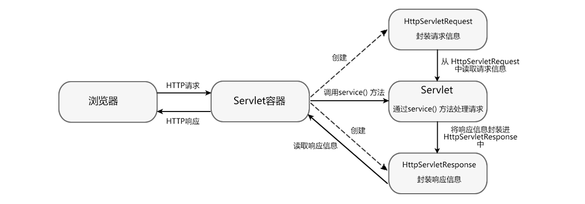

一般情况下，浏览器（客户端）通过 HTTP 协议来访问服务器的资源，Servlet 主要用来处理 HTTP 请求。

Servlet 处理 HTTP 请求的流程如下：

1.  Servlet 容器接收到来自客户端的 HTTP 请求后，容器会针对该请求分别创建一个 HttpServletRequest 对象和 HttpServletReponse 对象。
2.  容器将 HttpServletRequest 对象和 HttpServletReponse 对象以参数的形式传入 service() 方法内，并调用该方法。
3.  在 service() 方法中 Servlet 通过 HttpServletRequest 对象获取客户端信息以及请求的相关信息。
4.  对 HTTP 请求进行处理。
5.  请求处理完成后，将响应信息封装到 HttpServletReponse 对象中。
6.  Servlet 容器将响应信息返回给客户端。
7.  当 Servlet 容器将响应信息返回给客户端后，HttpServletRequest 对象和 HttpServletReponse 对象被销毁。

通过以上流程可以看出， HttpServletRequest 和 HttpServletReponse 是 Servlet 处理 HTTP 请求流程中最重要的两个对象。HttpServletRequest 对象用于封装 HTTP 请求信息，HttpServletReponse 对象用于封装 HTTP 响应信息。