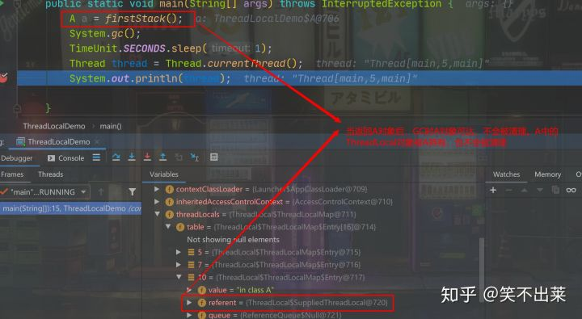
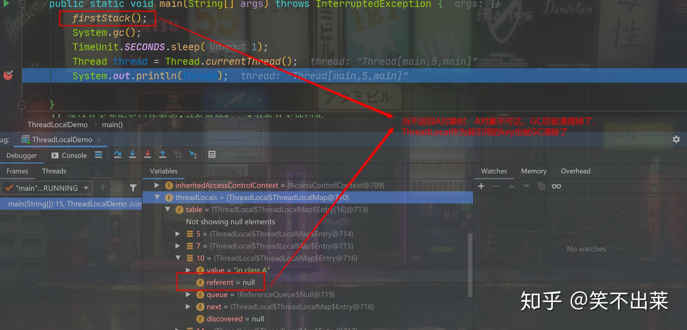
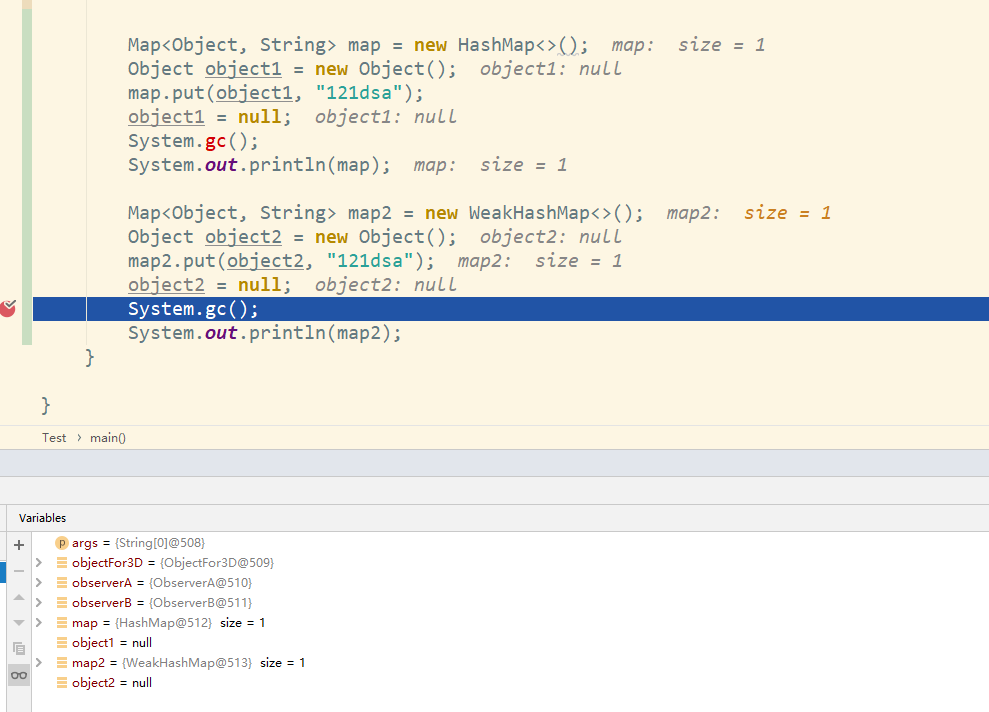
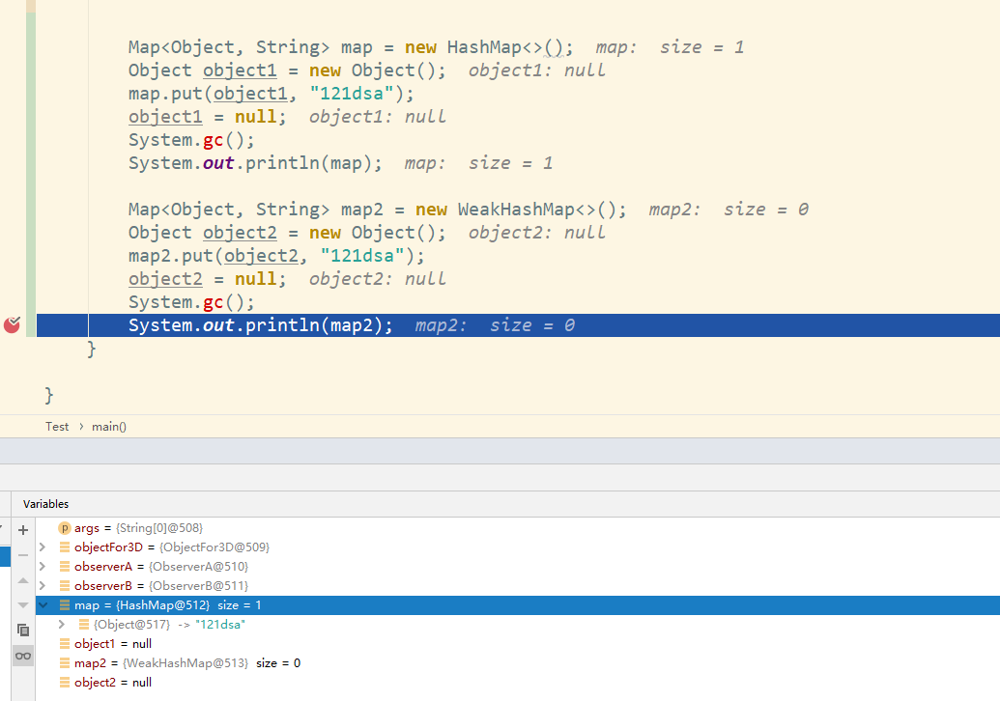

## 1、简介

ThreadLocal是什么呢？其实ThreadLocal并非是一个线程的本地实现版本，它并不是一个Thread，而是threadlocalvariable(线程局部变量)。也许把它命名为ThreadLocalVar更加合适。线程局部变量(ThreadLocal)其实的功用非常简单，就是为每一个使用该变量的线程都提供一个变量值的副本，是Java中一种较为特殊的线程绑定机制，是每一个线程都可以独立地改变自己的副本，而不会和其它线程的副本冲突。

## 2、Spring中应用

Spring使用ThreadLocal解决线程安全问题。一般情况下，只有无状态的Bean才可以在多线程环境下共享，在Spring中，绝大部分Bean都可以声明为singleton作用域。就是因为Spring对一些Bean（如RequestContextHolder、TransactionSynchronizationManager、LocaleContextHolder等）中非线程安全状态采用ThreadLocal进行处理，让它们也成为线程安全的状态，因为有状态的Bean就可以在多线程中共享了。

## 3、Slf4j 日志输出中的应用

Java Web项目中，通常使用实现了 Slf4j 的Logback或Log4j来进行日志输出，Slf4j 中定义了 MDC 接口，要求实现多线程间日志隔离，Logback 和 Log4j 正是利用ThreadLocal来实现的。更多内容将会在另一篇专门介绍MDC的文章中讲解。

## 4、实现原理

ThreadLocal起作用的根源是Thread类：


```java
public class Thread implements Runnable {
   ......(其他源码)
    /* 
     * 当前线程的ThreadLocalMap，主要存储该线程自身的ThreadLocal
     * 本文主要讨论的就是这个ThreadLocalMap
     */
    ThreadLocal.ThreadLocalMap threadLocals = null;

    /*
     * InheritableThreadLocal，自父线程集成而来的ThreadLocalMap，
     * 主要用于父子线程间ThreadLocal变量的传递
     * 此处我们不过多解释inheritableThreadLocals变量
     */
    ThreadLocal.ThreadLocalMap inheritableThreadLocals = null;
    ......(其他源码)
}
```

正是由于Thread中有 **ThreadLocal.ThreadLocalMap** 变量，ThreadLocal才得以使用。
 下面来看一下ThreadLocal工作原理。
 ThreadLocal的set()方法的源码是：


```java
    /**
     * Sets the current thread's copy of this thread-local variable
     * to the specified value.  Most subclasses will have no need to
     * override this method, relying solely on the {@link #initialValue}
     * method to set the values of thread-locals.
     *
     * @param value the value to be stored in the current thread's copy of
     *        this thread-local.
     */
    public void set(T value) {
        Thread t = Thread.currentThread();
        ThreadLocalMap map = getMap(t);
        if (map != null)
            map.set(this, value);
        else
            createMap(t, value);
    }

	private void set(ThreadLocal<?> key, Object value) {
            ThreadLocal.ThreadLocalMap.Entry[] tab = this.table;
            int len = tab.length;
            int i = key.threadLocalHashCode & len - 1;

            for(ThreadLocal.ThreadLocalMap.Entry e = tab[i]; e != null; e = tab[i = nextIndex(i, len)]) {
                ThreadLocal<?> k = (ThreadLocal)e.get();
                if (k == key) {
                    e.value = value;
                    return;
                }

                if (k == null) {
                    this.replaceStaleEntry(key, value, i);
                    return;
                }
            }

            tab[i] = new ThreadLocal.ThreadLocalMap.Entry(key, value);
            int sz = ++this.size;
            if (!this.cleanSomeSlots(i, sz) && sz >= this.threshold) {
                this.rehash();
            }

    }
```

在这个方法内部我们看到，首先通过getMap(Thread t)方法获取一个和当前线程相关的ThreadLocalMap，然后将变量的值设置到这个ThreadLocalMap对象中，当然如果获取到的ThreadLocalMap对象为空，就通过createMap方法创建。

线程隔离的秘密，就在于ThreadLocalMap这个类。ThreadLocalMap是ThreadLocal类的一个静态内部类，它实现了键值对的设置和获取（对比Map对象来理解），每个线程中都有一个独立的ThreadLocalMap副本，它所存储的值，只能被当前线程读取和修改。ThreadLocal类通过操作每一个线程特有的ThreadLocalMap副本，从而实现了变量访问在不同线程中的隔离。因为每个线程的变量都是自己特有的，完全不会有并发错误。还有一点就是，**ThreadLocalMap存储的键值对中的键是this对象指向的ThreadLocal对象**(所以可以创建多个threadLocal对象)，而值就是你所设置的对象了。


```java
    /**
     * Get the map associated with a ThreadLocal. Overridden in
     * InheritableThreadLocal.
     *
     * @param  t the current thread
     * @return the map
     */
    ThreadLocalMap getMap(Thread t) {
        return t.threadLocals;
    }

    /**
     * Create the map associated with a ThreadLocal. Overridden in
     * InheritableThreadLocal.
     *
     * @param t the current thread
     * @param firstValue value for the initial entry of the map
     */
    void createMap(Thread t, T firstValue) {
        t.threadLocals = new ThreadLocalMap(this, firstValue);
    }
```

再看一下ThreadLocal类中的get()方法:


```java
/**
     * Returns the value in the current thread's copy of this
     * thread-local variable.  If the variable has no value for the
     * current thread, it is first initialized to the value returned
     * by an invocation of the {@link #initialValue} method.
     *
     * @return the current thread's value of this thread-local
     */
    public T get() {
        Thread t = Thread.currentThread();
        ThreadLocalMap map = getMap(t);
        if (map != null) {
            ThreadLocalMap.Entry e = map.getEntry(this);
            if (e != null) {
                @SuppressWarnings("unchecked")
                T result = (T)e.value;
                return result;
            }
        }
        return setInitialValue();
    }

	private ThreadLocal.ThreadLocalMap.Entry getEntry(ThreadLocal<?> key) {
            int i = key.threadLocalHashCode & this.table.length - 1;
            ThreadLocal.ThreadLocalMap.Entry e = this.table[i];
            return e != null && e.get() == key ? e : this.getEntryAfterMiss(key, i, e);
    }
```

再来看setInitialValue()方法：


```java
    /**
     * Variant of set() to establish initialValue. Used instead
     * of set() in case user has overridden the set() method.
     *
     * @return the initial value
     */
    private T setInitialValue() {
        T value = initialValue();
        Thread t = Thread.currentThread();
        ThreadLocalMap map = getMap(t);
        if (map != null)
            map.set(this, value);
        else
            createMap(t, value);
        return value;
    }

	void createMap(Thread t, T firstValue) {
        t.threadLocals = new ThreadLocal.ThreadLocalMap(this, firstValue);
    }

	ThreadLocalMap(ThreadLocal<?> firstKey, Object firstValue) {
            this.table = new ThreadLocal.ThreadLocalMap.Entry[16];
            int i = firstKey.threadLocalHashCode & 15;
            this.table[i] = new ThreadLocal.ThreadLocalMap.Entry(firstKey, firstValue);
            this.size = 1;
            this.setThreshold(16);
    }

	static class Entry extends WeakReference<ThreadLocal<?>> {
            Object value;

            Entry(ThreadLocal<?> k, Object v) {
                super(k);
                this.value = v;
            }
    }
```

获取和当前线程绑定的值时，ThreadLocalMap对象是以this指向的ThreadLocal对象为键进行查找的，这当然和前面set()方法的代码是相呼应的。

## 5、内存泄漏


Threadlocal里面使用了一个存在弱引用的map,当释放掉threadlocal的强引用以后,map里面的value却没有被回收.而这块value永远不会被访问到了. 所以存在着内存泄露.

### 5.1、为什么使用弱引用

要理解为什么ThreadLocalMap中需要使用WeakReference作为key类型，那么首先需要理解WeakReference的意义。

> WeakReference是Java语言规范中为了区别直接的对象引用（程序中通过构造函数声明出来的对象引用）而定义的另外一种引用关系。WeakReference标志性的特点是：reference实例不会影响到被应用对象的GC回收行为（即只要对象被除WeakReference对象之外所有的对象解除引用后，该对象便可以被GC回收），只不过在被对象回收之后，reference实例想获得被应用的对象时程序会返回null。

> If you have a ThreadLocal as a final class member, that's a strong reference, and it cannot be collected until the class is unloaded. But this is how any class member works, and isn't considered a memory leak.

理解了WeakReference之后，ThreadLocalMap使用它的目的也相对清晰了：当threadLocal实例可以被GC回收时，系统可以检测到该threadLocal对应的Entry是否已经过期（根据reference.get() == null来判断，如果为true则表示过期，程序内部称为stale slots）来自动做一些清除工作，否则如果不清除的话容易产生内存无法释放的问题：value对应的对象即使不再使用，但由于被threadLocalMap所引用导致无法被GC回收。

### 5.2、最佳实践

ThreadLocalMap会在set，get以及resize等方法中对stale slots做自动删除（set以及get不保证所有过期slots会在操作中会被删除，而resize则会删除threadLocalMap中所有的过期slots）。


```dart
       /**
         * Get the entry associated with key.  This method
         * itself handles only the fast path: a direct hit of existing
         * key. It otherwise relays to getEntryAfterMiss.  This is
         * designed to maximize performance for direct hits, in part
         * by making this method readily inlinable.
         */
        private Entry getEntry(ThreadLocal<?> key) {
            int i = key.threadLocalHashCode & (table.length - 1);
            Entry e = table[i];
            if (e != null && e.get() == key)
                return e;
            else
                return getEntryAfterMiss(key, i, e);//此处着手清除key为null的Entry
        }
```

**最好的做法是将调用threadlocal的remove方法**：把当前ThreadLocal从当前线程的ThreadLocalMap中移除。(包括key，value)

## 6、总结

ThreadLocal使用场合主要解决多线程中数据数据因并发产生不一致问题。ThreadLocal为每个线程的中并发访问的数据提供一个副本，通过访问副本来运行业务，这样的结果是耗费了内存，单大大减少了线程同步所带来性能消耗，也减少了线程并发控制的复杂度。
 ThreadLocal不能使用基本数据类型，只能使用Object类型。

## 参考文献

1. [ThreadLocal可能引起的内存泄露](https://www.jianshu.com/p/1b32d72dd08b)
2. [ThreadLocal与WeakReference](https://www.jianshu.com/p/c0ca0db80299)
3. [ThreadLocal Resource Leak and WeakReference](https://link.jianshu.com?t=https%3A%2F%2Fstackoverflow.com%2Fquestions%2F940506%2Fthreadlocal-resource-leak-and-weakreference)


# 谈谈ThreadLocal为什么被设计为弱引用

**ThreadLocal在用作ThreadLocalMap的key时，是被设计为弱引用的。**

ThreadLocalMap的内部类Entry被设计为实现了WeakReference，Entry用来存放数据。在构造Entry对象时，将传进来的ThreadLocal对象包装成了真正的弱引用对象，而Entry对象和内部的value对象本身是强引用的。

弱引用的解释：

> 只具有弱引用的对象拥有更短暂的生命周期。在垃圾回收器线程扫描它所管辖的内存区域的过程中，**一旦发现了只具有弱引用的对象，不管当前内存空间足够与否，都会回收它的内存**。不过，由于垃圾回收器是一个优先级很低的线程，因此不一定会很快发现那些只具有弱引用的对象。

**简单理解就是当垃圾回收时，该对象只被WeakReference对象的弱引用字段（T reference）所引用，而未被任何强类型的对象引用，那么，该弱引用的对象就会被回收。**

**注意：WeakReference引用本身是强引用，它内部的（T reference）才是真正的弱引用字段，WeakReference就是一个装弱引用的容器而已。**

举个例子:

```java
public class ThreadLocalDemo {
    public static void main(String[] args) throws InterruptedException {
        firstStack();
        System.gc();
        TimeUnit.SECONDS.sleep(1);
        Thread thread = Thread.currentThread();
        System.out.println(thread); // 在这里打断点，观察thread对象里的ThreadLocalMap数据

    }
    // 通过是否获取返回值观察A对象里的local对象是否被回收
    private static A firstStack(){
        A a = new A();
        System.out.println("value: "+ a.get());
        return a;
    }
    private static class A{
        private ThreadLocal<String> local = ThreadLocal.withInitial(() -> "in class A");

        public String get(){
            return local.get();
        }
        public void set(String str){
            local.set(str);
        }

    }
}
```

1.ThreadLocal被强引用持有，不会被回收

2.ThreadLocal只被弱引用持有，gc后被回收了

**如上面的代码，当构造一个A对象时，内部的local对象也构造了，之后调用get和set方法堆local对象取值和设置值，当A对象不可达时，垃圾收集器就会回收A。**

**现在我们假设ThreadLocalMap的Entey里的key（ThreadLocal对象）不是弱引用的，且已经调用了A的对象的get或set方法，那么垃圾收集器回收A对象时，一定不会回收里面的local对象，为什么？**

因为Entey已近持有了local对象的引用，我们没有设置引用类型，那这个引用就默认是个强引用。

**Thread -> ThreadLocal.ThreadLocalMap -> Entry[] -> Enrty -> key（threadLocal对象）和value**

引用链如上面所示，这个引用链全是强引用，当这个线程还未结束时，他持有的强引用，包括递归下去的所有强引用都不会被垃圾回收器回收。

那么回到正常情况，ThreadLocalMap里Entey的key是弱引用，在本例中也就是local对象在这里是弱引用，当对象A回收时，由于local对象只剩下被弱引用key所引用，所以local对象也会被回收。

## **重点来了，key为什么被设计为弱引用？？**

回归本质，ThreadLocalMap是用来存放对象的，在一次线程的执行栈中，存放数据后方便我们在任意的地方取得我们想要的值而不被其他线程干扰。T**hreadLocalMap本身并没有为外界提供取出和存放数据的API，我们所能获得数据的方式只有通过ThreadLocal类提供的API来间接的从ThreadLocalMap取出数据，所以，当我们用不了key（ThreadLocal对象）的API也就无法从ThreadLocalMap里取出指定的数据。**

在上面的例子中，**A对象被回收了，这些get和set方法也访问不到了，也就没法从ThreadLocalMap里取出数据了。没法利用API取出数据，那这个Entry对象还有用吗？？**所以最好的方法是在A对象被回收后，系统自动回收对应的Entry对象，但是让Entry对象或其中的value对象做为弱引用都是非常不合理的。**所以，让key（threadLocal对象）为弱引用，自动被垃圾回收，key就变为null了，下次，我们就可以通过Entry不为null，而key为null来判断该Entry对象该被清理掉了。**

至于ThreadLocalMap为什么不给外界提供API来操作数据，我觉得是因为这个Map对于一个线程只有一份，任何地方都在用，为了提供更方便的API和为了我们不破换其他框架保存到里面的数据，所以才用ThreadLocal作为key和API来操作数据。

------

## **总结**

综上，**Entry的key被设计为弱引用就是为了让程序自动的对访问不到的数据进行回收提醒，所以，在访问不到的数据被回收之前，内存泄漏确实是存在的，但是我们不用担心，就算我们不调用remove，ThreadLocalMap在内部的set，get和扩容时都会清理掉泄漏的Entry，内存泄漏完全没必要过于担心**

**如果不是设计为弱引用，而是强引用的话，即使key在外部为null了，由于被map引用，此key也不会别回收**。

HashMap强引用  WeakHashMap 的key就为弱引用

所以，ThreadLocal的建议使用方法：

1. **设计为static的，被class对象给强引用，线程存活期间就不会被回收，也不用remove，完全不用担心内存泄漏**
2. **设计为非static的，长对象（比如被spring管理的对象）的内部，也不会被回收**
3. **没必要在方法中创建ThreadLocal对象**

个人也觉得没必要让创建的ThreadLocal对象生命周期过短，ThreadLocal被设计出来本身就是用来跨方法栈获取当前线程set的数据或者无锁的获取线程安全的数据，空间换时间。只要让ThreadLocal具有线程的生命周期，就完全没必要使用remove方法，也完全不用担心内存泄漏的问题。

另外说一点，HashMap是使用拉链法解决hash冲突的，ThreadLocalMap是使用线性探测解决hash冲突的（内部只维护Entey数组，没有链表）。所以，源码中在清除泄漏的Entry时，会进行rehash，防止数组的当前位置为null后，有hash冲突的Entry访问不到的问题。

断点处 map2 已经为空了，因为println方法会调用 weakHashMap 的 size() 方法，size 方法会调用 expungeStaleEntries() 此方法会去把过期的键值对清理掉。而Hash为强引用，不会为空。






（1）强引用

如果一个对象具有强引用，它就不会被垃圾回收器回收。即使当前内存空间不足，JVM也不会回收它，而是抛出 OutOfMemoryError 错误，使程序异常终止。比如String str = "hello"这时候str就是一个强引用。

（2）软引用

内存足够的时候，软引用对象不会被回收，只有在内存不足时，系统则会回收软引用对象，如果回收了软引用对象之后仍然没有足够的内存，才会抛出内存溢出异常。

（3）弱引用

如果一个对象具有弱引用，在垃圾回收时候，一旦发现弱引用对象，无论当前内存空间是否充足，都会将弱引用回收。

（4）虚引用

如果一个对象具有虚引用，就相当于没有引用，在任何时候都有可能被回收。使用虚引用的目的就是为了得知对象被GC的时机，所以可以利用虚引用来进行销毁前的一些操作，比如说资源释放等。

### 引用队列(Reference Queue)

一旦弱引用对象开始返回null，该弱引用指向的对象就被标记成了垃圾。而这个弱引用对象（非其指向的对象）就没有什么用了。通常这时候需要进行一些清理工作。比如WeakHashMap会在这时候移除没用的条目来避免保存无限制增长的没有意义的弱引用。

引用队列可以很容易地实现跟踪不需要的引用。当你在构造WeakReference时传入一个ReferenceQueue对象，当该引用指向的对象被标记为垃圾的时候，这个引用对象会自动地加入到引用队列里面。接下来，你就可以在固定的周期，处理传入的引用队列，比如做一些清理工作来处理这些没有用的引用对象。