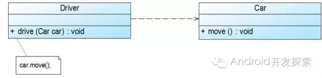

# 1.类图基础属性


类图的表示

```none
+表示public
-表示private  
#表示protected 
~表示default,也就是包权限  
_下划线表示static  
斜体表示抽象  
```

# 2.类与类之间关系


在UML类图中，常见的有以下几种关系: 泛化（Generalization）, 实现（Realization），关联（Association)，聚合（Aggregation），组合(Composition)，依赖(Dependency)

### 1、关联关系

对于两个相对独立的对象，当一个对象的实例与另一个对象的一些特定实例存在固定的对应关系时，这两个对象之间为关联关系。

关联关系又可进一步分为单向关联、双向关联和自关联。

（1）单向关联


我们可以看到，在UML类图中单向关联用一个带箭头的直线表示。上图表示每个顾客都有一个地址，这通过让Customer类持有一个类型为Address的成员变量类实现。

 

（2）双向关联


从上图中我们很容易看出，所谓的双向关联就是双方各自持有对方类型的成员变量。在UML类图中，双向关联用一个不带箭头的直线表示。上图中在Customer类中维护一个Product[]数组，表示一个顾客购买了那些产品；在Product类中维护一个Customer类型的成员变量表示这个产品被哪个顾客所购买。

 

（3）自关联


自关联在UML类图中用一个带有箭头且指向自身的直线表示。上图的意思就是Node类包含类型为Node的成员变量，也就是“自己包含自己”。

 

### 2、聚合关系

表示一种弱的‘拥有’关系，即has-a的关系，体现的是A对象可以包含B对象，但B对象不是A对象的一部分。 **两个对象具有各自的生命周期**。


上图中的Car类与Engine类就是聚合关系（Car类中包含一个Engine类型的成员变量）。由上图我们可以看到，UML中聚合关系用带空心菱形和箭头的直线表示。聚合关系强调是“整体”包含“部分”，但是“部分”可以脱离“整体”而单独存在。比如上图中汽车包含了发动机，而发动机脱离了汽车也能单独存在。

 

### 3、组合关系

组合是一种强的‘拥有’关系，是一种contains-a的关系，体现了严格的部分和整体关系，**部分和整体的生命周期一样**。

组合关系与聚合关系见得最大不同在于：这里的“部分”脱离了“整体”便不复存在。比如下图：


显然，嘴是头的一部分且不能脱离了头而单独存在。在UML类图中，组合关系用一个带实心菱形和箭头的直线表示。

 

### 4、依赖关系

对于两个相对独立的对象，当一个对象负责构造另一个对象的实例，或者依赖另一个对象的服务时，这两个对象之间主要体现为依赖关系。



从上图我们可以看到，Driver的drive方法只有传入了一个Car对象才能发挥作用，因此我们说Driver类依赖于Car类。在UML类图中，依赖关系用一条带有箭头的虚线表示。

 

### 5、继承关系

继承关系对应的是extend关键字，在UML类图中用带空心三角形的直线表示，如下图所示中，Student类与Teacher类继承了Person类。


 

### 6、接口实现关系

这种关系对应implement关键字，在UML类图中用带空心三角形的虚线表示。如下图中，Car类与Ship类都实现了Vehicle接口。

