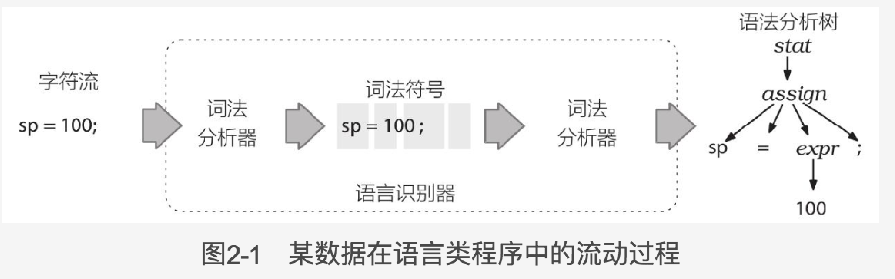
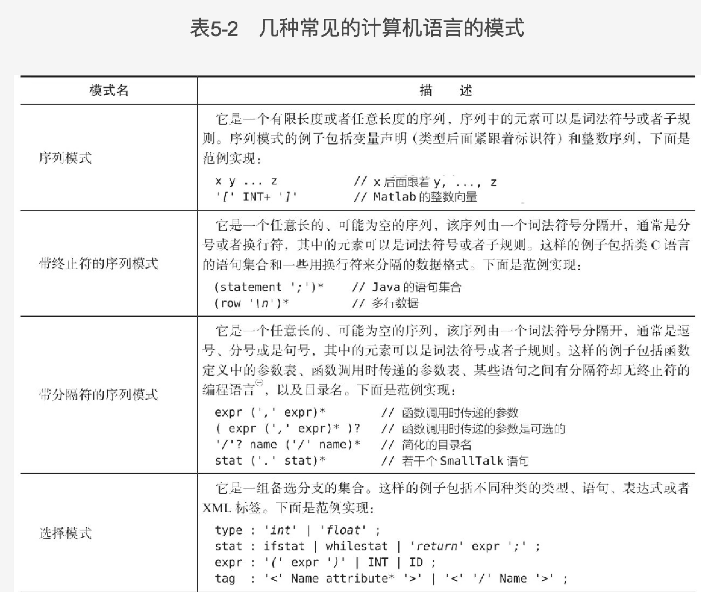
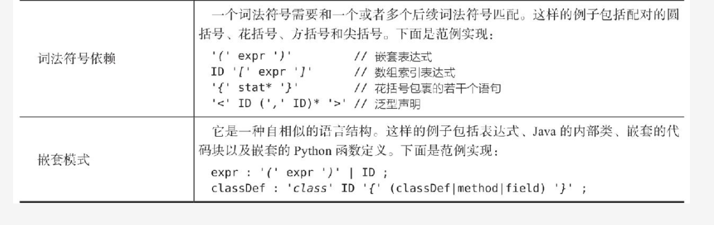
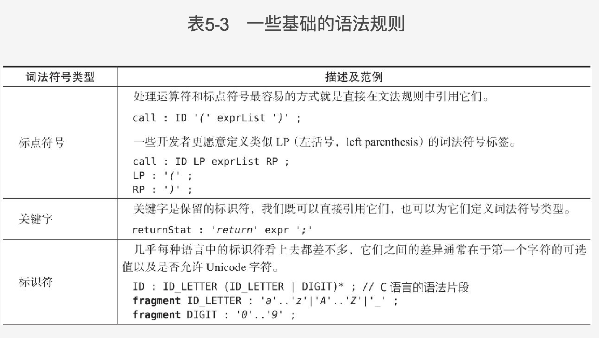
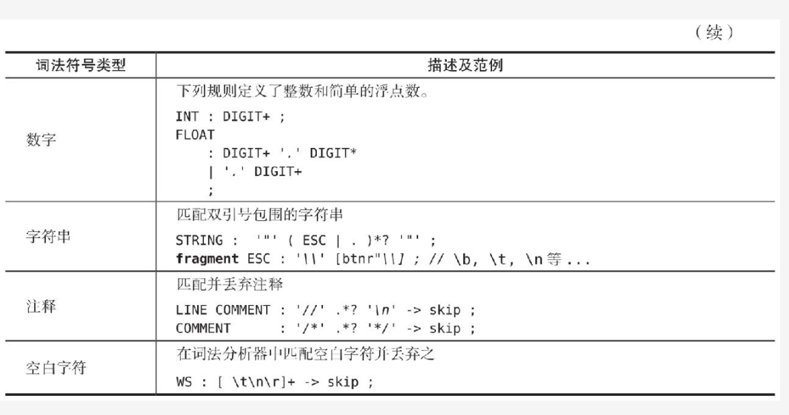

Antlr解决歧义问题的方式是：匹配在语法定义中最靠前的那条词法规则。

词法分析器处理字符序列并将生成的词法符号提供给语法分析器，语法分析器随即根据这些信息来检查语法的正确性并建造出一颗语法分析树。这个过程对应的ANTLR类是ChatStream，Lexer，Token，Parser以及ParseTree。

语法分析树监听器和访问器。

语法分析器的规则以小写字母开头。

词法分析器的规则以大写字母开头。

监听器的方法会被ANTLR提供的遍历器对象自动调用，而在访问器的方法中，必须显示调用visit方法来访问子节点，没有调用visit方法的后果就是对应的子树将不会被访问到。

可选（？），出现0次或多次（*），至少一次（+）

### 第五章 设计语法

语言模式

序列，选择，词法符号依赖，嵌套结构

序列：

```
exprList : expr ( ', ' expr)* ;
```

选择

```
filed ： INT | STRING ；
```

词法符号依赖

```
object
    :   '{' pair (',' pair)* '}'    # AnObject
    |   '{' '}'                     # EmptyObject
    ;
    
pair:   STRING ':' value ;
```

嵌套结构

```
expr : ID '[' expr ']'
	| '(' expr ')'
	| INT
	;
```





ANTLR通过优先级选择位置靠前的备选分支来解决歧义问题，这隐式的允许我们指定运算符优先级。

ANTLR 能够处理左递归，但是无法处理间接左递归。

##### 词法结构

ANTLR词法分析器解决歧义问题的方法是优先使用位置靠前的词法规则。这意味着，ID规则必须定义在所有的关键字规则之后。

.*? 非贪婪匹配：获取一些字符，直到发现匹配后续子规则的字符为止





看到第六章 探索真实的语法世界