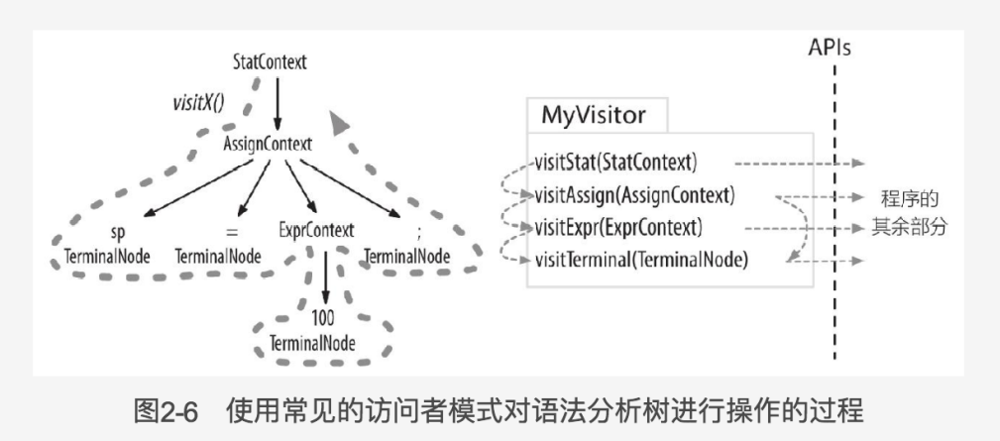

# 第一部分 ANTLR 和 计算机语言简介

## 第 1 章 初始 ANTLR

语法分析器通过输入的词法符号流来识别特定的语言结构，而词法分析器通过输入的字符流来识别特定的语言结构。

语法分析器规则以小写字母开头，词法分析器规则以大写字母开头。

以 fragment 开头的规则只能被其他的词法分析器规则使用，它们并不是词法符号。

Antlr4支持左递归，类似：

```g4
expr:   expr ('*'|'/') expr   
    |   expr ('+'|'-') expr   
    |   INT                    
    |   ID                    
    |   '(' expr ')'         
    ;
```

监听器是自动遍历的，无法控制遍历的过程，也无法利用方法的返回值来传递数据，访问器模式则相反，但访问器模式必须显式访问它们的子节点，而监听器无须如此


## 第 2 章  纵观全局


Antlr解决歧义问题的方式是：匹配在语法定义中最靠前的那条词法规则。

词法分析器处理字符序列并将生成的词法符号提供给语法分析器，语法分析器随即根据这些信息来检查语法的正确性并建造出一颗语法分析树。这个过程对应的ANTLR类是ChatStream，Lexer，Token，Parser以及ParseTree。

语法分析树监听器和访问器。

### 监听器

一个监听器的方法实际上就是回调函数。


### 访问器

有时候我们希望控制遍历语法分析树的过程，通过显式的方法调用来访问子节点。



访问器和监听器最大的区别在于，监听器的方法会被ANTLR提供的遍历器对象自动调用，而在访问器的方法中，必须显示调用visit方法来访问子节点。忘记调用visit（）方法的后果就是对应的子树将不会被访问。


## 第 3 章 入门的 ANTLR 项目


## 第 4 章 快速指南

### 4.1 匹配算术表达式的语言

```json
grammar Expr;

/** The start rule; begin parsing here. 语法分析器规则以小写字母开头，词法分析器规则以大写字母开头*/
prog:   stat+ ; 

stat:   expr NEWLINE                
    |   ID '=' expr NEWLINE        
    |   NEWLINE                   
    ;

expr:   expr ('*'|'/') expr   
    |   expr ('+'|'-') expr   
    |   INT                    
    |   ID                    
    |   '(' expr ')'         
    ;

ID  :   [a-zA-Z]+ ;      // match identifiers <label id="code.tour.expr.3"/>
INT :   [0-9]+ ;         // match integers
NEWLINE:'\r'? '\n' ;     // return newlines to parser (is end-statement signal)
WS  :   [ \t]+ -> skip ; // toss out whitespace
```

语法分析器的规则以小写字母开头。

词法分析器的规则以大写字母开头。

监听器的方法会被ANTLR提供的遍历器对象自动调用，而在访问器的方法中，必须显示调用visit方法来访问子节点，没有调用visit方法的后果就是对应的子树将不会被访问到。

可选（？），出现0次或多次（*），至少一次（+）

访问器和监听器最大的区别在于，监听器的方法会被ANTLR提供的遍历器对象自动调用，而在访问器的方法中，必须显示调用visit方法来访问子节点。忘记调用visit（）方法的后果就是对应的子树将不会被访问。

### 4.2 使用访问器构建一个计算器

访问器

给备选分支加上标签

### 4.3 使用监听器构建一个翻译程序

### 4.4 定制语法分析过程

在语法中嵌入任意动作

使用语义判定改变语法分析过程

### 4.5 神奇的词法分析特性

孤岛语法：处理相同文件中的不同格式

重写输入流 插桩

将词法符号送入不同通道

# 第二部分 ANTLR开发语言类应用程序

## 第 5 章 设计语法

### 5.1 从编程语言的范例代码中提取语法

### 5.2 以现有的语法规范为指南

### 5.3 使用ANTLR语法识别常见的语言模式

语言模式

序列，选择，词法符号依赖，嵌套结构

序列：

```
exprList : expr ( ', ' expr)* ;
```

选择

多个备选分支

```
filed ： INT | STRING ；
```

词法符号依赖

```
object
    :   '{' pair (',' pair)* '}'    # AnObject
    |   '{' '}'                     # EmptyObject
    ;
    
pair:   STRING ':' value ;
```

嵌套结构

```
expr : ID '[' expr ']'
	| '(' expr ')'
	| INT
	;
```


### 5.4 处理优先级 左递归和结合性

ANTLR通过优先级选择位置靠前的备选分支来解决歧义问题，这隐式的允许我们指定运算符优先级。

ANTLR 能够处理左递归，但是无法处理间接左递归。


### 5.5 识别常见的词法结构

ANTLR词法分析器解决歧义问题的方法是优先使用位置靠前的词法规则。这意味着，ID规则必须定义在所有的关键字规则之后。

.*? 非贪婪匹配：获取一些字符，直到发现匹配后续子规则的字符为止


### 5.6 划定词法分析器和语法分析器的界线


## 第 6 章 探索真实的语法世界

### 6.1 解析CSV文件

```javascript
grammar CSV;

file : hdr row+ ;
hdr : row ;

row : field (',' field)* '\r'? '\n' ;

field
    :   TEXT	# text
    |   STRING	# string
    |		# empty
    ;

TEXT : ~[,\n\r"]+ ;
STRING : '"' ('""'|~'"')* '"' ;

```


### 6.2 解析JSON

```javascript
// Derived from http://json.org
grammar JSON;

json:   object
    |   array
    ;

object
    :   '{' pair (',' pair)* '}'    # AnObject
    |   '{' '}'                     # EmptyObject
    ;
	
array
    :   '[' value (',' value)* ']'  # ArrayOfValues
    |   '[' ']'                     # EmptyArray
    ;

pair:   STRING ':' value ;

value
    :   STRING		# String
    |   NUMBER		# Atom
    |   object  	# ObjectValue
    |   array  		# ArrayValue
    |   'true'		# Atom
    |   'false'		# Atom
    |   'null'		# Atom
    ;

LCURLY : '{' ;
LBRACK : '[' ;
STRING :  '"' (ESC | ~["\\])* '"' ;

fragment ESC :   '\\' (["\\/bfnrt] | UNICODE) ;
fragment UNICODE : 'u' HEX HEX HEX HEX ;
fragment HEX : [0-9a-fA-F] ;

NUMBER
    :   '-'? INT '.' INT EXP?   // 1.35, 1.35E-9, 0.3, -4.5
    |   '-'? INT EXP            // 1e10 -3e4
    |   '-'? INT                // -3, 45
    ;
fragment INT :   '0' | '1'..'9' '0'..'9'* ; // no leading zeros
fragment EXP :   [Ee] [+\-]? INT ; // \- since - means "range" inside [...]

WS  :   [ \t\n\r]+ -> skip ;

```

### 6.3 解析DOT语言

### 6.5 解析R语言


## 第 7 章 将语法和程序的逻辑代码解耦

### 7.1 从内嵌动作到监听器的演进

### 7.2 使用语法分析树监听器编写程序

监听器的遍历过程和方法触发都是自动进行的，如果需要控制遍历过程或者希望事件方法返回值时，我们可以使用访问者模式。

```javascript
grammar PropertyFile;
file : prop+ ;
prop : ID '=' STRING '\n' ;
ID   : [a-z]+ ;
STRING : '"' .*? '"' ;
```


```java
package com.moon.demo.anltr.examples.file; /***
 * Excerpted from "The Definitive ANTLR 4 Reference",
 * published by The Pragmatic Bookshelf.
 * Copyrights apply to this code. It may not be used to create training material, 
 * courses, books, articles, and the like. Contact us if you are in doubt.
 * We make no guarantees that this code is fit for any purpose. 
 * Visit http://www.pragmaticprogrammer.com/titles/tpantlr2 for more book information.
***/

import org.antlr.v4.runtime.ANTLRInputStream;
import org.antlr.v4.runtime.CommonTokenStream;
import org.antlr.v4.runtime.tree.ParseTree;
import org.antlr.v4.runtime.tree.ParseTreeWalker;

import java.io.InputStream;
import java.nio.file.Files;
import java.nio.file.Paths;
import java.util.LinkedHashMap;
import java.util.Map;

/**
 * @author wuxiaojian
 */
public class TestPropertyFile {
    public static class PropertyFileLoader extends PropertyFileBaseListener {
        Map<String,String> props = new LinkedHashMap<>();
        @Override
        public void exitProp(PropertyFileParser.PropContext ctx) {
            String id = ctx.ID().getText(); // prop : ID '=' STRING '\n' ;
            String value = ctx.STRING().getText();
            props.put(id, value);
        }
    }

    public static void main(String[] args) throws Exception {
        String inputFile = null;
        if ( args.length>0 ) {
            inputFile = args[0];
        }
        InputStream is = System.in;
        if ( inputFile!=null ) {
            is = Files.newInputStream(Paths.get(inputFile));
        }
        ANTLRInputStream input = new ANTLRInputStream(is);
        PropertyFileLexer lexer = new PropertyFileLexer(input);
        CommonTokenStream tokens = new CommonTokenStream(lexer);
        PropertyFileParser parser = new PropertyFileParser(tokens);
        ParseTree tree = parser.file();

        // create a standard ANTLR parse tree walker
        ParseTreeWalker walker = new ParseTreeWalker();
        // create listener then feed to walker
        PropertyFileLoader loader = new PropertyFileLoader();
        // walk parse tree
        walker.walk(loader, tree);
        // print results
        System.out.println(loader.props);
    }
}

```


### 7.3 使用访问器编写程序

```java
package com.moon.demo.anltr.examples.file; /***
 * Excerpted from "The Definitive ANTLR 4 Reference",
 * published by The Pragmatic Bookshelf.
 * Copyrights apply to this code. It may not be used to create training material, 
 * courses, books, articles, and the like. Contact us if you are in doubt.
 * We make no guarantees that this code is fit for any purpose. 
 * Visit http://www.pragmaticprogrammer.com/titles/tpantlr2 for more book information.
***/

import org.antlr.v4.runtime.ANTLRInputStream;
import org.antlr.v4.runtime.CommonTokenStream;
import org.antlr.v4.runtime.tree.ParseTree;

import java.io.FileInputStream;
import java.io.InputStream;
import java.util.LinkedHashMap;
import java.util.Map;

public class TestPropertyFileVisitor {
    public static class PropertyFileVisitor extends
        PropertyFileBaseVisitor<Void>
    {
        Map<String,String> props = new LinkedHashMap<>();
        @Override
        public Void visitProp(PropertyFileParser.PropContext ctx) {
            String id = ctx.ID().getText(); // prop : ID '=' STRING '\n' ;
            String value = ctx.STRING().getText();
            props.put(id, value);
            return null; // Java says must return something even when Void
        }
    }

    public static void main(String[] args) throws Exception {
        String inputFile = null;
        if ( args.length>0 ) {
            inputFile = args[0];
        }
        InputStream is = System.in;
        if ( inputFile!=null ) {
            is = new FileInputStream(inputFile);
        }
        ANTLRInputStream input = new ANTLRInputStream(is);
        PropertyFileLexer lexer = new PropertyFileLexer(input);
        CommonTokenStream tokens = new CommonTokenStream(lexer);
        PropertyFileParser parser = new PropertyFileParser(tokens);
        ParseTree tree = parser.file();

        PropertyFileVisitor loader = new PropertyFileVisitor();
        loader.visit(tree);
        System.out.println(loader.props); // print results
    }
}

```

### 7.4 标记备选分支以获取精确的事件方法

为获取更加精确的监听器事件，ANTLR允许我们利用#运算符为任意规则的最外层备选分支提供标签。利用这种方法，我们在Expr语法的基础上，为e的备选分支增加标签，得到LExpr语法


需要注意的是，ANTLR也为不同的备选分支生成了特定的上下文对象（EContext的子类），并以标签命名。这样的上下文对象中的getter方法被限制为只能获取对应备选分支中的内容。

### 7.5 在事件方法中共享信息

1. 使用访问器遍历语法分析树

访问器返回一个用户指定类型的值。不过，如果访问器需要传递参数，那就必须使用下面两种方案。

2. 使用栈来模拟返回值

在上下文类中维护一个栈字段，以与Java调用栈相同的方式，模拟参数和返回值的入栈和出栈。

3. 标注（Annotate）语法分析树

在上下文类中维护一个map字段，用对应的值来标注节点。


## 第 8 章 构建真实的语言类应用程序

### 8.1 加载CSV数据

### 8.2 将JSON翻译成XML

### 8.3 生成调用图

### 8.4 验证程序中符号的使用