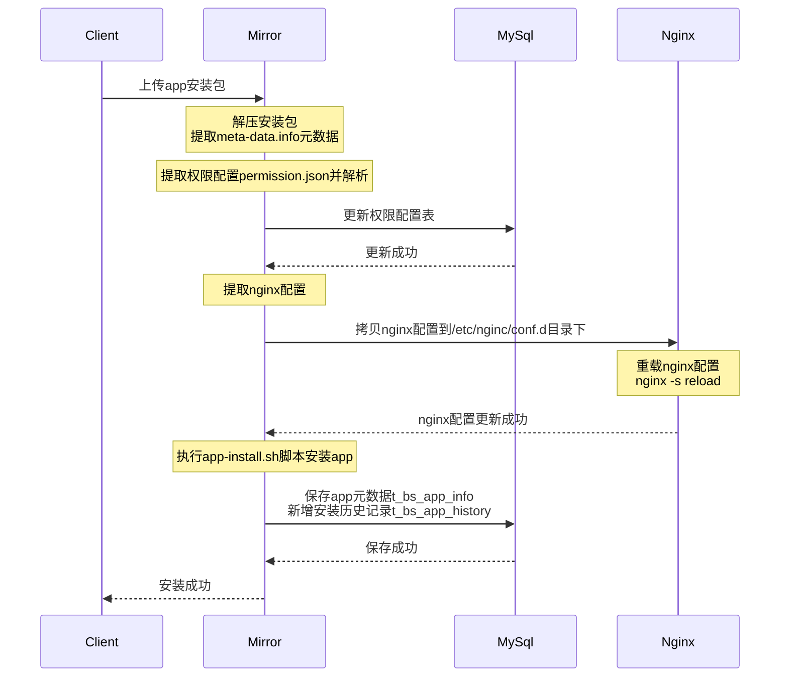
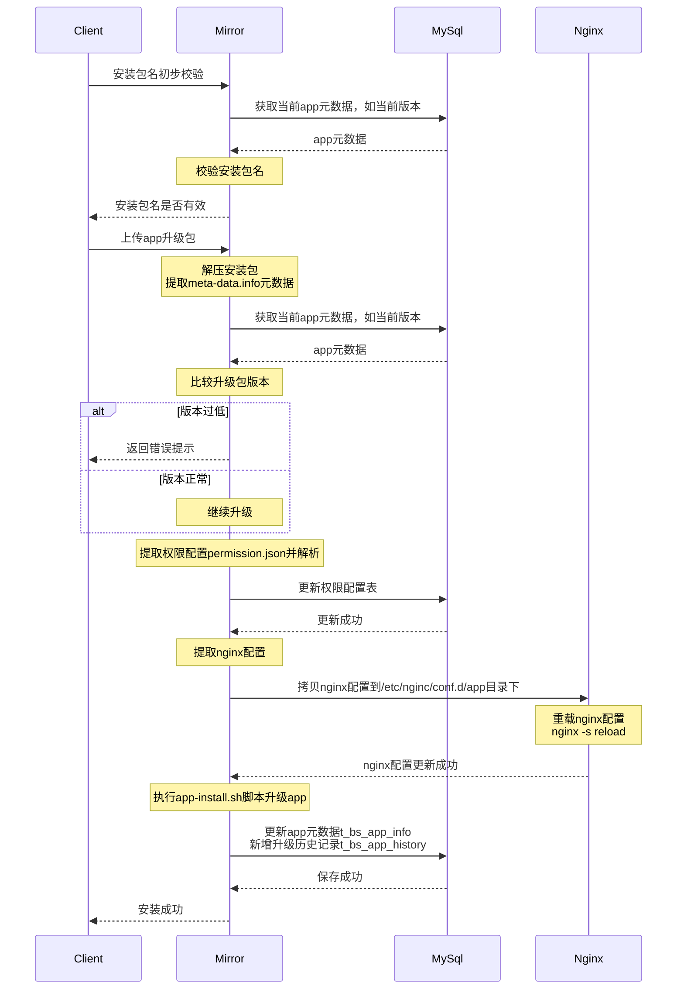
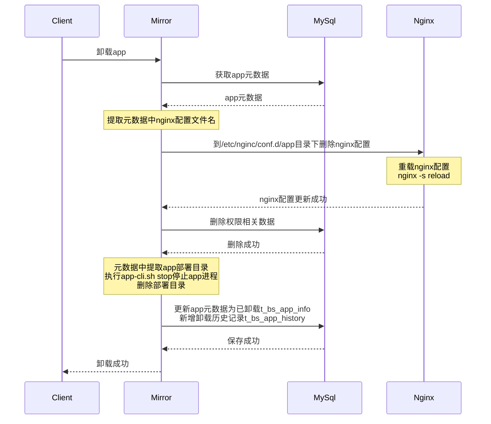
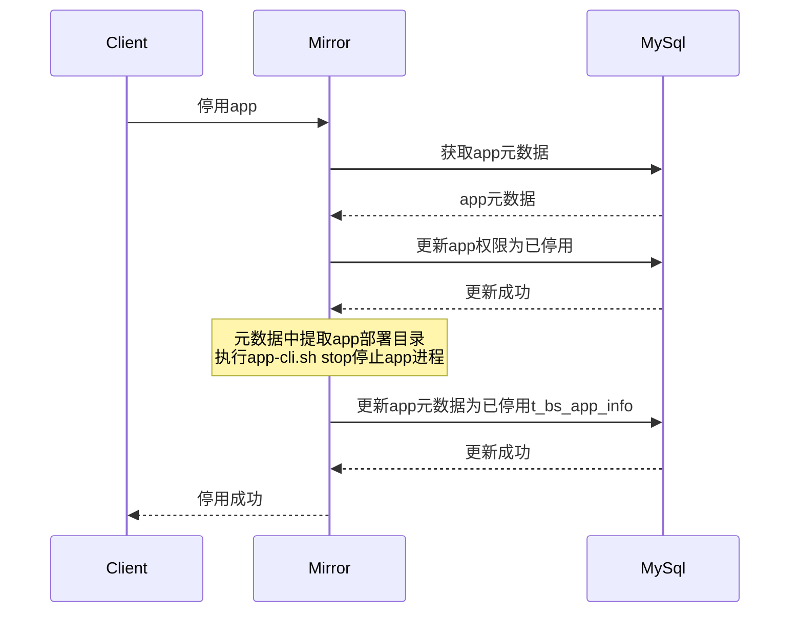
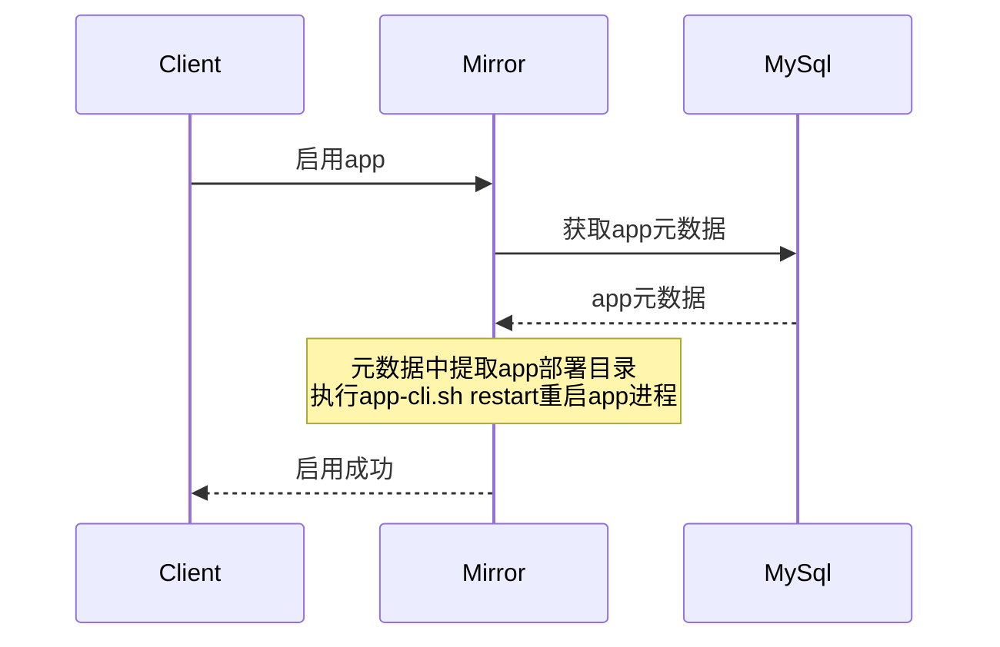

## 业务流程

### 1、app安装

###2、app更新

###3、app卸载

###4、app停用

###5、app启用

###6、app重启

## 数模设计

### 1、app基本信息

t_bs_app_info

| 字段名       | 字段类型      | 描述                                                         |
| ------------ | ------------- | ------------------------------------------------------------ |
| id           | bigint(20)    | 主键                                                         |
| code         | varchar(150)  | app英文名                                                    |
| name         | varchar(150)  | app中文名                                                    |
| description  | varchar(4096) | app描述                                                      |
| install_time | imestamp      | 安装时间                                                     |
| version      | varchar(100)  | 当前版本                                                     |
| docker_id    | varchar(150)  | 部署容器id                                                   |
| deploy_path  | varchar(1024) | 部署路径                                                     |
| status       | varchar(100)  | 状态，start:启用，stop:停用，uninstall:已卸载，installing:安装中，restarting:重启中，uninstalling:卸载中 |
| meta_info    | ext           | 其他元数据，json格式存储                                     |

###2、app安装升级历史日志

t_bs_app_history

| 字段名       | 字段类型     | 描述                                               |
| ------------ | ------------ | -------------------------------------------------- |
| id           | bigint(20)   | 主键                                               |
| code         | varchar(150) | app英文名，外键                                    |
| last_version | varchar(100) | 历史版本                                           |
| version      | varchar(100) | 操作时版本                                         |
| operate_time | timestamp    | 操作时间                                           |
| operate_type | varchar(32)  | 操作类型，install:安装,upgrade:升级,uninstall:卸载 |
| is_success   | tinyint(1)   | 是否成功                                           |
| result       | Text         | 结果信息                                           |

## 接口设计

###1、app列表

获取所有app基本信息，包括已卸载的app

**method**：GET

**url**：/api/apps

**请求参数**：

| 字段名           | 字段类型 | 描述                                                         |
| ---------------- | -------- | ------------------------------------------------------------ |
| code             | string   | app英文名                                                    |
| name             | string   | app中文名                                                    |
| version          | string   | app版本                                                      |
| installStartTime | string   | app安装起始时间，yyyy-MM-dd                                  |
| installEndTime   | string   | app安装终止时间，yyyy-MM-dd                                  |
| status           | string   | start:启用，stop:停用，uninstall:已卸载，installing:安装中，restarting:重启中，uninstalling:卸载中 |

**响应参数**：

| 字段名       | 字段类型 | 描述                                                         |
| ------------ | -------- | ------------------------------------------------------------ |
| code         | string   | app英文名                                                    |
| name         | string   | app中文名                                                    |
| description  | string   | app描述                                                      |
| install_time | string   | 安装时间，yyyy-MM-dd HH:mm:ss                                |
| version      | string   | 当前版本                                                     |
| status       | string   | start:启用，stop:停用，uninstall:已卸载，installing:安装中，restarting:重启中，uninstalling:卸载中 |
| healthy      | string   | 健康状态，green:正常，red:异常                               |
| success      | boolean  | 安装/重启是否成功                                            |
| result       | string   | 安装/重启结果信息                                            |

###2、获取app详情

app基本信息，包含元数据，屏蔽敏感数据，如部署目录

**method**：GET

**url**：/api/apps/{code}

**请求参数**：

| 字段名 | 字段类型 | 字段描述  |
| ------ | -------- | --------- |
| code   | string   | app英文名 |

**响应参数**：

| 字段名       | 字段类型 | 字段描述                      |
| ------------ | -------- | ----------------------------- |
| code         | string   | app英文名                     |
| name         | string   | app中文名                     |
| description  | string   | app描述                       |
| install_time | string   | 安装时间，yyyy-MM-dd HH:mm:ss |
| version      | string   | 当前版本                      |
| metaInfos    | Object   | app元数据，看具体app定义      |

###3、安装包校验

通过安装包名称初步验证，版本是否过低

**method**:GET

**url**:/api/apps/check

**请求参数**：

| 字段名   | 字段类型 | 字段描述   |
| -------- | -------- | ---------- |
| fileName | string   | 安装包名称 |

**响应参数**：

| 字段名  | 字段类型 | 字段描述                       |
| ------- | -------- | ------------------------------ |
| code    | number   | 0：验证通过，非0：验证不通过   |
| message | string   | 提示信息                       |
| data    | boolean  | true:验证通过，false验证不通过 |

###4、上传app安装|升级包

统一接口上传，通过包名区分不同app

**method**：POST

**url**：/api/apps

**Content-Type**: multipart/form-data

**请求参数**:

| 字段名 | 字段类型 | 字段描述   |
| ------ | -------- | ---------- |
| file   | file     | 安装包文件 |

**响应参数**：

| 字段名  | 字段类型 | 字段描述                 |
| ------- | -------- | ------------------------ |
| code    | number   | 0：安装中，非0：安装异常 |
| message | string   | 响应信息                 |
| data    | boolean  | 是否提交成功             |

###5、启用app

异步接口，批量启用

**method**:PUT

**url**:/api/apps/start

**Content-Type**:application/json

**请求参数**：

| 字段名 | 字段类型 | 字段描述  |
| ------ | -------- | --------- |
| codes  | array    | app英文名 |

**响应参数**：

| 字段名  | 字段类型 | 字段描述                 |
| ------- | -------- | ------------------------ |
| code    | number   | 0：启动中，非0：启动异常 |
| message | string   | 响应信息                 |
| data    | boolean  | 操作是否提交成功         |

###6、重启app

异步接口，批量重启

**method**:PUT

**url**:/api/apps/restart

**Content-Type**:application/json

**请求参数**：

| 字段名 | 字段类型 | 字段描述  |
| ------ | -------- | --------- |
| codes  | array    | app英文名 |

**响应参数**：

| 字段名  | 字段类型 | 字段描述                 |
| ------- | -------- | ------------------------ |
| code    | number   | 0：启动中，非0：启动异常 |
| message | string   | 响应信息                 |
| data    | boolean  | 操作是否提交成功         |

###7、停用app

异步接口，批量停用

**method**:PUT

**url**:/api/apps/stop

**Content-Type**:application/json

**请求参数**：

| 字段名 | 字段类型 | 字段描述  |
| ------ | -------- | --------- |
| codes  | array    | app英文名 |

**响应参数**：

| 字段名  | 字段类型 | 字段描述                 |
| ------- | -------- | ------------------------ |
| code    | number   | 0：停用中，非0：停用异常 |
| message | string   | 响应信息                 |
| data    | boolean  | 操作是否提交成功         |

###8、卸载app

异步接口，批量卸载

**method**:PUT

**url**:/api/apps/uninstall

**Content-Type**:application/json

**请求参数**：

| 字段名 | 字段类型 | 字段描述  |
| ------ | -------- | --------- |
| codes  | array    | app英文名 |

**响应参数**：

| 字段名  | 字段类型 | 字段描述                 |
| ------- | -------- | ------------------------ |
| code    | number   | 0：卸载中，非0：卸载异常 |
| message | string   | 响应信息                 |
| data    | boolean  | 操作是否提交成功         |

###9、日志下载

异步接口，批量卸载

**method**:GET

**url**:/api/apps/{code}/logs

**请求参数**：

| 字段名 | 字段类型 | 字段描述  |
| ------ | -------- | --------- |
| code   | string   | app英文名 |

**响应参数**：

文件流

## 已知问题

1. 角色管理界面
   - [ ] 权限树添加icon，区分菜单与操作权限
   - [ ] 菜单联动选择功能失效
2. app前端菜单管理
   - [ ] 
   - [ ] menulist字段定义
3. app脚手架
   - [ ] 添加meta-info.properties文件，描述app元数据（nacos元数据功能能否使用）
   - [ ] 默认log4j2配置集成
4. menulist接口bug
   - [ ] license未上传时只显示license菜单
5. mirror基础工程
   - [ ] 仅包含用户管理、角色管理、组织关联、app管理
6. session管理
   - [ ] session超时时间配置功能失效，其他认证安全配置功能需要测试
   - [ ] 其他相关业务功能需要梳理，如存在用户登录中则此用户无法删除

## 任务

1. app管理，app列表，app安装/更新/卸载，app启停，日志下载

   前端-2人天——马延昭

   后端-10人天——谭立聪

2. app安装/更新日志，仅查询功能

   前端-1人天——马延昭

   后端-1人天——谭立聪

3. app前端菜单管理

   iframe or 多页面

4. 角色管理功能完善

   权限树添加icon，区分菜单与操作权限-0.5人天——马延昭

   菜单联动选择功能(历史功能)-1人天——马延昭

5. app基础工程&脚手架完善

   添加meta-info.data文件-0.5人天——童绪祥

   添加基础log4j2配置-0.5人天——童绪祥

6. session管理，mirror已有功能适配

   session超时时间配置-1人天——俞天明

   session存活时间数据采集-1人天——俞天明

7. 配置中心

   公用配置放配置中心管理，如trustip，trustReferer——童绪祥