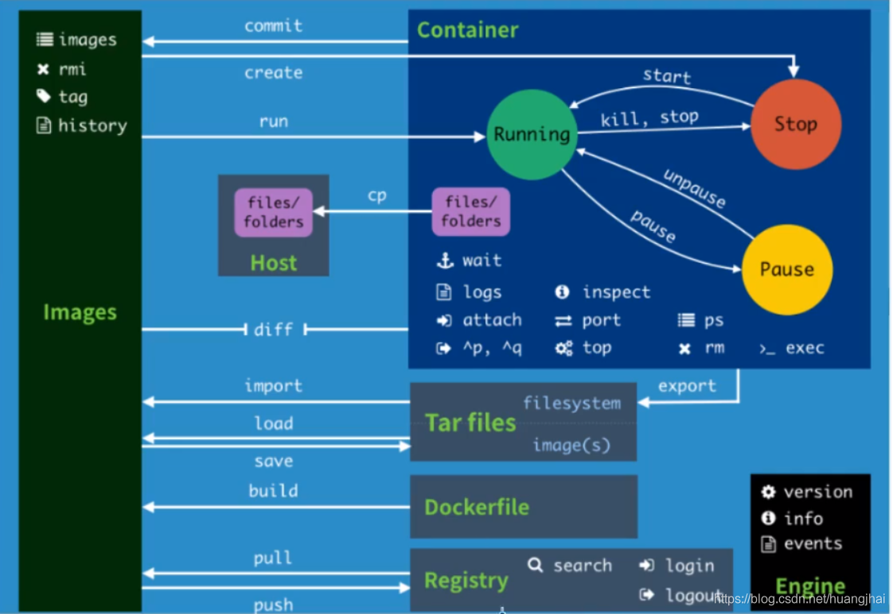

### docker常用命令

#### 基础命令

```shell
docker version          #查看docker的版本信息
docker info             #查看docker的系统信息,包括镜像和容器的数量
docker 命令 --help       #帮助命令(可查看可选的参数)
docker COMMAND --help
```

命令的帮助文档地址:https://docs.docker.com/engine/reference/commandline/docker/

#### 镜像命令

**1.docker images 查看本地主机的所有镜像**

```shell
[root@iZwz99sm8v95sckz8bd2c4Z ~]# docker images
REPOSITORY    TAG       IMAGE ID       CREATED         SIZE
hello-world   latest    bf756fb1ae65   11 months ago   13.3kB
```

#解释:
1.REPOSITORY  镜像的仓库源

2.TAG  镜像的标签

3.IMAGE ID 镜像的id

4.CREATED 镜像的创建时间

5.SIZE 镜像的大小

可选参数

-a/--all 列出所有镜像

-q/--quiet 只显示镜像的id

**2.docker search 搜索镜像**

```shell
[root@iZwz99sm8v95sckz8bd2c4Z ~]# docker search mysql
NAME                              DESCRIPTION                                     STARS     OFFICIAL   AUTOMATED
mysql                             MySQL is a widely used, open-source relation…   10308     [OK]
mariadb                           MariaDB is a community-developed fork of MyS…   3819      [OK]
mysql/mysql-server                Optimized MySQL Server Docker images. Create…   754                  [OK]
percona                           Percona Server is a fork of the MySQL relati…   517       [OK]
centos/mysql-57-centos7           MySQL 5.7 SQL database server                   86
mysql/mysql-cluster               Experimental MySQL Cluster Docker images. Cr…   79
centurylink/mysql                 Image containing mysql. Optimized to be link…   60                   [OK]
```


#可选参数

Search the Docker Hub for images

Options:
  -f, --filter filter   Filter output based on conditions provided
      --format string   Pretty-print search using a Go template
      --limit int       Max number of search results (default 25)
      --no-trunc        Don't truncate output
      
      
#搜索收藏数大于3000的镜像

```shell
[root@iZwz99sm8v95sckz8bd2c4Z ~]# docker search mysql --filter=STARS=3000
NAME      DESCRIPTION                                     STARS     OFFICIAL   AUTOMATED
mysql     MySQL is a widely used, open-source relation…   10308     [OK]
mariadb   MariaDB is a community-developed fordockerk of MyS…   3819      [OK]

```

**3.docker pull 镜像名[:tag] 下载镜像**

```shell
[root@iZwz99sm8v95sckz8bd2c4Z ~]# docker pull mysql
Using default tag: latest            #如果不写tag默认就是latest
latest: Pulling from library/mysql
6ec7b7d162b2: Pull complete          #分层下载,docker image的核心-联合文件系统
fedd960d3481: Pull complete
7ab947313861: Pull complete
64f92f19e638: Pull complete
3e80b17bff96: Pull complete
014e976799f9: Pull complete
59ae84fee1b3: Pull complete
ffe10de703ea: Pull complete
657af6d90c83: Pull complete
98bfb480322c: Pull complete
6aa3859c4789: Pull complete
1ed875d851ef: Pull complete
Digest: sha256:78800e6d3f1b230e35275145e657b82c3fb02a27b2d8e76aac2f5e90c1c30873 #签名
Status: Downloaded newer image for mysql:latest
docker.io/library/mysql:latest  #下载来源的真实地址  #docker pull mysql等价于docker pull docker.io/library/mysql:latest
```


**指定版本下载**

```shell
[root@iZwz99sm8v95sckz8bd2c4Z ~]# docker pull mysql:5.7
5.7: Pulling from library/mysql
6ec7b7d162b2: Already exists
fedd960d3481: Already exists
7ab947313861: Already exists
64f92f19e638: Already exists
3e80b17bff96: Already exists
014e976799f9: Already exists
59ae84fee1b3: Already exists
7d1da2a18e2e: Pull complete
301a28b700b9: Pull complete
529dc8dbeaf3: Pull complete
bc9d021dc13f: Pull complete
Digest: sha256:c3a567d3e3ad8b05dfce401ed08f0f6bf3f3b64cc17694979d5f2e5d78e10173
Status: Downloaded newer image for mysql:5.7
docker.io/library/mysql:5.7
```


**4.docker rmi 删除镜像**

```shell
#1.删除指定的镜像id
[root@iZwz99sm8v95sckz8bd2c4Z ~]# docker rmi -f  镜像id
#2.删除多个镜像id
[root@iZwz99sm8v95sckz8bd2c4Z ~]# docker rmi -f  镜像id 镜像id 镜像id
#3.删除全部的镜像id
[root@iZwz99sm8v95sckz8bd2c4Z ~]# docker rmi -f  $(docker images -aq)
```

**5.提交镜像**

使用docker commit 命令提交容器成为一个新的版本 

```shell
docker commit -m=“提交的描述信息”  -a="作者" 容器id 目标镜像名:[TAG]
```

#### 容器命令

如拉取一个centos容器

```shell
docker pull centos
```

**运行容器**

```shell
docker run [可选参数] image

#参数说明
--name="名字"           指定容器名字
-d                     后台方式运行
-it                    使用交互方式运行,进入容器查看内容
-p                     指定容器的端口
(
-p ip:主机端口:容器端口  配置主机端口映射到容器端口
-p 主机端口:容器端口
-p 容器端口
)
-P                     随机指定端口(大写的P)
```

**进入容器**

```shell
[root@iZwz99sm8v95sckz8bd2c4Z ~]# docker run -it centos /bin/bash
[root@bd1b8900c547 /]# ls      
bin  dev  etc  home  lib  lib64  lost+found  media  mnt  opt  proc  root  run  sbin  srv  sys  tmp  usr  var
```

**退出容器**

#exit 停止并退出容器（后台方式运行则仅退出）
#Ctrl+P+Q  不停止容器退出

```shell
[root@bd1b8900c547 /]# exit
exit
[root@iZwz99sm8v95sckz8bd2c4Z ~]#
```


**列出运行过的容器**


**列出运行过的容器**

#docker ps 

列出当前正在运行的容器

-a   # 列出所有容器的运行记录
-n=? # 显示最近创建的n个容器
-q   # 只显示容器的编号

```shell
[root@iZwz99sm8v95sckz8bd2c4Z ~]# docker ps
CONTAINER ID   IMAGE     COMMAND   CREATED   STATUS    PORTS     NAMES
[root@iZwz99sm8v95sckz8bd2c4Z ~]# docker ps -a
CONTAINER ID   IMAGE          COMMAND       CREATED         STATUS                     PORTS     NAMES
bca129320bb5   centos         "/bin/bash"   4 minutes ago   Exited (0) 3 minutes ago             optimistic_shtern
bd1b8900c547   centos         "/bin/bash"   6 minutes ago   Exited (0) 5 minutes ago             cool_tesla
cf6adbf1b506   bf756fb1ae65   "/hello"      5 hours ago     Exited (0) 5 hours ago               optimistic_darwin
```


**删除容器**

docker rm 容器id                 #删除指定的容器,不能删除正在运行的容器,强制删除使用 rm -f
docker rm -f $(docker ps -aq)   #删除所有的容器
docker ps -a -q|xargs docker rm #删除所有的容器

**启动和停止容器**

docker start 容器id          #启动容器
docker restart 容器id        #重启容器
docker stop 容器id           #停止当前运行的容器
docker kill 容器id           #强制停止当前容器


####  其他常用命令

**日志的查看**：

```shell
[root@iZwz99sm8v95sckz8bd2c4Z ~]# docker logs --help

Usage:  docker logs [OPTIONS] CONTAINER

Fetch the logs of a container

Options:
      --details        Show extra details provided to logs
  -f, --follow         Follow log output
      --since string   Show logs since timestamp (e.g. 2013-01-02T13:23:37Z) or relative (e.g. 42m for 42 minutes)
  -n, --tail string    Number of lines to show from the end of the logs (default "all")
  -t, --timestamps     Show timestamps
      --until string   Show logs before a timestamp (e.g. 2013-01-02T13:23:37Z) or relative (e.g. 42m for 42 minutes)
```

常用：
docker logs -tf 容器id
docker logs --tail number 容器id #num为要显示的日志条数

#docker容器后台运行，必须要有一个前台的进程，否则会自动停止
#编写shell脚本循环执行，使得centos容器保持运行状态

```shell
[root@iZwz99sm8v95sckz8bd2c4Z ~]# docker run -d centos /bin/sh -c "while true;do echo hi;sleep 5;done"
c703b5b1911ff84d584390263a35707b6024816e1f46542b61918a6327a570dc
[root@iZwz99sm8v95sckz8bd2c4Z ~]# docker ps
CONTAINER ID   IMAGE     COMMAND                  CREATED          STATUS          PORTS     NAMES
c703b5b1911f   centos    "/bin/sh -c 'while t…"   13 seconds ago   Up 10 seconds             pedantic_banach
[root@iZwz99sm8v95sckz8bd2c4Z ~]# docker logs -tf --tail 10 c703b5b1911f
2020-12-27T03:34:07.255599560Z hi
2020-12-27T03:34:12.257641517Z hi
2020-12-27T03:34:17.259706294Z hi
2020-12-27T03:34:22.261693707Z hi
2020-12-27T03:34:27.262609289Z hi
2020-12-27T03:34:32.267862677Z hi
2020-12-27T03:34:37.270382873Z hi
2020-12-27T03:34:42.272414182Z hi
2020-12-27T03:34:47.274823243Z hi
2020-12-27T03:34:52.277419274Z hi
```


查看容器中进程信息


**查看容器中进程信息**

```shell
[root@iZwz99sm8v95sckz8bd2c4Z ~]# docker top c703b5b1911f
UID                 PID                 PPID                C                   STIME               TTY                 TIME                CMD
root                11156               11135               0                   11:31               ?                   00:00:00            /bin/sh -c while true;do echo hi;sleep 5;done
root                11886               11156               0                   11:43               ?                   00:00:00            /usr/bin/coreutils --coreutils-prog-shebang=sleep /usr/bin/sleep 5
```


**查看容器的元数据**

[root@iZwz99sm8v95sckz8bd2c4Z ~]# docker inspect 容器id

**进入当前正在运行的容器**

因为通常我们的容器都是使用后台方式来运行的，有时需要进入容器修改配置

方式一：

```shell
[root@iZwz99sm8v95sckz8bd2c4Z ~]# docker exec -it c703b5b1911f /bin/bash
[root@c703b5b1911f /]# ls
bin  dev  etc  home  lib  lib64  lost+found  media  mnt  opt  proc  root  run  sbin  srv  sys  tmp  usr  var
[root@c703b5b1911f /]# ps -ef      
UID        PID  PPID  C STIME TTY          TIME CMD
root         1     0  0 03:31 ?        00:00:00 /bin/sh -c while true;do echo hi;sleep 5;done
root       279     0  0 03:54 pts/0    00:00:00 /bin/bash
root       315     1  0 03:56 ?        00:00:00 /usr/bin/coreutils --coreutils-prog-shebang=sleep /usr/bin/sleep 5
root       316   279  0 03:56 pts/0    00:00:00 ps -ef
```


方式二：

```shell
[root@iZwz99sm8v95sckz8bd2c4Z ~]# docker attach c703b5b1911f
```

docker exec 进入容器后开启一个新的终端，可以在里面操作

docker attach 进入容器正在执行的终端，不会启动新的进程

**拷贝容器的文件到主机中**

docker cp 容器id:容器内路径 目的主机路径

```shell
[root@iZwz99sm8v95sckz8bd2c4Z ~]# docker exec -it c703b5b1911f /bin/bash
[root@c703b5b1911f /]# cd home
[root@c703b5b1911f home]# ls
#touch 新建文件
[root@c703b5b1911f home]# touch test.java
[root@c703b5b1911f home]# ls
test.java
[root@c703b5b1911f home]# exit
exit
[root@iZwz99sm8v95sckz8bd2c4Z ~]# docker ps
CONTAINER ID   IMAGE     COMMAND                  CREATED          STATUS          PORTS     NAMES
c703b5b1911f   centos    "/bin/sh -c 'while t…"   35 minutes ago   Up 35 minutes             pedantic_banach
[root@iZwz99sm8v95sckz8bd2c4Z ~]# docker cp c703b5b1911f:/home/test.java /home
[root@iZwz99sm8v95sckz8bd2c4Z ~]# ls /home
hai  pan  test.java
```

#### 命令小结



### 容器数据卷

#### 挂载

指定路径挂载

```shell
docker run -it -v 主机目录：容器内目录
```

匿名和具名挂载

```shell
# 匿名挂载
-v 容器内路径
docker run -d --name nginx01 -v /etc/nginx nginx 
# 匿名挂载，-v 只写了容器内的地址

# 查看所有 volume 的情况
docker volume ls

# 具名挂载
# 通过 -v 卷名：容器内路径
docker run -d --name nginx02 -v juming:/etc/nginx nginx 
# 查看具名卷
docker volume inspect juming
```

所有docker容器内的卷，没有指定目录的情况下 都是在 /var/lib/docker/volumes/xxxx/_data

#### 初识Dockerfile

dockerfile 就是用来构建 docker 镜像的构建文件

#### 数据卷容器

多个容器内同步数据

--volumes-from


### DockerFile

构建步骤

1. 编写一个 dockerfile 文件
2. docker build 构建成为一个镜像
3. docker run 运行镜像
4.  docker push 发布镜像

常用指令

FROM ADD CMD VOLUME 等， 详细网站搜索下

```shell
# 编写dockerfile 的文件
FROM centos

ENV MYPATH /usr/local
WORKDIR $MYPATH

RUN yum -y install vim

EXPOSE 80

CMD echo "---end---"
CMD /bin/bash

# 通过这个文件构建镜像
# docker build -f dockerfile文件路径 -t 镜像名:[tag]
```

镜像的制作历史

docker history 镜像id

### Docker网络

#### docker0

默认会创建docker0网卡作为路由，容器内部间是可以通过网络访问的

docker 使用的是linux的桥接，宿主机是一个docker容器的网桥 docker0

#### 自定义网络

查看所有网络 

```shell
docker network ls
```

网络模式

bridge： 桥接 docker 默认

none ：不配置网络

host：和宿主机共享网络

```shell
# 创建网络
docker network create
```

自定义的网络可以直接ping 容器名

#### 网络连通

```shell
# 网络连通
docker network connect --help
```

### Docker compose

批量容器编排
应用 app.py
Dockerfile 应用打包为镜像
docker-compose.yaml 文件（定义整个服务，需要的环境，web，redis），完整的上线一个服务
启动compose 项目（docker-compose up）


### 容器CPU、memory资源限制

#### 背景

在使用 docker 运行容器时，默认的情况下，docker没有对容器进行硬件资源的限制，当一台主机上运行几百个容器，这些容器虽然互相隔离，但是底层却使用着相同的 CPU、内存和磁盘资源。如果不对容器使用的资源进行限制，那么容器之间会互相影响，小的来说会导致容器资源使用不公平；大的来说，可能会导致主机和集群资源耗尽，服务完全不可用。

docker 作为容器的管理者，自然提供了控制容器资源的功能。正如使用内核的 namespace 来做容器之间的隔离，docker 也是通过内核的 cgroups 来做容器的资源限制；包括CPU、内存、磁盘三大方面，基本覆盖了常见的资源配额和使用量控制。

Docker内存控制OOME在linxu系统上，如果内核探测到当前宿主机已经没有可用内存使用，那么会抛出一个OOME(Out Of Memory Exception:内存异常 )，并且会开启killing去杀掉一些进程。

一旦发生OOME，任何进程都有可能被杀死，包括docker daemon在内，为此，docker特地调整了docker daemon的OOM_Odj优先级，以免他被杀掉，但容器的优先级并未被调整。经过系统内部复制的计算后，每个系统进程都会有一个OOM_Score得分，OOM_Odj越高，得分越高，（在docker run的时候可以调整OOM_Odj）得分最高的优先被kill掉，当然，也可以指定一些特定的重要的容器禁止被OMM杀掉，在启动容器时使用 –oom-kill-disable=true指定。

*参考：[Docker监控容器资源的占用情况](https://www.cnblogs.com/zhuochong/p/9729032.html)*

#### **cgroup简介**

cgroup是Control Groups的缩写，是Linux 内核提供的一种可以限制、记录、隔离进程组所使用的物理资源(如 cpu、memory、磁盘IO等等) 的机制，被LXC、docker等很多项目用于实现进程资源控制。cgroup将任意进程进行分组化管理的 Linux 内核功能。cgroup本身是提供将进程进行分组化管理的功能和接口的基础结构，I/O 或内存的分配控制等具体的资源管理功能是通过这个功能来实现的。这些具体的资源管理功能称为cgroup子系统，有以下几大子系统实现：

1. blkio：设置限制每个块设备的输入输出控制。例如:磁盘，光盘以及usb等等。
2. cpu：使用调度程序为cgroup任务提供cpu的访问。
3. cpuacct：产生cgroup任务的cpu资源报告。
4. cpuset：如果是多核心的cpu，这个子系统会为cgroup任务分配单独的cpu和内存。
5. devices：允许或拒绝cgroup任务对设备的访问。
6. freezer：暂停和恢复cgroup任务。
7. memory：设置每个cgroup的内存限制以及产生内存资源报告。
8. net_cls：标记每个网络包以供cgroup方便使用。
9. ns：命名空间子系统。
10. perf_event：增加了对每group的监测跟踪的能力，即可以监测属于某个特定的group的所有线程以及运行在特定CPU上的线程。

目前docker只是用了其中一部分子系统，实现对资源配额和使用的控制。

资源监控的关键目录：cat读出
已使用内存：
`/sys/fs/cgroup/memory/docker/应用ID/memory.usage_in_bytes`

分配的总内存：
`/sys/fs/cgroup/memory/docker/应用ID/memory.limit_in_bytes`

已使用的cpu：单位纳秒
`/sys/fs/cgroup/cpuacct/docker/应用ID/cpuacct.usage`

```shell
[root@localhost docker]# pwd
/sys/fs/cgroup/memory/docker
[root@localhost docker]# free -h
              total        used        free      shared  buff/cache   available
Mem:            62G         42G        768M        1.1G         19G         18G
Swap:           31G        4.1G         27G
[root@localhost docker]# pwd
/sys/fs/cgroup/memory/docker
[root@localhost docker]# for i in `ls`;do if [ -d $i ];then docker inspect $i -f "{{.Name}}:" && echo $i && cat $i/memory.stat|grep "^cache";fi;done
/elasticsearch:
34b959228c37a2893b1d47bdbb74afb88f50ddff5db09ae4c5b925704a01afa3
cache 9934327808
/auth:
3539534eaea9379d352c843eaa3fdf4dad008dfe3b6a41fda404769c2f28f248
cache 1851392
/mysql:
4bd2707f6ed00ea489396ccc753444bdd71dd35750f6634df5cee2b1a8e9cf97
cache 3069337600
/workflow:
4bf4bb984719508370cdafb5bab7cf75acdbb4ceac6530915c10a552df2ffd6f
cache 42708992
/nacos:
4d8b8a3b272ee1b6f2aa94a16b5ac1d8ef98462e586c9f193944c9e90b39ebca
cache 84164608
/dasca-assets-center:
5f064be611dddaea3a4b720ca64196a991e5cd4fe2b149df55986c7c8e2daadb
cache 16760832
/minio:
642308ba87d9aaf111be7ee3857dffa846cc50eeb4e7deba41c2fdfc23861821
cache 6262784
/zookeeper:
6b30c9942209b7ae8c0214383e9cea7f014cf5eeac8d43440102e73327600e29
cache 3141632
/kafka:
793a7c2fbc45d458dc55a4fb069b2f0e0ce5a3305ea53d96e0f799148cc53a1a
cache 902877184
/redis:
8647f13183ce337dc69081d47f3c3ce774ee2c673b89f5d6244f3067d26b0124
cache 1150976
/kibana:
92eeaf60347f3c5dc4ae13ebcdf7585acaae7fe05a6143415e748eebd3d65ce6
cache 4763648
/dasca-script-engine:
967d3c46d273a79877aeb1643cb5beb191452b107a57d1f99159a0e7f675b031
cache 25579520
/dasca-databus:
9b91beca5643fadf12021bee7559d13c52106096c1ef49d05aaf1e9ad1580128
cache 1283620864
/nginx:
9fd0edad7106289fd88f25bb945807ef5740566050f5d7e886b11245ddbd7be8
cache 79028224
/workflow-h2:
abd2a66470d64301e1361eb986bfdb2feefcdb9fb2715a78998ac8f757dd8f02
cache 615514112
/zuul:
c3d3cd84b85f9fe3ef519d69e62545b663214a8d217176ee31999841ffd5d3a3
cache 52350976
/soar-web:
dcbbf0911df82c503aa443318322de83164700bf9a999d3e698674e7573f01a5
cache 6209536

```


 