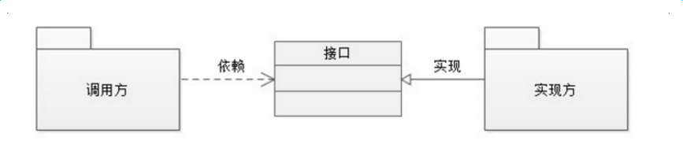
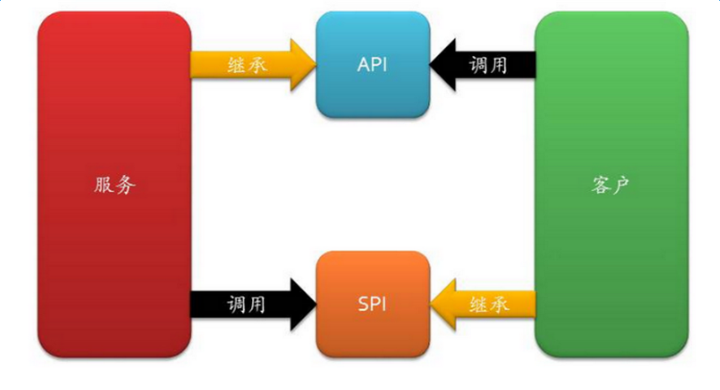
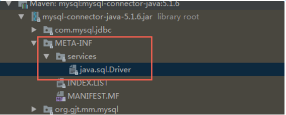
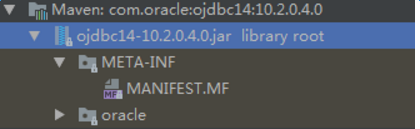
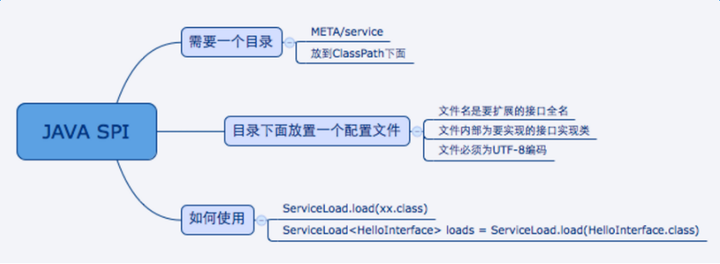

## spi的概念





首先放个图：我们在“调用方”和“实现方”之间需要引入“接口”，可以思考一下什么情况应该把接口放入调用方，什么时候可以把接口归为实现方。

先来看看接口属于实现方的情况，这个很容易理解，实现方提供了接口和实现，我们可以引用接口来达到调用某实现类的功能，这就是我们经常说的api，它具有以下特征：

1. 概念上更接近实现方
2. 组织上位于实现方所在的包中
3. 实现和接口在一个包中

当接口属于调用方时，我们就将其称为spi，全称为：service provider interface，spi的规则如下：

1. 概念上更依赖调用方
2. 组织上位于调用方所在的包中
3. 实现位于独立的包中（也可认为在提供方中）

如下图所示：



（上图来自：[设计原则：小议 SPI 和 API](https://link.zhihu.com/?target=http%3A//www.cnblogs.com/happyframework/archive/2013/09/17/3325560.html)）


## 开源的案例

接下来从几个案例总结下java spi思想


## Jdk

在jdk6里面引进的一个新的特性ServiceLoader，从官方的文档来说，它主要是用来装载一系列的service provider。而且ServiceLoader可以通过service provider的配置文件来装载指定的service provider。当服务的提供者，提供了服务接口的一种实现之后，我们只需要在jar包的META-INF/services/目录里同时创建一个以服务接口命名的文件。该文件里就是实现该服务接口的具体实现类。而当外部程序装配这个模块的时候，就能通过该jar包META-INF/services/里的配置文件找到具体的实现类名，并装载实例化，完成模块的注入。
可能上面讲的有些抽象，下面就结合一个示例来具体讲讲。

## jdk spi案例

我们现在需要使用一个内容搜索接口，搜索的实现可能是基于文件系统的搜索，也可能是基于数据库的搜索。

先定义好接口

```java
package com.cainiao.ys.spi.learn;

import java.util.List;

public interface Search {
    public List<String> searchDoc(String keyword);   
}
```

文件搜索实现

```java
package com.cainiao.ys.spi.learn;

import java.util.List;

public class FileSearch implements Search{
    @Override
    public List<String> searchDoc(String keyword) {
        System.out.println("文件搜索 "+keyword);
        return null;
    }
}
```

数据库搜索实现

```java
package com.cainiao.ys.spi.learn;

import java.util.List;

public class DatabaseSearch implements Search{
    @Override
    public List<String> searchDoc(String keyword) {
        System.out.println("数据搜索 "+keyword);
        return null;
    }
}
```

接下来可以在resources下新建META-INF/services/目录，然后新建接口全限定名的文件：com.cainiao.ys.spi.learn.Search，里面加上我们需要用到的实现类

```java
com.cainiao.ys.spi.learn.FileSearch
```

然后写一个测试方法

```java
package com.cainiao.ys.spi.learn;

import java.util.Iterator;
import java.util.ServiceLoader;

public class TestCase {
    public static void main(String[] args) {
        ServiceLoader<Search> s = ServiceLoader.load(Search.class);
        Iterator<Search> iterator = s.iterator();
        while (iterator.hasNext()) {
           Search search =  iterator.next();
           search.searchDoc("hello world");
        }
    }
}
```

可以看到输出结果：文件搜索 hello world

如果在com.cainiao.ys.spi.learn.Search文件里写上两个实现类，那最后的输出结果就是两行了。
这就是因为ServiceLoader.load(Search.class)在加载某接口时，会去META-INF/services下找接口的全限定名文件，再根据里面的内容加载相应的实现类。

这就是spi的思想，接口的实现由provider实现，provider只用在提交的jar包里的META-INF/services下根据平台定义的接口新建文件，并添加进相应的实现类内容就好。

那为什么配置文件为什么要放在META-INF/services下面？
可以打开ServiceLoader的代码，里面定义了文件的PREFIX如下：

```java
private static final String PREFIX = "META-INF/services/"
```

以上是我们自己的实现，接下来可以看下jdk中DriverManager的spi设计思路

## DriverManager spi案例

DriverManager是jdbc里管理和注册不同数据库driver的工具类。从它设计的初衷来看，和我们前面讨论的场景有相似之处。针对一个数据库，可能会存在着不同的数据库驱动实现。我们在使用特定的驱动实现时，不希望修改现有的代码，而希望通过一个简单的配置就可以达到效果。

我们在使用mysql驱动的时候，会有一个疑问，DriverManager是怎么获得某确定驱动类的？

我们在运用Class.forName("com.mysql.jdbc.Driver")加载mysql驱动后，就会执行其中的静态代码把driver注册到DriverManager中，以便后续的使用。
代码如下：

```java
package com.mysql.jdbc;

public class Driver extends NonRegisteringDriver implements java.sql.Driver {
    public Driver() throws SQLException {
    }

    static {
        try {
            DriverManager.registerDriver(new Driver());
        } catch (SQLException var1) {
            throw new RuntimeException("Can't register driver!");
        }
    }
}
```

这里可以看到，不同的驱动实现了相同的接口java.sql.Driver，然后通过registerDriver把当前driver加载到DriverManager中
这就体现了使用方提供规则，提供方根据规则把自己加载到使用方中的spi思想

这里有一个有趣的地方，查看DriverManager的源码，可以看到其内部的静态代码块中有一个loadInitialDrivers方法，在注释中我们看到用到了上文提到的spi工具类ServiceLoader

```java
/**
* Load the initial JDBC drivers by checking the System property
* jdbc.properties and then use the {@code ServiceLoader} mechanism
*/
static {
	loadInitialDrivers();
	println("JDBC DriverManager initialized");
}
```

点进方法，看到方法里有如下代码：

```java
ServiceLoader<Driver> loadedDrivers = ServiceLoader.load(Driver.class);
Iterator<Driver> drivers = loadedDrivers.iterator();
println("DriverManager.initialize: jdbc.drivers = " + loadedDrivers);
```

可见，DriverManager初始化时也运用了spi的思想，使用ServiceLoader把写到配置文件里的Driver都加载了进来。

我们打开mysql-connector-java的jar包，果然在META-INF/services下发现了上文中提到的接口路径，打开里面的内容，可以看到是com.mysql.jdbc.Driver



其实对符合DriverManager设定规则的驱动，我们并不用去调用class.forname，直接连接就好.因为DriverManager在初始化的时候已经把所有符合的驱动都加载进去了，避免了在程序中频繁加载。

但对于没有符合配置文件规则的驱动，如oracle，它还是需要去显示调用classforname，再执行静态代码块把驱动加载到manager里，因为它不符合配置文件规则:



最后总结一下jdk spi需要遵循的规范




#### Spring Boot 中的SPI 机制

在Spring boot 中也有一种类似的加载机制，它在META-INFO/spring.factories文件中配置接口的实现类名称，然后在程序中读取这些配置文件并实例化。

这种自定义的SPI 机制就是Spring Boot Starter 实现的基础。

## Spring Factories实现原理

spring -core 包里定义了SpringFactoriesLoader 类，这个类实现了检索META-INF/spring.factories文件，并获取指定接口的配置的功能。 在这个类中定义了两个对外的方法：

- loadFactories 根据接口类获取其实现类的实例，这个方法返回的是对象列表
- loadFactoryNames 根据接口获取其接口类的名称，这个方法返回的是类名的列表。

上面两个方法的关键都是从指定的ClassLoader中获取spring.factories文件，并解析得到类名列表，具体代码如下：


```java
    private static Map<String, List<String>> loadSpringFactories(@Nullable ClassLoader classLoader) {
        MultiValueMap<String, String> result = cache.get(classLoader);
        if (result != null) {
            return result;
        }

        try {
            Enumeration<URL> urls = (classLoader != null ?
                    classLoader.getResources(FACTORIES_RESOURCE_LOCATION) :
                    ClassLoader.getSystemResources(FACTORIES_RESOURCE_LOCATION));
            result = new LinkedMultiValueMap<>();
            while (urls.hasMoreElements()) {
                URL url = urls.nextElement();
                UrlResource resource = new UrlResource(url);
                Properties properties = PropertiesLoaderUtils.loadProperties(resource);
                for (Map.Entry<?, ?> entry : properties.entrySet()) {
                    String factoryClassName = ((String) entry.getKey()).trim();
                    for (String factoryName : StringUtils.commaDelimitedListToStringArray((String) entry.getValue())) {
                        result.add(factoryClassName, factoryName.trim());
                    }
                }
            }
            cache.put(classLoader, result);
            return result;
        }
        catch (IOException ex) {
            throw new IllegalArgumentException("Unable to load factories from location [" +
                    FACTORIES_RESOURCE_LOCATION + "]", ex);
        }
    }
```

从代码中可以看到，在这个方法中会遍历整个ClassLoader 中所有Jar包下的spring.factories文件，也就是我们可以在自己jar中配置spring.factories文件，不会影响到其他地方的配置，也不回被别人的配置覆盖。

spring.factories的是通过Properties解析得到的，所以我们在写文件中的内容都是按照下面这种方式配置的。


```java
com.xxx.interface=com.xxx.classname
```

如果一个接口希望配置多个实现类，可以用","分割。

## spring-boot包中的spring.factories文件

在Spring Boot 的很多包中都能够找到spring.factories，下面就是spring-boot 包中的spring.factories文件。


```xml
# PropertySource Loaders
org.springframework.boot.env.PropertySourceLoader=\
org.springframework.boot.env.PropertiesPropertySourceLoader,\
org.springframework.boot.env.YamlPropertySourceLoader

# Run Listeners
org.springframework.boot.SpringApplicationRunListener=\
org.springframework.boot.context.event.EventPublishingRunListener

# Error Reporters
org.springframework.boot.SpringBootExceptionReporter=\
org.springframework.boot.diagnostics.FailureAnalyzers

# Application Context Initializers
org.springframework.context.ApplicationContextInitializer=\
org.springframework.boot.context.ConfigurationWarningsApplicationContextInitializer,\
org.springframework.boot.context.ContextIdApplicationContextInitializer,\
org.springframework.boot.context.config.DelegatingApplicationContextInitializer,\
org.springframework.boot.web.context.ServerPortInfoApplicationContextInitializer

# Application Listeners
org.springframework.context.ApplicationListener=\
org.springframework.boot.ClearCachesApplicationListener,\
org.springframework.boot.builder.ParentContextCloserApplicationListener,\
org.springframework.boot.context.FileEncodingApplicationListener,\
org.springframework.boot.context.config.AnsiOutputApplicationListener,\
org.springframework.boot.context.config.ConfigFileApplicationListener,\
org.springframework.boot.context.config.DelegatingApplicationListener,\
org.springframework.boot.context.logging.ClasspathLoggingApplicationListener,\
org.springframework.boot.context.logging.LoggingApplicationListener,\
org.springframework.boot.liquibase.LiquibaseServiceLocatorApplicationListener

# Environment Post Processors
org.springframework.boot.env.EnvironmentPostProcessor=\
org.springframework.boot.cloud.CloudFoundryVcapEnvironmentPostProcessor,\
org.springframework.boot.env.SpringApplicationJsonEnvironmentPostProcessor,\
org.springframework.boot.env.SystemEnvironmentPropertySourceEnvironmentPostProcessor

# Failure Analyzers
org.springframework.boot.diagnostics.FailureAnalyzer=\
org.springframework.boot.diagnostics.analyzer.BeanCurrentlyInCreationFailureAnalyzer,\
org.springframework.boot.diagnostics.analyzer.BeanNotOfRequiredTypeFailureAnalyzer,\
org.springframework.boot.diagnostics.analyzer.BindFailureAnalyzer,\
org.springframework.boot.diagnostics.analyzer.BindValidationFailureAnalyzer,\
org.springframework.boot.diagnostics.analyzer.UnboundConfigurationPropertyFailureAnalyzer,\
org.springframework.boot.diagnostics.analyzer.ConnectorStartFailureAnalyzer,\
org.springframework.boot.diagnostics.analyzer.NoUniqueBeanDefinitionFailureAnalyzer,\
org.springframework.boot.diagnostics.analyzer.PortInUseFailureAnalyzer,\
org.springframework.boot.diagnostics.analyzer.ValidationExceptionFailureAnalyzer,\
org.springframework.boot.diagnostics.analyzer.InvalidConfigurationPropertyNameFailureAnalyzer,\
org.springframework.boot.diagnostics.analyzer.InvalidConfigurationPropertyValueFailureAnalyzer

# FailureAnalysisReporters
org.springframework.boot.diagnostics.FailureAnalysisReporter=\
org.springframework.boot.diagnostics.LoggingFailureAnalysisReporter
```

在日常工作中，我们可能需要实现一些SDK 或者Sring boot starter 给别人用的时候，我们就可以使用Factories机制，Factories机制可以让SDK或者Stater的使用只需要很少或者不需要进行配置，只需要在服务中引入我们的Jar包就即可。


## @EnableAutoConfiguration

- 总结,@EnableAutoConfiguration 作用：

**从classpath中搜索所有META-INF/spring.factories配置文件然后，将其中org.springframework.boot.autoconfigure.EnableAutoConfiguration key对应的配置项加载到spring容器
只有spring.boot.enableautoconfiguration为true（默认为true）的时候，才启用自动配置**

- @EnableAutoConfiguration还可以进行排除，排除方式有2中，一是根据class来排除（exclude），二是根据class name（excludeName）来排除

其内部实现的关键点有：

1. ImportSelector 该接口的方法的返回值都会被纳入到spring容器管理中
2. SpringFactoriesLoader 该类可以从classpath中搜索所有META-INF/spring.factories配置文件，并读取配置