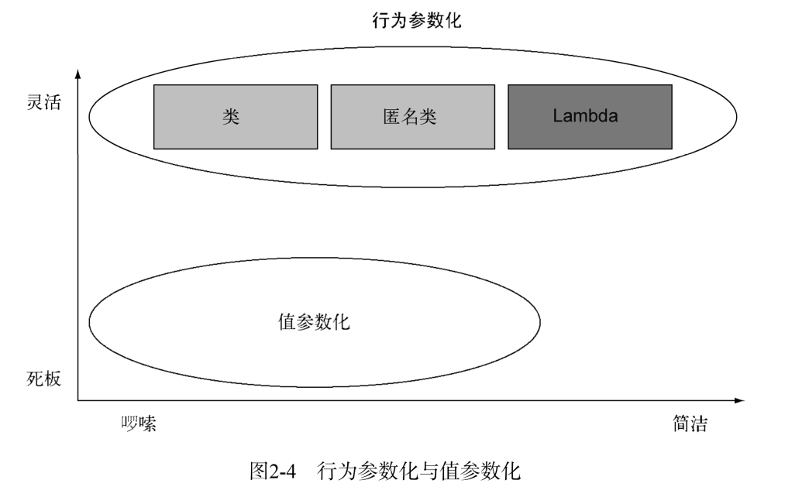
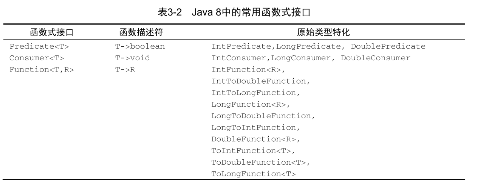
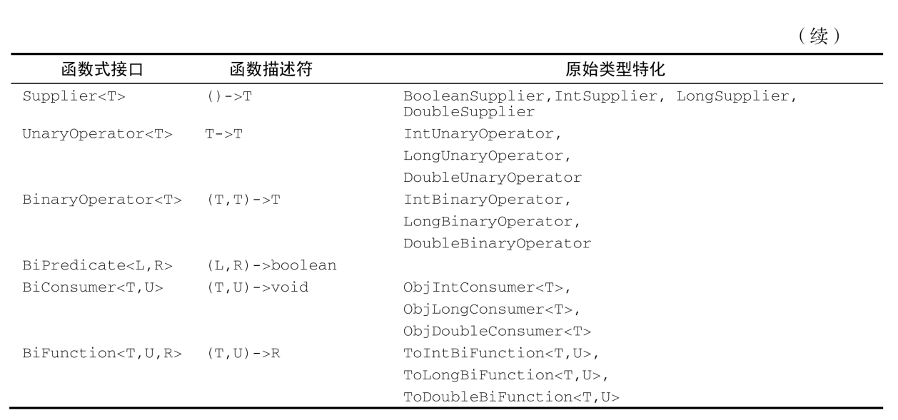

 

## 第一部分 基础知识

### 第 2 章 通过行为参数化传递代码 

行为参数化



```java
public interface Predicate<T>{
	boolean test(T t);
}
public static <T> List<T> filter(List<T> list, Predicate<T> p){
	List<T> result = new ArrayList<>();
	for(T e: list){
		if(p.test(e)){
			result.add(e);
		}
	}
	return result;
}
```

现在你可以把filter方法用在香蕉、桔子、 Integer或是String的列表上了。这里有一个
使用Lambda表达式的例子：

```java
List<Apple> redApples =
filter(inventory, (Apple apple) -> "red".equals(apple.getColor()));
List<Integer> evenNumbers =
filter(numbers, (Integer i) -> i % 2 == 0);  
```

#### 2.5 小结

以下是你应从本章中学到的关键概念。
 行为参数化，就是一个方法接受多个不同的行为作为参数，并在内部使用它们， 完
同行为的能力。
 行为参数化可让代码更好地适应不断变化的要求，减轻未来的工作量。
 传递代码，就是将新行为作为参数传递给方法。但在Java 8之前这实现起来很啰嗦。
口声明许多只用一次的实体类而造成的啰嗦代码，在Java 8之前可以用匿名类来减少
 Java API包含很多可以用不同行为进行参数化的方法，包括排序、线程和GUI处理。  


### 第 3 章 Lambda 表达式

#### 3.2 常用的函数式接口





一言以蔽之， 函数式接口就是只定义一个抽象方法的接口。你已经知道了Java API中的一些
其他函数式接口，如我们在第2章中谈到的Comparator和Runnable。

```java
public interface Comparator<T> { int compare(T o1, T o2);

}

public interface Runnable{ void run();

}
public interface ActionListener extends EventListener{
	void actionPerformed(ActionEvent e);
}

public interface Callable<V>{ V call();

}

public interface PrivilegedAction<V>{ V run();

}
```

@FunctionalInterface又是怎么回事？
如果你去看看新的Java API，会发现函数式接口带有@FunctionalInterface的标注（ 3.4
节中会深入研究函数式接口，并会给出一个长长的列表）。这个标注用于表示该接口会设计成
一个函数式接口。如果你用@FunctionalInterface定义了一个接口，而它却不是函数式接
口的话，编译器将返回一个提示原因的错误。  


#### 3.6 构造函数引用

构造函数引用  

不将构造函数实例化却能够引用它，这个功能有一些有趣的应用。例如，你可以使用Map来
将构造函数映射到字符串值。你可以创建一个giveMeFruit方法，给它一个String和一个
Integer，它就可以创建出不同重量的各种水果：

```java
static Map<String, Function<Integer, Fruit>> map = new HashMap<>();
static {
	map.put("apple", Apple::new);
	map.put("orange", Orange::new);
	// etc...
}
public static Fruit giveMeFruit(String fruit, Integer weight){
	return map.get(fruit.toLowerCase())
			.apply(weight);
}  
```

你已经看到了如何将有零个、一个、两个参数的构造函数转变为构造函数引用。那要怎么
样才能对具有三个参数的构造函数，比如Color(int, int, int)， 使用构造函数引用呢？
答案：你看，构造函数引用的语法是ClassName::new，那么在这个例子里面就是
Color::new。但是你需要与构造函数引用的签名匹配的函数式接口。但是语言本身并没有提
供这样的函数式接口，你可以自己创建一个：

```java
public interface TriFunction<T, U, V, R>{
	R apply(T t, U u, V v);
}
```

现在你可以像下面这样使用构造函数引用了：

```java
TriFunction<Integer, Integer, Integer, Color> colorFactory = Color::new;  
```

#### 3.7 Lambda和方法引用实战

为了给这一章还有我们讨论的所有关于Lambda的内容收个尾，我们需要继续研究开始的那
个问题——用不同的排序策略给一个Apple列表排序，并需要展示如何把一个原始粗暴的解决方案转变得更为简明。这会用到书中迄今讲到的所有概念和功能：行为参数化、匿名类、 Lambda
表达式和方法引用。我们想要实现的最终解决方案是这样的（请注意，所有源代码均可见于本书
网站）：

```java
inventory.sort(comparing(Apple::getWeight));  
```

##### 3.7.1 第 1 步：传递代码

你很幸运， Java 8的API已经为你提供了一个List可用的sort方法，你不用自己去实现它。
那么最困难的部分已经搞定了！但是，如何把排序策略传递给sort方法呢？你看， sort方法的
签名是这样的：

```java
void sort(Comparator<? super E> c)

```

它需要一个Comparator对象来比较两个Apple！这就是在Java中传递策略的方式：它们必
须包裹在一个对象里。我们说sort的行为被参数化了：传递给它的排序策略不同，其行为也会
不同。
你的第一个解决方案看上去是这样的：

```java
public class AppleComparator implements Comparator<Apple> {
	public int compare(Apple a1, Apple a2){
		return a1.getWeight().compareTo(a2.getWeight());
	}
}
inventory.sort(new AppleComparator());  
```

##### 3.7.2 第 2 步：使用匿名类

你在前面看到了，你可以使用匿名类来改进解决方案，而不是实现一个Comparator却只实
例化一次：

```java
inventory.sort(new Comparator<Apple>() {
	public int compare(Apple a1, Apple a2){
		return a1.getWeight().compareTo(a2.getWeight());
	}
})  
```

##### 3.7.3 第 3 步：使用 Lambda 表达式

但你的解决方案仍然挺啰嗦的。 Java 8引入了Lambda表达式，它提供了一种轻量级语法来实
现相同的目标： 传递代码。你看到了，在需要函数式接口的地方可以使用Lambda表达式。我们
回顾一下：函数式接口就是仅仅定义一个抽象方法的接口。抽象方法的签名（称为函数描述符）
描述了Lambda表达式的签名。在这个例子里， Comparator代表了函数描述符(T, T) -> int。
因为你用的是苹果，所以它具体代表的就是(Apple, Apple) -> int。改进后的新解决方案看上去就是这样的了：

```java
inventory.sort((Apple a1, Apple a2)
-> a1.getWeight().compareTo(a2.getWeight())
);
```

我们前面解释过了， Java编译器可以根据Lambda出现的上下文来推断Lambda表达式参数的
类型。那么你的解决方案就可以重写成这样：

```java
inventory.sort((a1, a2) -> a1.getWeight().compareTo(a2.getWeight()));
```

你的代码还能变得更易读一点吗？ Comparator具有一个叫作comparing的静态辅助方法，
它可以接受一个Function来提取Comparable键值，并生成一个Comparator对象（我们会在第
9章解释为什么接口可以有静态方法）。它可以像下面这样用（注意你现在传递的Lambda只有一
个参数： Lambda说明了如何从苹果中提取需要比较的键值）：

```java
Comparator<Apple> c = Comparator.comparing((Apple a) -> a.getWeight());
```

现在你可以把代码再改得紧凑一点了：

```java
import static java.util.Comparator.comparing;
inventory.sort(comparing((a) -> a.getWeight()));  
```

##### 3.7.4 第 4 步：使用方法引用

前面解释过，方法引用就是替代那些转发参数的Lambda表达式的语法糖。你可以用方法引
用让你的代码更简洁（假设你静态导入了java.util.Comparator.comparing）：

```java
inventory.sort(comparing(Apple::getWeight));
```

恭喜你，这就是你的最终解决方案！这比Java 8之前的代码好在哪儿呢？它比较短；它的意
思也很明显，并且代码读起来和问题描述差不多：“对库存进行排序，比较苹果的重量。”  

#### 3.10 小结

以下是你应从本章中学到的关键概念。
 Lambda表达式可以理解为一种匿名函数：它没有名称，但有参数列表、函数主体、返回
类型，可能还有一个可以抛出的异常的列表。
 Lambda表达式让你可以简洁地传递代码。
 函数式接口就是仅仅声明了一个抽象方法的接口。
 只有在接受函数式接口的地方才可以使用Lambda表达式。
 Lambda表达式允许你直接内联，为函数式接口的抽象方法提供实现，并且将整个表达式
作为函数式接口的一个实例。
 Java 8自带一些常用的函数式接口，放在java.util.function包里，包括Predicate
<T>、 Function<T,R>、 Supplier<T>、 Consumer<T>和BinaryOperator<T>，如表
3-2所述。
 为了避免装箱操作，对Predicate<T>和Function<T, R>等通用函数式接口的原始类型
特化： IntPredicate、 IntToLongFunction等。  

 环绕执行模式（即在方法所必需的代码中间，你需要执行点儿什么操作，比如资源分配
和清理）可以配合Lambda提高灵活性和可重用性。
 Lambda表达式所需要代表的类型称为目标类型。
 方法引用让你重复使用现有的方法实现并直接传递它们。
 Comparator、 Predicate和Function等函数式接口都有几个可以用来结合Lambda表达
式的默认方法。

## 第二部分 函数式数据处理  

### 第 4 章 引入流

#### 4.5 小结

以下是你应从本章中学到的一些关键概念。
 流是“从支持数据处理操作的源生成的一系列元素”。
 流利用内部迭代：迭代通过filter、 map、 sorted等操作被抽象掉了。
 流操作有两类：中间操作和终端操作。
 filter和map等中间操作会返回一个流，并可以链接在一起。可以用它们来设置一条流
水线，但并不会生成任何结果。
 forEach和count等终端操作会返回一个非流的值，并处理流水线以返回结果。
 流中的元素是按需计算的。  

### 第 5 章  使用流

#### 5.1 筛选与切片

filter，distinct，limit，skip

#### 5.2 映射

1、map

2、flatmap

(3) 如何扩展前一个例子，只返回总和能被3整除的数对呢？例如(2, 4)和(3, 3)是可以的。
答案：你在前面看到了， filter可以配合谓词使用来筛选流中的元素。因为在flatMap
操作后，你有了一个代表数对的int[]流，所以你只需要一个谓词来检查总和是否能被3整除
就可以了：

```java
List<Integer> numbers1 = Arrays.asList(1, 2, 3);
        List<Integer> numbers2 = Arrays.asList(3, 4);
        List<int[]> pairs =
                numbers1.stream()
                        .flatMap(i ->
                                numbers2.stream()
                                        .filter(j -> (i + j) % 3 == 0)
                                        .map(j -> new int[]{i, j})
                        )
                        .collect(toList());
```

其结果是[(2, 4), (3, 3)] 。

#### 5.3 查找和匹配

另一个常见的数据处理套路是看看数据集中的某些元素是否匹配一个给定的属性。 Stream
API通过allMatch、 anyMatch、 noneMatch、 findFirst和findAny方法提供了这样的工具。  

其结果是[(2, 4), (3, 3)]  

```java
List<Integer> someNumbers = Arrays.asList(1, 2, 3, 4, 5);
Optional<Integer> firstSquareDivisibleByThree =
	someNumbers.stream()
		.map(x -> x * x)
		.filter(x -> x % 3 == 0)
		.findFirst(); // 9  
```

#### 5.4 归约

reduce，

要是还能把所有的数字相乘，而不必去复制粘贴这段代码，岂不是很好？这正是reduce操
作的用武之地，它对这种重复应用的模式做了抽象。你可以像下面这样对流中所有的元素求和：

```java
int sum = numbers.stream().reduce(0, (a, b) -> a + b);
int calories = menu.stream()
				.map(Dish::getCalories)
				.reduce(0, Integer::sum);
```

reduce接受两个参数：
 一个初始值，这里是0；
 一个BinaryOperator<T>来将两个元素结合起来产生一个新值，这里我们用的是
lambda (a, b) -> a + b。
你也很容易把所有的元素相乘，只需要将另一个Lambda： (a, b) -> a * b传递给reduce
操作就可以了：

```java
int product = numbers.stream().reduce(1, (a, b) -> a * b);  
```

无初始值
reduce还有一个重载的变体，它不接受初始值，但是会返回一个Optional对象：

```java
Optional<Integer> sum = numbers.stream().reduce((a, b) -> (a + b));
```

为什么它返回一个Optional<Integer>呢？考虑流中没有任何元素的情况。 reduce操作无
法返回其和，因为它没有初始值。这就是为什么结果被包裹在一个Optional对象里，以表明和
可能不存在。  

#### 5.6 数值流

```
int calories = menu.stream().mapToInt(Dish::getCalories).sum();  
```

#### 5.8 小结

 Streams API可以表达复杂的数据处理查询。常用的流操作总结在表5-1中。
 你可以使用filter、 distinct、 skip和limit对流做筛选和切片。
 你可以使用map和flatMap提取或转换流中的元素。
 你 可 以 使 用 findFirst 和 findAny 方 法 查 找 流 中 的 元 素 。 你 可 以 用 allMatch 、
noneMatch和anyMatch方法让流匹配给定的谓词。
 这些方法都利用了短路：找到结果就立即停止计算；没有必要处理整个流。
 你可以利用reduce方法将流中所有的元素迭代合并成一个结果，例如求和或查找最大
元素。
 filter和map等操作是无状态的，它们并不存储任何状态。 reduce等操作要存储状态才
能计算出一个值。 sorted和distinct等操作也要存储状态，因为它们需要把流中的所
有元素缓存起来才能返回一个新的流。这种操作称为有状态操作。
 流有三种基本的原始类型特化： IntStream、 DoubleStream和LongStream。它们的操
作也有相应的特化。
 流不仅可以从集合创建，也可从值、数组、文件以及iterate与generate等特定方法
创建。
 无限流是没有固定大小的流。  

### 第 6 章 用流收集数据

#### 6.1 收集器简介

#### 6.2 归约与汇总

##### 6.2.1 查找流中的最大值和最小值

##### 6.2.4 广义的归约汇总

事实上，我们已经讨论的所有收集器，都是一个可以用reducing工厂方法定义的归约过程
的特殊情况而已。 Collectors.reducing工厂方法是所有这些特殊情况的一般化。可以说，先
前讨论的案例仅仅是为了方便程序员而已。（但是，请记得方便程序员和可读性是头等大事！ ）例
如，可以用reducing方法创建的收集器来计算你菜单的总热量，如下所示：

```java
int totalCalories = menu.stream().collect(reducing(0, Dish::getCalories, (i, j) -> i + j));
```

它需要三个参数。
 第一个参数是归约操作的起始值，也是流中没有元素时的返回值，所以很显然对于数值
和而言0是一个合适的值。
 第二个参数就是你在6.2.2节中使用的函数，将菜肴转换成一个表示其所含热量的int。
 第三个参数是一个BinaryOperator，将两个项目累积成一个同类型的值。这里它就是
对两个int求和。  

它需要三个参数。
 第一个参数是归约操作的起始值，也是流中没有元素时的返回值，所以很显然对于数值
和而言0是一个合适的值。
 第二个参数就是你在6.2.2节中使用的函数，将菜肴转换成一个表示其所含热量的int。
 第三个参数是一个BinaryOperator，将两个项目累积成一个同类型的值。这里它就是
对两个int求和。  

在现实中，我们在6.2节开始时提到的counting收集器也是类似地利用三参数reducing工厂
方法实现的。它把流中的每个元素都转换成一个值为1的Long型对象，然后再把它们相加：

```java
public static <T> Collector<T, ?, Long> counting() {
	return reducing(0L, e -> 1L, Long::sum);
}  
```

#### 6.3 分组

##### 6.3.1 多级分组

```java
Map<Dish.Type, Map<CaloricLevel, List<Dish>>> dishesByTypeCaloricLevel =
	menu.stream().collect(
			groupingBy(Dish::getType,
				groupingBy(dish -> {
					if (dish.getCalories() <= 400) return CaloricLevel.DIET;
					else if (dish.getCalories() <= 700) return CaloricLevel.NORMAL;
					else return CaloricLevel.FAT;
			} )
	)
);
```

##### 6.3.2 按子组收集数据

```java
Map<Dish.Type, Integer> totalCaloriesByType =
	menu.stream().collect(groupingBy(Dish::getType,
	summingInt(Dish::getCalories)));
```

#### 6.7 小结

 collect是一个终端操作，它接受的参数是将流中元素累积到汇总结果的各种方式（称
为收集器）。
 预定义收集器包括将流元素归约和汇总到一个值，例如计算最小值、最大值或平均值。
这些收集器总结在表6-1中。
 预定义收集器可以用groupingBy对流中元素进行分组，或用partitioningBy进行分区。
 收集器可以高效地复合起来，进行多级分组、分区和归约。
 你可以实现Collector接口中定义的方法来开发你自己的收集器。  

### 第 7 章  并行数据处理与性能

#### 7.4 小结

在本章中，你了解了以下内容。
 内部迭代让你可以并行处理一个流，而无需在代码中显式使用和协调不同的线程。
 虽然并行处理一个流很容易，却不能保证程序在所有情况下都运行得更快。并行软件的
行为和性能有时是违反直觉的，因此一定要测量，确保你并没有把程序拖得更慢。
 像并行流那样对一个数据集并行执行操作可以提升性能，特别是要处理的元素数量庞大，
或处理单个元素特别耗时的时候。
 从性能角度来看，使用正确的数据结构，如尽可能利用原始流而不是一般化的流，几乎
总是比尝试并行化某些操作更为重要。
 分支/合并框架让你得以用递归方式将可以并行的任务拆分成更小的任务，在不同的线程
上执行，然后将各个子任务的结果合并起来生成整体结果。
 Spliterator定义了并行流如何拆分它要遍历的数据。  

## 第三部分 高效 Java 8 编程

### 第 8 章 重构、测试和调试

#### 8.5 小结

下面回顾一下这一章的主要内容。
 Lambda表达式能提升代码的可读性和灵活性。
 如果你的代码中使用了匿名类，尽量用Lambda表达式替换它们，但是要注意二者间语义
的微妙差别，比如关键字this，以及变量隐藏。
 跟Lambda表达式比起来，方法引用的可读性更好 。
 尽量使用Stream API替换迭代式的集合处理。
 Lambda表达式有助于避免使用面向对象设计模式时容易出现的僵化的模板代码，典型的
比如策略模式、模板方法、观察者模式、责任链模式，以及工厂模式。
 即使采用了Lambda表达式，也同样可以进行单元测试，但是通常你应该关注使用了
Lambda表达式的方法的行为。
 尽量将复杂的Lambda表达式抽象到普通方法中。
 Lambda表达式会让栈跟踪的分析变得更为复杂。
 流提供的peek方法在分析Stream流水线时，能将中间变量的值输出到日志中，是非常有
用的工具。  

### 第 9 章 默认方法

#### 9.5 小结 

下面是本章你应该掌握的关键概念。
 Java 8中的接口可以通过默认方法和静态方法提供方法的代码实现。
 默认方法的开头以关键字default修饰，方法体与常规的类方法相同。
 向发布的接口添加抽象方法不是源码兼容的。
 默认方法的出现能帮助库的设计者以后向兼容的方式演进API。
 默认方法可以用于创建可选方法和行为的多继承。
 我们有办法解决由于一个类从多个接口中继承了拥有相同函数签名的方法而导致的冲突。
 类或者父类中声明的方法的优先级高于任何默认方法。如果前一条无法解决冲突，那就
选择同函数签名的方法中实现得最具体的那个接口的方法。
 两个默认方法都同样具体时，你需要在类中覆盖该方法，显式地选择使用哪个接口中提
供的默认方法。  

### 第 10 章 用 Optional 取代 null

#### 10.5 小结

这一章中，你学到了以下的内容。
 null引用在历史上被引入到程序设计语言中，目的是为了表示变量值的缺失。
 Java 8中引入了一个新的类java.util.Optional<T>，对存在或缺失的变量值进行
建模。
 你可以使用静态工厂方法Optional.empty、 Optional.of以及Optional.ofNullable创建Optional对象。
 Optional类支持多种方法，比如map、 flatMap、 filter，它们在概念上与Stream类
中对应的方法十分相似。
 使用Optional会迫使你更积极地解引用Optional对象，以应对变量值缺失的问题，最
终，你能更有效地防止代码中出现不期而至的空指针异常。
 使用Optional能帮助你设计更好的API，用户只需要阅读方法签名，就能了解该方法是
否接受一个Optional类型的值  

### 第 11 章 CompletableFuture：组合式异步编程

#### 11.6 小结

这一章中，你学到的内容如下。
 执行比较耗时的操作时，尤其是那些依赖一个或多个远程服务的操作，使用异步任务可
以改善程序的性能，加快程序的响应速度。
 你应该尽可能地为客户提供异步API。使用CompletableFuture类提供的特性，你能够
轻松地实现这一目标。
 CompletableFuture类还提供了异常管理的机制，让你有机会抛出/管理异步任务执行
中发生的异常。
 将同步API的调用封装到一个CompletableFuture中，你能够以异步的方式使用其结果。
 如果异步任务之间相互独立，或者它们之间某一些的结果是另一些的输入，你可以将这
些异步任务构造或者合并成一个。
 你可以为CompletableFuture注册一个回调函数，在Future执行完毕或者它们计算的
结果可用时，针对性地执行一些程序。
 你可以决定在什么时候结束程序的运行，是等待由CompletableFuture对象构成的列表
中所有的对象都执行完毕，还是只要其中任何一个首先完成就中止程序的运行。  

### 第 12 章 新的日期和时间 API

#### 12.4 小结

这一章中，你应该掌握下面这些内容。
 Java 8之前老版的java.util.Date类以及其他用于建模日期时间的类有很多不一致及
设计上的缺陷，包括易变性以及糟糕的偏移值、默认值和命名。
 新版的日期和时间API中，日期时间对象是不可变的。
 新的API提供了两种不同的时间表示方式，有效地区分了运行时人和机器的不同需求。
 你可以用绝对或者相对的方式操纵日期和时间，操作的结果总是返回一个新的实例，老
的日期时间对象不会发生变化。
 TemporalAdjuster让你能够用更精细的方式操纵日期，不再局限于一次只能改变它的
一个值，并且你还可按照需求定义自己的日期转换器。
 你现在可以按照特定的格式需求，定义自己的格式器，打印输出或者解析日期时间对象。
这些格式器可以通过模板创建，也可以自己编程创建，并且它们都是线程安全的。
 你可以用相对于某个地区/位置的方式，或者以与UTC/格林尼治时间的绝对偏差的方式表
示时区，并将其应用到日期时间对象上，对其进行本地化。
 你现在可以使用不同于ISO-8601标准系统的其他日历系统了。  

## 第四部分 超越 Java8

### 第 13 章 函数式的思考

#### 13.4 小结

下面是这一章中你应该掌握的关键概念。
 从长远看，减少共享的可变数据结构能帮助你降低维护和调试程序的代价。
 函数式编程支持无副作用的方法和声明式编程。
 函数式方法可以由它的输入参数及输出结果进行判断。
 如果一个函数使用相同的参数值调用，总是返回相同的结果，那么它是引用透明的。采
用递归可以取得迭代式的结构，比如while循环。
 相对于Java语言中传统的递归，“尾递”可能是一种更好的方式，它开启了一扇门，让我
们有机会最终使用编译器进行优化。  

### 第 14 章 函数式编程的技巧

#### 14.1 无处不在的函数

第13章中我们使用术语“函数式编程”意指函数或者方法的行为应该像“数学函数”一样——没有任何副作用。对于使用函数式语言的程序员而言，这个术语的范畴更加宽泛，它还意味着函数可以像任何其他值一样随意使用：可以作为参数传递，可以作为返回值，还能存储在数据结构中。能够像普通变量一样使用的函数称为一等函数（ first-class function）。这是Java 8补充的全新内容：通过::操作符，你可以创建一个方法引用，像使用函数值一样使用方法，也能使用Lambda表达式（比如， (int x) -> x + 1）直接表示方法的值。 Java 8中使用下面这样的方法引用将一个方法引用保存到一个变量是合理合法的：

```java
Function<String, Integer> strToInt = Integer::parseInt;  
```

##### 14.1.2 科里化

```java
static double converter(double x, double f, double b) {
	return x * f + b;
}
```

```java
static DoubleUnaryOperator curriedConverter(double f, double b){
	return (double x) -> x * f + b;
}
```

```java
DoubleUnaryOperator convertCtoF = curriedConverter(9.0/5, 32);
DoubleUnaryOperator convertUSDtoGBP = curriedConverter(0.6, 0);
DoubleUnaryOperator convertKmtoMi = curriedConverter(0.6214, 0);
double gbp = convertUSDtoGBP.applyAsDouble(1000);
```

