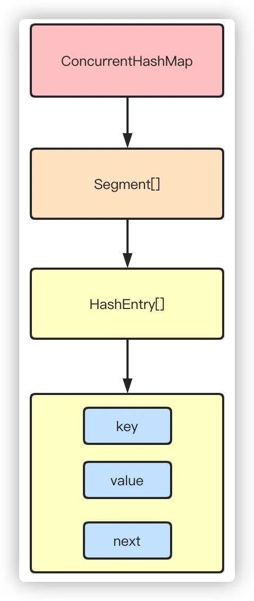
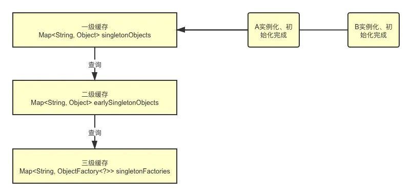

## 面试题系列：JVM 夺命连环10问

## **1.说说 JVM 的内存布局？** 

Java虚拟机主要包含几个区域：

**堆：**堆Java虚拟机中最大的一块内存，是线程共享的内存区域，基本上所有的对象实例数组都是在堆上分配空间。堆区细分为Yound区年轻代和Old区老年代，其中年轻代又分为Eden、S0、S1 3个部分，他们默认的比例是8:1:1的大小。

**栈：**栈是线程私有的内存区域，每个方法执行的时候都会在栈创建一个栈帧，方法的调用过程就对应着栈的入栈和出栈的过程。每个栈帧的结构又包含局部变量表、操作数栈、动态连接、方法返回地址。

局部变量表用于存储方法参数和局部变量。当第一个方法被调用的时候，他的参数会被传递至从0开始的连续的局部变量表中。

操作数栈用于一些字节码指令从局部变量表中传递至操作数栈，也用来准备方法调用的参数以及接收方法返回结果。

动态连接用于将符号引用表示的方法转换为实际方法的直接引用。

**元数据：**在Java1.7之前，包含方法区的概念，常量池就存在于方法区（永久代）中，而方法区本身是一个逻辑上的概念，在1.7之后则是把常量池移到了堆内，1.8之后移出了永久代的概念(方法区的概念仍然保留)，实现方式则是现在的元数据。它包含类的元信息和运行时常量池。

Class文件就是类和接口的定义信息。

运行时常量池就是类和接口的常量池运行时的表现形式。

**本地方法栈：**主要用于执行本地native方法的区域

**程序计数器：**也是线程私有的区域，用于记录当前线程下虚拟机正在执行的字节码的指令地址

## **2.知道 new 一个对象的过程吗？**

当虚拟机遇见new关键字时候，实现判断当前类是否已经加载，如果类没有加载，首先执行类的加载机制，加载完成后再为对象分配空间、初始化等。

1.首先校验当前类是否被加载，如果没有加载，执行类加载机制

2.加载：就是从字节码加载成二进制流的过程

3.验证：当然加载完成之后，当然需要校验Class文件是否符合虚拟机规范，跟我们接口请求一样，第一件事情当然是先做个参数校验了

4.准备：为静态变量、常量赋默认值

5.解析：把常量池中符号引用(以符号描述引用的目标)替换为直接引用(指向目标的指针或者句柄等)的过程

6.初始化：执行static代码块(cinit)进行初始化，如果存在父类，先对父类进行初始化

Ps：静态代码块是绝对线程安全的，只能隐式被java虚拟机在类加载过程中初始化调用！(此处该有问题static代码块线程安全吗？)

当类加载完成之后，紧接着就是对象分配内存空间和初始化的过程

1.首先为对象分配合适大小的内存空间

2.接着为实例变量赋默认值

3.设置对象的头信息，对象hash码、GC分代年龄、元数据信息等

4.执行构造函数(init)初始化

##  

## **3.知道双亲委派模型吗？**

**
**

类加载器自顶向下分为：

1.Bootstrap ClassLoader启动类加载器：默认会去加载JAVA_HOME/lib目录下的jar

2.Extention ClassLoader扩展类加载器：默认去加载JAVA_HOME/lib/ext目录下的jar

3.Application ClassLoader应用程序类加载器：比如我们的web应用，会加载web程序中ClassPath下的类

4.User ClassLoader用户自定义类加载器：由用户自己定义

当我们在加载类的时候，首先都会向上询问自己的父加载器是否已经加载，如果没有则依次向上询问，如果没有加载，则从上到下依次尝试是否能加载当前类，直到加载成功。

**4.说说有哪些垃圾回收算法？**

### **标记-清除**

统一标记出需要回收的对象，标记完成之后统一回收所有被标记的对象，而由于标记的过程需要遍历所有的GC ROOT，清除的过程也要遍历堆中所有的对象，所以标记-清除算法的效率低下，同时也带来了内存碎片的问题。

### **复制算法**

为了解决性能的问题，复制算法应运而生，它将内存分为大小相等的两块区域，每次使用其中的一块，当一块内存使用完之后，将还存活的对象拷贝到另外一块内存区域中，然后把当前内存清空，这样性能和内存碎片的问题得以解决。但是同时带来了另外一个问题，可使用的内存空间缩小了一半！

因此，诞生了我们现在的常见的年轻代+老年代的内存结构：Eden+S0+S1组成，因为根据IBM的研究显示，98%的对象都是朝生夕死，所以实际上存活的对象并不是很多，完全不需要用到一半内存浪费，所以默认的比例是8:1:1。

这样，在使用的时候只使用Eden区和S0S1中的一个，每次都把存活的对象拷贝另外一个未使用的Survivor区，同时清空Eden和使用的Survivor，这样下来内存的浪费就只有10%了。

如果最后未使用的Survivor放不下存活的对象，这些对象就进入Old老年代了。

PS：所以有一些初级点的问题会问你为什么要分为Eden区和2个Survior区？有什么作用？就是为了节省内存和解决内存碎片的问题，这些算法都是为了解决问题而产生的，如果理解原因你就不需要死记硬背了

### **标记-整理**

针对老年代再用复制算法显然不合适，因为进入老年代的对象都存活率比较高了，这时候再频繁的复制对性能影响就比较大，而且也不会再有另外的空间进行兜底。所以针对老年代的特点，通过标记-整理算法，标记出所有的存活对象，让所有存活的对象都向一端移动，然后清理掉边界以外的内存空间。

## **5.那么什么是 GC ROOT？有哪些 GC ROOT？**

上面提到的标记的算法，怎么标记一个对象是否存活？简单的通过引用计数法，给对象设置一个引用计数器，每当有一个地方引用他，就给计数器+1，反之则计数器-1，但是这个简单的算法无法解决循环引用的问题。

Java通过可达性分析算法来达到标记存活对象的目的，定义一系列的GC ROOT为起点，从起点开始向下开始搜索，搜索走过的路径称为引用链，当一个对象到GC ROOT没有任何引用链相连的话，则对象可以判定是可以被回收的。

而可以作为GC ROOT的对象包括：

1.栈中引用的对象

2.静态变量、常量引用的对象

3.本地方法栈native方法引用的对象

##  

## **6.垃圾回收器了解吗？年轻代和老年代都有哪些垃圾回收器？**

年轻代的垃圾收集器包含有Serial、ParNew、Parallell，老年代则包括Serial Old老年代版本、CMS、Parallel Old老年代版本和JDK11中的船新的G1收集器。

**Serial：**单线程版本收集器，进行垃圾回收的时候会STW（Stop The World），也就是进行垃圾回收的时候其他的工作线程都必须暂停

**ParNew：**Serial的多线程版本，用于和CMS配合使用

**Parallel Scavenge：**可以并行收集的多线程垃圾收集器

**Serial Old：**Serial的老年代版本，也是单线程

**Parallel Old：**Parallel Scavenge的老年代版本

CMS（Concurrent Mark Sweep）：CMS收集器是以获取最短停顿时间为目标的收集器，相对于其他的收集器STW的时间更短暂，可以并行收集是他的特点，同时他基于标记-清除算法，整个GC的过程分为4步。

1.初始标记：标记GC ROOT能关联到的对象，需要STW

2.并发标记：从GCRoots的直接关联对象开始遍历整个对象图的过程，不需要STW

3.重新标记：为了修正并发标记期间，因用户程序继续运作而导致标记产生改变的标记，需要STW

4.并发清除：清理删除掉标记阶段判断的已经死亡的对象，不需要STW

从整个过程来看，并发标记和并发清除的耗时最长，但是不需要停止用户线程，而初始标记和重新标记的耗时较短，但是需要停止用户线程，总体而言，整个过程造成的停顿时间较短，大部分时候是可以和用户线程一起工作的。

G1（Garbage First）：G1收集器是JDK9的默认垃圾收集器，而且不再区分年轻代和老年代进行回收。

## **7.G1 的原理了解吗？**

G1作为JDK9之后的服务端默认收集器，且不再区分年轻代和老年代进行垃圾回收，他把内存划分为多个Region，每个Region的大小可以通过-XX：G1HeapRegionSize设置，大小为1~32M，对于大对象的存储则衍生出Humongous的概念，超过Region大小一半的对象会被认为是大对象，而超过整个Region大小的对象被认为是超级大对象，将会被存储在连续的N个Humongous Region中，G1在进行回收的时候会在后台维护一个优先级列表，每次根据用户设定允许的收集停顿时间优先回收收益最大的Region。

G1的回收过程分为以下四个步骤：

1.初始标记：标记GC ROOT能关联到的对象，需要STW

2.并发标记：从GCRoots的直接关联对象开始遍历整个对象图的过程，扫描完成后还会重新处理并发标记过程中产生变动的对象

3.最终标记：短暂暂停用户线程，再处理一次，需要STW

4.筛选回收：更新Region的统计数据，对每个Region的回收价值和成本排序，根据用户设置的停顿时间制定回收计划。再把需要回收的Region中存活对象复制到空的Region，同时清理旧的Region。需要STW

总的来说除了并发标记之外，其他几个过程也还是需要短暂的STW，G1的目标是在停顿和延迟可控的情况下尽可能提高吞吐量。

## **8.什么时候会触发 YGC 和 FGC？对象什么时候会进入老年代？**

当一个新的对象来申请内存空间的时候，如果Eden区无法满足内存分配需求，则触发YGC，使用中的Survivor区和Eden区存活对象送到未使用的Survivor区，如果YGC之后还是没有足够空间，则直接进入老年代分配，如果老年代也无法分配空间，触发FGC，FGC之后还是放不下则报出OOM异常。

YGC之后，存活的对象将会被复制到未使用的Survivor区，如果S区放不下，则直接晋升至老年代。而对于那些一直在Survivor区来回复制的对象，通过-XX：MaxTenuringThreshold配置交换阈值，默认15次，如果超过次数同样进入老年代。

此外，还有一种动态年龄的判断机制，不需要等到MaxTenuringThreshold就能晋升老年代。如果在Survivor空间中相同年龄所有对象大小的总和大于Survivor空间的一半，年龄大于或等于该年龄的对象就可以直接进入老年代。

## **9.频繁 FullGC 怎么排查？**

这种问题最好的办法就是结合有具体的例子举例分析，如果没有就说一般的分析步骤。发生FGC有可能是内存分配不合理，比如Eden区太小，导致对象频繁进入老年代，这时候通过启动参数配置就能看出来，另外有可能就是存在内存泄露，可以通过以下的步骤进行排查：

1.jstat -gcutil或者查看gc.log日志，查看内存回收情况

S0 S1 分别代表两个Survivor区占比

E代表Eden区占比，图中可以看到使用78%

O代表老年代，M代表元空间，YGC发生54次，YGCT代表YGC累计耗时，GCT代表GC累计耗时。

[GC [FGC 开头代表垃圾回收的类型

PSYoungGen: 6130K->6130K(9216K)] 12274K->14330K(19456K), 0.0034895 secs代表YGC前后内存使用情况

Times: user=0.02 sys=0.00, real=0.00 secs，user表示用户态消耗的CPU时间，sys表示内核态消耗的CPU时间，real表示各种墙时钟的等待时间

这两张图只是举例并没有关联关系，比如你从图里面看能到是否进行FGC，FGC的时间花费多长，GC后老年代，年轻代内存是否有减少，得到一些初步的情况来做出判断。

2.dump出内存文件在具体分析，比如通过jmap命令jmap -dump:format=b,file=dumpfile pid，导出之后再通过Eclipse Memory Analyzer等工具进行分析，定位到代码，修复

这里还会可能存在一个提问的点，比如CPU飙高，同时FGC怎么办？办法比较类似

1.找到当前进程的pid，top -p pid -H 查看资源占用，找到线程

2.printf “%x\n” pid，把线程pid转为16进制，比如0x32d

3.jstack pid|grep -A 10 0x32d查看线程的堆栈日志，还找不到问题继续

4.dump出内存文件用MAT等工具进行分析，定位到代码，修复

##  

## **10.JVM 调优有什么经验吗？**

要明白一点，所有的调优的目的都是为了用更小的硬件成本达到更高的吞吐，JVM的调优也是一样，通过对垃圾收集器和内存分配的调优达到性能的最佳。

### **简单的参数含义**

首先，需要知道几个主要的参数含义。

1.-Xms设置初始堆的大小，-Xmx设置最大堆的大小

2.-XX:NewSize年轻代大小，-XX:MaxNewSize年轻代最大值，-Xmn则是相当于同时配置-XX:NewSize和-XX:MaxNewSize为一样的值

3.-XX:NewRatio设置年轻代和年老代的比值，如果为3，表示年轻代与老年代比值为1:3，默认值为2

4.-XX:SurvivorRatio年轻代和两个Survivor的比值，默认8，代表比值为8:1:1

5.-XX:PretenureSizeThreshold 当创建的对象超过指定大小时，直接把对象分配在老年代。

6.-XX:MaxTenuringThreshold设定对象在Survivor复制的最大年龄阈值，超过阈值转移到老年代

7.-XX:MaxDirectMemorySize当Direct ByteBuffer分配的堆外内存到达指定大小后，即触发Full GC

### Minor GC ，Full GC 触发条件

Minor GC触发条件：当Eden区满时，触发Minor GC。

Full GC触发条件：

（1）调用System.gc时，系统建议执行Full GC，但是不必然执行

（2）老年代空间不足

（3）方法去空间不足

（4）通过Minor GC后进入老年代的平均大小大于老年代的可用内存

（5）由Eden区、From Space区向To Space区复制时，对象大小大于To Space可用内存，则把该对象转存到老年代，且老年代的可用内存小于该对象大小

### **调优**

1.为了打印日志方便排查问题最好开启GC日志，开启GC日志对性能影响微乎其微，但是能帮助我们快速排查定位问题。-XX:+PrintGCTimeStamps -XX:+PrintGCDetails -Xloggc:gc.log

2.一般设置-Xms=-Xmx，这样可以获得固定大小的堆内存，减少GC的次数和耗时，可以使得堆相对稳定

3.-XX:+HeapDumpOnOutOfMemoryError让JVM在发生内存溢出的时候自动生成内存快照，方便排查问题

4.-Xmn设置新生代的大小，太小会增加YGC，太大会减小老年代大小，一般设置为整个堆的1/4到1/3

5.设置-XX:+DisableExplicitGC禁止系统System.gc()，防止手动误触发FGC造成问题

## 面试题系列：网络篇夺命连环12问

艾小仙 [阿里云云栖号](javascript:void(0);) *6月3日*

### 作者 | 前阿里技术专家 - 艾小仙

### **一、谈一谈你对 TCP/IP 四层模型，OSI 七层模型的理解？** 

为了增强通用性和兼容性，计算机网络都被设计成层次机构，每一层都遵守一定的规则。

因此有了OSI这样一个抽象的网络通信参考模型，按照这个标准使计算机网络系统可以互相连接。

**物理层：**通过网线、光缆等这种物理方式将电脑连接起来。传递的数据是比特流，0101010100。

**数据链路层：**首先，把比特流封装成数据帧的格式，对0、1进行分组。电脑连接起来之后，数据都经过网卡来传输，而网卡上定义了全世界唯一的MAC地址。然后再通过广播的形式向局域网内所有电脑发送数据，再根据数据中MAC地址和自身对比判断是否是发给自己的。

**网络层：**广播的形式太低效，为了区分哪些MAC地址属于同一个子网，网络层定义了IP和子网掩码，通过对IP和子网掩码进行与运算就知道是否是同一个子网，再通过路由器和交换机进行传输。IP协议属于网络层的协议。

**传输层：**有了网络层的MAC+IP地址之后，为了确定数据包是从哪个进程发送过来的，就需要端口号，通过端口来建立通信，比如TCP和UDP属于这一层的协议。

**会话层：**负责建立和断开连接

**表示层：**为了使得数据能够被其他的计算机理解，再次将数据转换成另外一种格式，比如文字、视频、图片等。

**应用层：**最高层，面对用户，提供计算机网络与最终呈现给用户的界面

TCP/IP则是四层的结构，相当于是对OSI模型的简化。

1.数据链路层，也有称作网络访问层、网络接口层。他包含了OSI模型的物理层和数据链路层，把电脑连接起来。

2.网络层，也叫做IP层，处理IP数据包的传输、路由，建立主机间的通信。

3.传输层，就是为两台主机设备提供端到端的通信。

4.应用层，包含OSI的会话层、表示层和应用层，提供了一些常用的协议规范，比如FTP、SMPT、HTTP等。

总结下来，就是物理层通过物理手段把电脑连接起来，数据链路层则对比特流的数据进行分组，网络层来建立主机到主机的通信，传输层建立端口到端口的通信，应用层最终负责建立连接，数据格式转换，最终呈现给用户。

###  

### **二、说说 TCP 3次握手的过程？**

建立连接前server端需要监听端口，所以初始状态是LISTEN。

1.client端建立连接，发送一个SYN同步包，发送之后状态变成SYN_SENT

2.server端收到SYN之后，同意建立连接，返回一个ACK响应，同时也会给client发送一个SYN包，发送完成之后状态变为SYN_RCVD

3.client端收到server的ACK之后，状态变为ESTABLISHED，返回ACK给server端。server收到之后状态也变为ESTABLISHED，连接建立完成。

###  

### **三、为什么要3次？2次，4次不行吗？**

因为TCP是双工传输模式，不区分客户端和服务端，连接的建立是双向的过程。

如果只有两次，无法做到双向连接的建立，从建立连接server回复的SYN和ACK合并成一次可以看出来，他也不需要4次。

挥手为什么要四次？因为挥手的ACK和FIN不能同时发送，因为数据发送的截止时间不同。

### **四、那么四次挥手的过程呢？**

1.client端向server发送FIN包，进入FIN_WAIT_1状态，这代表client端已经没有数据要发送了

2.server端收到之后，返回一个ACK，进入CLOSE_WAIT等待关闭的状态，因为server端可能还有没有发送完成的数据

3.等到server端数据都发送完毕之后，server端就向client发送FIN，进入LAST_ACK状态

4.client收到ACK之后，进入TIME_WAIT的状态，同时回复ACK，server收到之后直接进入CLOSED状态，连接关闭。但是client要等待2MSL(报文最大生存时间)的时间，才会进入CLOSED状态。

**五、为什么要等待2MSL 的时间才关闭？**

1.为了保证连接的可靠关闭。如果server没有收到最后一个ACK，那么就会重发FIN。

2.为了避免端口重用带来的数据混淆。如果client直接进入CLOSED状态，又用相同端口号向server建立一个连接，上一次连接的部分数据在网络中延迟到达server，数据就可能发生混淆了。

###  

### **六、TCP 怎么保证传输过程的可靠性？**

**校验和：**发送方在发送数据之前计算校验和，接收方收到数据后同样计算，如果不一致，那么传输有误。

**确认应答，序列号：**TCP进行传输时数据都进行了编号，每次接收方返回ACK都有确认序列号。

**超时重传：**如果发送方发送数据一段时间后没有收到ACK，那么就重发数据。

**连接管理：**三次握手和四次挥手的过程。

**流量控制：**TCP协议报头包含16位的窗口大小，接收方会在返回ACK时同时把自己的即时窗口填入，发送方就根据报文中窗口的大小控制发送速度。

**拥塞控制：**刚开始发送数据的时候，拥塞窗口是1，以后每次收到ACK，则拥塞窗口+1，然后将拥塞窗口和收到的窗口取较小值作为实际发送的窗口，如果发生超时重传，拥塞窗口重置为1。这样做的目的就是为了保证传输过程的高效性和可靠性。

###  

### **七、说下浏览器请求一个网址的过程？**

1.首先通过DNS服务器把域名解析成IP地址，通过IP和子网掩码判断是否属于同一个子网

2.构造应用层请求http报文，传输层添加TCP/UDP头部，网络层添加IP头部，数据链路层添加以太网协议头部

3.数据经过路由器、交换机转发，最终达到目标服务器，目标服务器同样解析数据，最终拿到http报文，按照对应的程序的逻辑响应回去。

### **八、知道HTTPS的工作原理吗？**

**
**

1.用户通过浏览器请求https网站，服务器收到请求，选择浏览器支持的加密和hash算法，同时返回数字证书给浏览器，包含颁发机构、网址、公钥、证书有效期等信息。

2.浏览器对证书的内容进行校验，如果有问题，则会有一个提示警告。否则，就生成一个随机数X，同时使用证书中的公钥进行加密，并且发送给服务器。

3.服务器收到之后，使用私钥解密，得到随机数X，然后使用X对网页内容进行加密，返回给浏览器

4.浏览器则使用X和之前约定的加密算法进行解密，得到最终的网页内容

### **九、负载均衡有哪些实现方式？**

**DNS：**这是最简单的负载均衡的方式，一般用于实现地理级别的负载均衡，不同地域的用户通过DNS的解析可以返回不同的IP地址，这种方式的负载均衡简单，但是扩展性太差，控制权在域名服务商。

**Http重定向：**通过修改Http响应头的Location达到负载均衡的目的，Http的302重定向。这种方式对性能有影响，而且增加请求耗时。

**反向代理：**作用于应用层的模式，也被称作为七层负载均衡，比如常见的Nginx，性能一般可以达到万级。这种方式部署简单，成本低，而且容易扩展。

**IP：**作用于网络层的和传输层的模式，也被称作四层负载均衡，通过对数据包的IP地址和端口进行修改来达到负载均衡的效果。常见的有LVS（Linux Virtual Server），通常性能可以支持10万级并发。

按照类型来划分的话，还可以分成DNS负载均衡、硬件负载均衡、软件负载均衡。

其中硬件负载均衡价格昂贵，性能最好，能达到百万级，软件负载均衡包括Nginx、LVS这种。

### **十、说说 BIO/NIO/AIO 的区别？**

BIO：同步阻塞IO，每一个客户端连接，服务端都会对应一个处理线程，对于没有分配到处理线程的连接就会被阻塞或者拒绝。相当于是一个连接一个线程。

**NIO：**同步非阻塞IO，基于Reactor模型，客户端和channel进行通信，channel可以进行读写操作，通过多路复用器selector来轮询注册在其上的channel，而后再进行IO操作。这样的话，在进行IO操作的时候再用一个线程去处理就可以了，也就是一个请求一个线程。

**AIO：**异步非阻塞IO，相比NIO更进一步，完全由操作系统来完成请求的处理，然后通知服务端开启线程去进行处理，因此是一个有效请求一个线程。

### **十一、那么你怎么理解同步和阻塞？**

首先，可以认为一个IO操作包含两个部分：

1.发起IO请求

2.实际的IO读写操作

同步和异步在于第二个，实际的IO读写操作，如果操作系统帮你完成了再通知你，那就是异步，否则都叫做同步。

阻塞和非阻塞在于第一个，发起IO请求，对于NIO来说通过channel发起IO操作请求后，其实就返回了，所以是非阻塞。

### **十二、谈一下你对Reactor模型的理解？**

Reactor模型包含两个组件：

1.Reactor：负责查询、响应IO事件，当检测到IO事件时，分发给Handlers处理。

2.Handler：与IO事件绑定，负责IO事件的处理。

它包含几种实现方式：

**单线程 Reactor**

这个模式reactor和handler在一个线程中，如果某个handler阻塞的话，会导致其他所有的handler无法执行，而且无法充分利用多核的性能。

**单 Reactor 多线程**

由于decode、compute、encode的操作并非IO的操作，多线程Reactor的思路就是充分发挥多核的特性，同时把非IO的操作剥离开。

但是，单个Reactor承担了所有的事件监听、响应工作，如果连接过多，还是可能存在性能问题。

**多 Reactor 多线程**

为了解决单Reactor的性能问题，就产生了多Reactor的模式。其中mainReactor建立连接，多个subReactor则负责数据读写。

## 面试题系列：Java 夺命连环16问

科技缪缪 [阿里云云栖号](javascript:void(0);) *5月26日*

### 作者 | 前阿里技术专家 - 艾小仙 

### **1.说说进程和线程的区别？**

进程是程序的一次执行，是系统进行资源分配和调度的独立单位，他的作用是是程序能够并发执行提高资源利用率和吞吐率。

由于进程是资源分配和调度的基本单位，因为进程的创建、销毁、切换产生大量的时间和空间的开销，进程的数量不能太多，而线程是比进程更小的能独立运行的基本单位，他是进程的一个实体，可以减少程序并发执行时的时间和空间开销，使得操作系统具有更好的并发性。

线程基本不拥有系统资源，只有一些运行时必不可少的资源，比如程序计数器、寄存器和栈，进程则占有堆、栈。

### **2.知道 synchronized 原理吗？**

synchronized是java提供的原子性内置锁，这种内置的并且使用者看不到的锁也被称为监视器锁，使用synchronized之后，会在编译之后在同步的代码块前后加上monitorenter和monitorexit字节码指令，他依赖操作系统底层互斥锁实现。他的作用主要就是实现原子性操作和解决共享变量的内存可见性问题。

执行monitorenter指令时会尝试获取对象锁，如果对象没有被锁定或者已经获得了锁，锁的计数器+1。此时其他竞争锁的线程则会进入等待队列中。

执行monitorexit指令时则会把计数器-1，当计数器值为0时，则锁释放，处于等待队列中的线程再继续竞争锁。

synchronized是排它锁，当一个线程获得锁之后，其他线程必须等待该线程释放锁后才能获得锁，而且由于Java中的线程和操作系统原生线程是一一对应的，线程被阻塞或者唤醒时时会从用户态切换到内核态，这种转换非常消耗性能。

从内存语义来说，加锁的过程会清除工作内存中的共享变量，再从主内存读取，而释放锁的过程则是将工作内存中的共享变量写回主内存。

实际上大部分时候我认为说到monitorenter就行了，但是为了更清楚的描述，还是再具体一点。

如果再深入到源码来说，synchronized实际上有两个队列waitSet和entryList。

- 当多个线程进入同步代码块时，首先进入entryList

- 有一个线程获取到monitor锁后，就赋值给当前线程，并且计数器+1

- 如果线程调用wait方法，将释放锁，当前线程置为null，计数器-1，同时进入waitSet等待被唤醒，调用notify或者notifyAll之后又会进入entryList竞争锁

- 如果线程执行完毕，同样释放锁，计数器-1，当前线程置为null

### **3.那锁的优化机制了解吗？**

从JDK1.6版本之后，synchronized本身也在不断优化锁的机制，有些情况下他并不会是一个很重量级的锁了。优化机制包括自适应锁、自旋锁、锁消除、锁粗化、轻量级锁和偏向锁。

锁的状态从低到高依次为**无锁->偏向锁->轻量级锁->重量级锁**，升级的过程就是从低到高，降级在一定条件也是有可能发生的。

**自旋锁：**由于大部分时候，锁被占用的时间很短，共享变量的锁定时间也很短，所有没有必要挂起线程，用户态和内核态的来回上下文切换严重影响性能。自旋的概念就是让线程执行一个忙循环，可以理解为就是啥也不干，防止从用户态转入内核态，自旋锁可以通过设置-XX:+UseSpining来开启，自旋的默认次数是10次，可以使用-XX:PreBlockSpin设置。

**自适应锁：**自适应锁就是自适应的自旋锁，自旋的时间不是固定时间，而是由前一次在同一个锁上的自旋时间和锁的持有者状态来决定。

**锁消除：**锁消除指的是JVM检测到一些同步的代码块，完全不存在数据竞争的场景，也就是不需要加锁，就会进行锁消除。

**锁粗化：**锁粗化指的是有很多操作都是对同一个对象进行加锁，就会把锁的同步范围扩展到整个操作序列之外。

**偏向锁：**当线程访问同步块获取锁时，会在对象头和栈帧中的锁记录里存储偏向锁的线程ID，之后这个线程再次进入同步块时都不需要CAS来加锁和解锁了，偏向锁会永远偏向第一个获得锁的线程，如果后续没有其他线程获得过这个锁，持有锁的线程就永远不需要进行同步，反之，当有其他线程竞争偏向锁时，持有偏向锁的线程就会释放偏向锁。可以用过设置-XX:+UseBiasedLocking开启偏向锁。

**轻量级锁：**JVM的对象的对象头中包含有一些锁的标志位，代码进入同步块的时候，JVM将会使用CAS方式来尝试获取锁，如果更新成功则会把对象头中的状态位标记为轻量级锁，如果更新失败，当前线程就尝试自旋来获得锁。

整个锁升级的过程非常复杂，我尽力去除一些无用的环节，简单来描述整个升级的机制。

简单点说，偏向锁就是通过对象头的偏向线程ID来对比，甚至都不需要CAS了，而轻量级锁主要就是通过CAS修改对象头锁记录和自旋来实现，重量级锁则是除了拥有锁的线程其他全部阻塞。

### **4.那对象头具体都包含哪些内容？**

在我们常用的Hotspot虚拟机中，对象在内存中布局实际包含3个部分：

- 对象头

- 实例数据

- 对齐填充

而对象头包含两部分内容，Mark Word中的内容会随着锁标志位而发生变化，所以只说存储结构就好了。

- 对象自身运行时所需的数据，也被称为Mark Word，也就是用于轻量级锁和偏向锁的关键点。具体的内容包含对象的hashcode、分代年龄、轻量级锁指针、重量级锁指针、GC标记、偏向锁线程ID、偏向锁时间戳。

- 存储类型指针，也就是指向类的元数据的指针，通过这个指针才能确定对象是属于哪个类的实例。

如果是数组的话，则还包含了数组的长度

### **5****.对于加锁，那再说下 ReentrantLock 原理？他和 synchronized 有什么区别？**

**
**

相比于synchronized，ReentrantLock需要显式的获取锁和释放锁，相对现在基本都是用JDK7和JDK8的版本，ReentrantLock的效率和synchronized区别基本可以持平了。他们的主要区别有以下几点：

- 等待可中断，当持有锁的线程长时间不释放锁的时候，等待中的线程可以选择放弃等待，转而处理其他的任务。

- 公平锁：synchronized和ReentrantLock默认都是非公平锁，但是ReentrantLock可以通过构造函数传参改变。只不过使用公平锁的话会导致性能急剧下降。

- 绑定多个条件：ReentrantLock可以同时绑定多个Condition条件对象。

ReentrantLock基于AQS(抽象队列同步器)实现。别说了，我知道问题了，AQS原理我来讲。

AQS内部维护一个state状态位，尝试加锁的时候通过CAS(CompareAndSwap)修改值，如果成功设置为1，并且把当前线程ID赋值，则代表加锁成功，一旦获取到锁，其他的线程将会被阻塞进入阻塞队列自旋，获得锁的线程释放锁的时候将会唤醒阻塞队列中的线程，释放锁的时候则会把state重新置为0，同时当前线程ID置为空。

### **6.CAS 的原理呢？**

CAS叫做CompareAndSwap，比较并交换，主要是通过处理器的指令来保证操作的原子性，它包含三个操作数：

- 变量内存地址，V表示

- 旧的预期值，A表示

- 准备设置的新值，B表示

当执行CAS指令时，只有当V等于A时，才会用B去更新V的值，否则就不会执行更新操作。

### **7.那么 CAS 有什么缺点吗？**

CAS的缺点主要有3点：

**ABA问题：**ABA的问题指的是在CAS更新的过程中，当读取到的值是A，然后准备赋值的时候仍然是A，但是实际上有可能A的值被改成了B，然后又被改回了A，这个CAS更新的漏洞就叫做ABA。只是ABA的问题大部分场景下都不影响并发的最终效果。

Java中有AtomicStampedReference来解决这个问题，他加入了预期标志和更新后标志两个字段，更新时不光检查值，还要检查当前的标志是否等于预期标志，全部相等的话才会更新。

**循环时间长开销大：**自旋CAS的方式如果长时间不成功，会给CPU带来很大的开销。

**只能保证一个共享变量的原子操作：**只对一个共享变量操作可以保证原子性，但是多个则不行，多个可以通过AtomicReference来处理或者使用锁synchronized实现。

### **8.说说 HashMap 原理吧？**

HashMap主要由数组和链表组成，他不是线程安全的。核心的点就是put插入数据的过程，get查询数据以及扩容的方式。JDK1.7和1.8的主要区别在于头插和尾插方式的修改，头插容易导致HashMap链表死循环，并且1.8之后加入红黑树对性能有提升。

**put 插入数据流程**

往map插入元素的时候首先通过对key hash然后与数组长度-1进行与运算((n-1)&hash)，都是2的次幂所以等同于取模，但是位运算的效率更高。找到数组中的位置之后，如果数组中没有元素直接存入，反之则判断key是否相同，key相同就覆盖，否则就会插入到链表的尾部，如果链表的长度超过8，则会转换成红黑树，最后判断数组长度是否超过默认的长度*负载因子也就是12，超过则进行扩容。

**get 查询数据**

查询数据相对来说就比较简单了，首先计算出hash值，然后去数组查询，是红黑树就去红黑树查，链表就遍历链表查询就可以了。

**resize 扩容过程**

扩容的过程就是对key重新计算hash，然后把数据拷贝到新的数组。

### **9.那多线程环境怎么使用 Map 呢？ConcurrentHashmap 了解过吗？**

多线程环境可以使用Collections.synchronizedMap同步加锁的方式，还可以使用HashTable，但是同步的方式显然性能不达标，而ConurrentHashMap更适合高并发场景使用。

ConcurrentHashmap在JDK1.7和1.8的版本改动比较大，1.7使用Segment+HashEntry分段锁的方式实现，1.8则抛弃了Segment，改为使用CAS+synchronized+Node实现，同样也加入了红黑树，避免链表过长导致性能的问题。

**1.7分段锁**

从结构上说，1.7版本的ConcurrentHashMap采用分段锁机制，里面包含一个Segment数组，Segment继承与ReentrantLock，Segment则包含HashEntry的数组，HashEntry本身就是一个链表的结构，具有保存key、value的能力能指向下一个节点的指针。

实际上就是相当于每个Segment都是一个HashMap，默认的Segment长度是16，也就是支持16个线程的并发写，Segment之间相互不会受到影响。

**put 流程**

其实发现整个流程和HashMap非常类似，只不过是先定位到具体的Segment，然后通过ReentrantLock去操作而已，后面的流程我就简化了，因为和HashMap基本上是一样的。

- 计算hash，定位到segment，segment如果是空就先初始化

- 使用ReentrantLock加锁，如果获取锁失败则尝试自旋，自旋超过次数就阻塞获取，保证一定获取锁成功

- 遍历HashEntry，就是和HashMap一样，数组中key和hash一样就直接替换，不存在就再插入链表，链表同样

**get 流程**

get也很简单，key通过hash定位到segment，再遍历链表定位到具体的元素上，需要注意的是value是volatile的，所以get是不需要加锁的。

**1.8CAS+synchronized**

1.8抛弃分段锁，转为用CAS+synchronized来实现，同样HashEntry改为Node，也加入了红黑树的实现。主要还是看put的流程。

**put 流程**

- 首先计算hash，遍历node数组，如果node是空的话，就通过CAS+自旋的方式初始化

- 如果当前数组位置是空则直接通过CAS自旋写入数据

- 如果hash==MOVED，说明需要扩容，执行扩容

- 如果都不满足，就使用synchronized写入数据，写入数据同样判断链表、红黑树，链表写入和HashMap的方式一样，key hash一样就覆盖，反之就尾插法，链表长度超过8就转换成红黑树

1. 

**get 查询**

get很简单，通过key计算hash，如果key hash相同就返回，如果是红黑树按照红黑树获取，都不是就遍历链表获取。

### **10.volatile 原理知道吗？**

相比synchronized的加锁方式来解决共享变量的内存可见性问题，volatile就是更轻量的选择，他没有上下文切换的额外开销成本。使用volatile声明的变量，可以确保值被更新的时候对其他线程立刻可见。volatile使用内存屏障来保证不会发生指令重排，解决了内存可见性的问题。

我们知道，线程都是从主内存中读取共享变量到工作内存来操作，完成之后再把结果写会主内存，但是这样就会带来可见性问题。举个例子，假设现在我们是两级缓存的双核CPU架构，包含L1、L2两级缓存。

线程A首先获取变量X的值，由于最初两级缓存都是空，所以直接从主内存中读取X，假设X初始值为0，线程A读取之后把X值都修改为1，同时写回主内存。这时候缓存和主内存的情况如下图。

线程B也同样读取变量X的值，由于L2缓存已经有缓存X=1，所以直接从L2缓存读取，之后线程B把X修改为2，同时写回L2和主内存。这时候的X值入下图所示。

那么线程A如果再想获取变量X的值，因为L1缓存已经有x=1了，所以这时候变量内存不可见问题就产生了，B修改为2的值对A来说没有感知。

1. 

   

   

那么，如果X变量用volatile修饰的话，当线程A再次读取变量X的话，CPU就会根据缓存一致性协议强制线程A重新从主内存加载最新的值到自己的工作内存，而不是直接用缓存中的值。

再来说内存屏障的问题，volatile修饰之后会加入不同的内存屏障来保证可见性的问题能正确执行。这里写的屏障基于书中提供的内容，但是实际上由于CPU架构不同，重排序的策略不同，提供的内存屏障也不一样，比如x86平台上，只有StoreLoad一种内存屏障。

- StoreStore屏障，保证上面的普通写不和volatile写发生重排序

- StoreLoad屏障，保证volatile写与后面可能的volatile读写不发生重排序

- LoadLoad屏障，禁止volatile读与后面的普通读重排序

- LoadStore屏障，禁止volatile读和后面的普通写重排序

1. 

### **11.那么说说你对 JMM 内存模型的理解？为什么需要 JMM？**

本身随着CPU和内存的发展速度差异的问题，导致CPU的速度远快于内存，所以现在的CPU加入了高速缓存，高速缓存一般可以分为L1、L2、L3三级缓存。基于上面的例子我们知道了这导致了缓存一致性的问题，所以加入了缓存一致性协议，同时导致了内存可见性的问题，而编译器和CPU的重排序导致了原子性和有序性的问题，JMM内存模型正是对多线程操作下的一系列规范约束，因为不可能让陈雇员的代码去兼容所有的CPU，通过JMM我们才屏蔽了不同硬件和操作系统内存的访问差异，这样保证了Java程序在不同的平台下达到一致的内存访问效果，同时也是保证在高效并发的时候程序能够正确执行。

**原子性：**Java内存模型通过read、load、assign、use、store、write来保证原子性操作，此外还有lock和unlock，直接对应着synchronized关键字的monitorenter和monitorexit字节码指令。

**可见性：**可见性的问题在上面的回答已经说过，Java保证可见性可以认为通过volatile、synchronized、final来实现。

**有序性：**由于处理器和编译器的重排序导致的有序性问题，Java通过volatile、synchronized来保证。

**happen-before 规则**

虽然指令重排提高了并发的性能，但是Java虚拟机会对指令重排做出一些规则限制，并不能让所有的指令都随意的改变执行位置，主要有以下几点：

- 单线程每个操作，happen-before于该线程中任意后续操作

- volatile写happen-before与后续对这个变量的读

- synchronized解锁happen-before后续对这个锁的加锁

- final变量的写happen-before于final域对象的读，happen-before后续对final变量的读

- 传递性规则，A先于B，B先于C，那么A一定先于C发生

###  

### **12.说了半天，到底工作内存和主内存是什么？**

主内存可以认为就是物理内存，Java内存模型中实际就是虚拟机内存的一部分。而工作内存就是CPU缓存，他有可能是寄存器也有可能是L1\L2\L3缓存，都是有可能的。

### **13.说说 ThreadLocal 原理？**

ThreadLocal可以理解为线程本地变量，他会在每个线程都创建一个副本，那么在线程之间访问内部副本变量就行了，做到了线程之间互相隔离，相比于synchronized的做法是用空间来换时间。

ThreadLocal有一个静态内部类ThreadLocalMap，ThreadLocalMap又包含了一个Entry数组，Entry本身是一个弱引用，他的key是指向ThreadLocal的弱引用，Entry具备了保存key value键值对的能力。

弱引用的目的是为了防止内存泄露，如果是强引用那么ThreadLocal对象除非线程结束否则始终无法被回收，弱引用则会在下一次GC的时候被回收。

但是这样还是会存在内存泄露的问题，假如key和ThreadLocal对象被回收之后，entry中就存在key为null，但是value有值的entry对象，但是永远没办法被访问到，同样除非线程结束运行。

但是只要ThreadLocal使用恰当，在使用完之后调用remove方法删除Entry对象，实际上是不会出现这个问题的。

### **14.那引用类型有哪些？有什么区别？**

引用类型主要分为强软弱虚四种：

- 强引用指的就是代码中普遍存在的赋值方式，比如A a = new A()这种。强引用关联的对象，永远不会被GC回收。

- 软引用可以用SoftReference来描述，指的是那些有用但是不是必须要的对象。系统在发生内存溢出前会对这类引用的对象进行回收。

- 弱引用可以用WeakReference来描述，他的强度比软引用更低一点，弱引用的对象下一次GC的时候一定会被回收，而不管内存是否足够。

- 虚引用也被称作幻影引用，是最弱的引用关系，可以用PhantomReference来描述，他必须和ReferenceQueue一起使用，同样的当发生GC的时候，虚引用也会被回收。可以用虚引用来管理堆外内存。

###  

### **15.线程池原理知道吗？**

**
**

首先线程池有几个核心的参数概念：

- 最大线程数maximumPoolSize

- 核心线程数corePoolSize

- 活跃时间keepAliveTime

- 阻塞队列workQueue

- 拒绝策略RejectedExecutionHandler

当提交一个新任务到线程池时，具体的执行流程如下：

- 当我们提交任务，线程池会根据corePoolSize大小创建若干任务数量线程执行任务

- 当任务的数量超过corePoolSize数量，后续的任务将会进入阻塞队列阻塞排队

- 当阻塞队列也满了之后，那么将会继续创建(maximumPoolSize-corePoolSize)个数量的线程来执行任务，如果任务处理完成，maximumPoolSize-corePoolSize额外创建的线程等待keepAliveTime之后被自动销毁

- 如果达到maximumPoolSize，阻塞队列还是满的状态，那么将根据不同的拒绝策略对应处理

###  

### **16.拒绝策略有哪些？**

**
**

主要有4种拒绝策略：

- AbortPolicy：直接丢弃任务，抛出异常，这是默认策略

- CallerRunsPolicy：只用调用者所在的线程来处理任务

- DiscardOldestPolicy：丢弃等待队列中最旧的任务，并执行当前任务

- DiscardPolicy：直接丢弃任务，也不抛出异常

### 17. 字符串有长度限制吗？是多少？

答：首先字符串的内容是由一个字符数组 char[] 来存储的，由于数组的长度及索引是整数，且String类中返回字符串长度的方法length() 的返回值也是int ，所以通过查看java源码中的类Integer我们可以看到Integer的最大范围是2^31 -1,由于数组是从0开始的，所以数组的最大长度可以使【0~2^31】通过计算是大概4GB。

但是通过翻阅java虚拟机手册对class文件格式的定义以及常量池中对String类型的结构体定义我们可以知道对于索引定义了u2，就是无符号占2个字节，2个字节可以表示的最大范围是2^16 -1 = 65535。

其实是65535，但是由于JVM需要1个字节表示结束指令，所以这个范围就为65534了。超出这个范围在编译时期是会报错的，但是运行时拼接或者赋值的话范围是在整形的最大范围。

## 面试题系列：Linux 夺命连环5问

艾小仙 [阿里云云栖号](javascript:void(0);) *5月24日*

### 作者 | 前阿里技术专家 - 艾小仙

### **1.CPU 负载和 CPU 利用率的区别是什么？** 

首先，我们可以通过uptime，w或者top命令看到CPU的平均负载。

**Load Average ：**负载的3个数字，比如上图的4.86，5.28，5.00，分别代表系统在过去的1分钟，5分钟，15分钟内的系统平均负载。他代表的是当前系统正在运行的和处于等待运行的进程数之和。也指的是处于可运行状态和不可中断状态的平均进程数。

如果单核CPU的话，负载达到1就代表CPU已经达到满负荷的状态了，超过1，后面的进行就需要排队等待处理了。

如果是是多核多CPU的话，假设现在服务器是2个CPU，每个CPU2个核，那么总负载不超过4都没什么问题。

怎么查看CPU有多少核呢？

通过命令cat /proc/cpuinfo | grep "model name"查看CPU的情况。

通过cat /proc/cpuinfo | grep "cpu cores"查看CPU的核数

**CPU 利用率：**和负载不同，CPU利用率指的是当前正在运行的进程实时占用CPU的百分比，他是对一段时间内CPU使用状况的统计。

我举个栗子🌰 ：

假设你们公司厕所有1个坑位，有一个人占了坑位，这时候负载就是1，如果还有一个人在排队，那么负载就是2。

如果在1个小时内，A上厕所花了10分钟，B上厕所花了20分钟，剩下30分钟厕所都没人使用，那么这一个小时内利用率就是50%。

###  

### **2.那如果 CPU 负载很高，利用率却很低该怎么办？**

CPU负载很高，利用率却很低，说明处于等待状态的任务很多，负载越高，代表可能很多僵死的进程。通常这种情况是IO密集型的任务，大量请求在请求相同的IO，导致任务队列堆积。

同样，可以先通过top命令观察(截图只是示意，不代表真实情况)，假设发现现在确实是高负载低使用率。

然后，再通过命令ps -axjf查看是否存在状态为D+状态的进程，这个状态指的就是不可中断的睡眠状态的进程。处于这个状态的进程无法终止，也无法自行退出，只能通过恢复其依赖的资源或者重启系统来解决。(对不起，我截不到D+的状态)

### **3.那如果负载很低，利用率却很高呢？**

如果你的公司只有一个厕所，外面没人排队，却有一个人在里面上了大半个小时，这说明什么？

两种可能：他没带纸，或者一些奇怪的事情发生了？

这表示CPU的任务并不多，但是任务执行的时间很长，大概率就是你写的代码本身有问题，通常是计算密集型任务，生成了大量耗时短的计算任务。

怎么排查？直接top命令找到使用率最高的任务，定位到去看看就行了。如果代码没有问题，那么过段时间CPU使用率就会下降的。

### **4.那如果 CPU 使用率达到100%呢？怎么排查？**

通过top找到占用率高的进程。

通过top -Hp pid找到占用CPU高的线程ID。这里找到958的线程ID

再把线程ID转化为16进制，printf "0x%x\n" 958，得到线程ID0x3be

通过命令jstack 163 | grep '0x3be' -C5 --color 或者 jstack 163|vim +/0x3be - 找到有问题的代码

###  

### **5.说说常见的 Linux 命令吧？**

**常用的文件、目录命令**

ls：用户查看目录下的文件，ls -a可以用来查看隐藏文件，ls -l可以用于查看文件的详细信息，包括权限、大小、所有者等信息。

touch：用于创建文件。如果文件不存在，则创建一个新的文件，如果文件已存在，则会修改文件的时间戳。

cat：cat是英文concatenate的缩写，用于查看文件内容。使用cat查看文件的话，不管文件的内容有多少，都会一次性显示，所以他不适合查看太大的文件。

more：more和cat有点区别，more用于分屏显示文件内容。可以用空格键向下翻页，b键向上翻页

less：和more类似，less用于分行显示

tail：可能是平时用的最多的命令了，查看日志文件基本靠他了。一般用户tail -fn 100 xx.log查看最后的100行内容

**常用的权限命令**

chmod：修改权限命令。一般用+号添加权限，-号删除权限，x代表执行权限，r代表读取权限，w代表写入权限，常见写法比如chmod +x 文件名 添加执行权限。

还有另外一种写法，使用数字来授权，因为r=4，w=2，x=1，平时执行命令chmod 777 文件名这就是最高权限了。

第一个数字7=4+2+1代表着所有者的权限，第二个数字7代表所属组的权限，第三个数字代表其他人的权限。

常见的权限数字还有644，所有者有读写权限，其他人只有只读权限，755代表其他人有只读和执行权限。

chown：用于修改文件和目录的所有者和所属组。一般用法chown user 文件用于修改文件所有者，chown user:user 文件修改文件所有者和组，冒号前面是所有者，后面是组。

**常用的压缩命令**

zip：压缩zip文件命令，比如zip test.zip 文件可以把文件压缩成zip文件，如果压缩目录的话则需添加-r选项。

unzip：与zip对应，解压zip文件命令。unzip xxx.zip直接解压，还可以通过-d选项指定解压目录。

gzip：用于压缩.gz后缀文件，gzip命令不能打包目录。需要注意的是直接使用gzip 文件名源文件会消失，如果要保留源文件，可以使用gzip -c 文件名 > xx.gz，解压缩直接使用gzip -d xx.gz

tar：tar常用几个选项，-x解打包，-c打包，-f指定压缩包文件名，-v显示打包文件过程，一般常用tar -cvf xx.tar 文件来打包，解压则使用tar -xvf xx.tar。

Linux的打包和压缩是分开的操作，如果要打包并且压缩的话，按照前面的做法必须先用tar打包，然后再用gzip压缩。当然，还有更好的做法就是-z命令，打包并且压缩。

使用命令tar -zcvf xx.tar.gz 文件来打包压缩，使用命令tar -zxvf xx.tar.gz来解压缩

## 面试题系列：Spring 夺命连环10问

艾小仙 [阿里云云栖号](javascript:void(0);) *4月30日*

### **1.说说 Spring 里用到了哪些设计模式?** 

**单例模式：**Spring 中的 Bean 默认情况下都是单例的。无需多说。

**工厂模式：**工厂模式主要是通过 BeanFactory 和 ApplicationContext 来生产 Bean 对象。

**代理模式：**最常见的 AOP 的实现方式就是通过代理来实现，Spring主要是使用 JDK 动态代理和 CGLIB 代理。

**模板方法模式：**主要是一些对数据库操作的类用到，比如 JdbcTemplate、JpaTemplate，因为查询数据库的建立连接、执行查询、关闭连接几个过程，非常适用于模板方法。

###  

### **2.谈谈你对 IOC 和 AOP 的理解？他们的实现原理是什么？**

IOC 叫做控制反转，指的是通过Spring来管理对象的创建、配置和生命周期，这样相当于把控制权交给了Spring，不需要人工来管理对象之间复杂的依赖关系，这样做的好处就是解耦。在Spring里面，主要提供了 BeanFactory 和 ApplicationContext 两种 IOC 容器，通过他们来实现对 Bean 的管理。

AOP 叫做面向切面编程，他是一个编程范式，目的就是提高代码的模块性。Spring AOP 基于动态代理的方式实现，如果是实现了接口的话就会使用 JDK 动态代理，反之则使用 CGLIB 代理，Spring中 AOP 的应用主要体现在 事务、日志、异常处理等方面，通过在代码的前后做一些增强处理，可以实现对业务逻辑的隔离，提高代码的模块化能力，同时也是解耦。Spring主要提供了 Aspect 切面、JoinPoint 连接点、PointCut 切入点、Advice 增强等实现方式。

### **3. JDK 动态代理和 CGLIB 代理有什么区别？**

JDK 动态代理主要是针对类实现了某个接口，AOP 则会使用 JDK 动态代理。他基于反射的机制实现，生成一个实现同样接口的一个代理类，然后通过重写方法的方式，实现对代码的增强。

而如果某个类没有实现接口，AOP 则会使用 CGLIB 代理。他的底层原理是基于 asm 第三方框架，通过修改字节码生成成成一个子类，然后重写父类的方法，实现对代码的增强。

### **4. Spring AOP 和 AspectJ AOP 有什么区别？**

**
**

Spring AOP 基于动态代理实现，属于运行时增强。

AspectJ 则属于编译时增强，主要有3种方式：

1.编译时织入：指的是增强的代码和源代码我们都有，直接使用 AspectJ 编译器编译就行了，编译之后生成一个新的类，他也会作为一个正常的 Java 类装载到JVM。

2.编译后织入：指的是代码已经被编译成 class 文件或者已经打成 jar 包，这时候要增强的话，就是编译后织入，比如你依赖了第三方的类库，又想对他增强的话，就可以通过这种方式。

3.加载时织入：指的是在 JVM 加载类的时候进行织入。

总结下来的话，就是 Spring AOP 只能在运行时织入，不需要单独编译，性能相比 AspectJ 编译织入的方式慢，而 AspectJ 只支持编译前后和类加载时织入，性能更好，功能更加强大。

### **5. FactoryBean 和 BeanFactory 有什么区别？**

BeanFactory 是 Bean 的工厂， ApplicationContext 的父类，IOC 容器的核心，负责生产和管理 Bean 对象。

FactoryBean 是 Bean，可以通过实现 FactoryBean 接口定制实例化 Bean 的逻辑，通过代理一个Bean对象，对方法前后做一些操作。

### **6.SpringBean 的生命周期说说？**

SpringBean 生命周期简单概括为4个阶段：

1.实例化，创建一个Bean对象

2.填充属性，为属性赋值

3.初始化

- 如果实现了xxxAware接口，通过不同类型的Aware接口拿到Spring容器的资源

- 如果实现了BeanPostProcessor接口，则会回调该接口的postProcessBeforeInitialzation和postProcessAfterInitialization方法

- 如果配置了init-method方法，则会执行init-method配置的方法

4.销毁

- 容器关闭后，如果Bean实现了DisposableBean接口，则会回调该接口的destroy方法

- 如果配置了destroy-method方法，则会执行destroy-method配置的方法

### **7.Spring 是怎么解决循环依赖的？**

首先，Spring 解决循环依赖有两个前提条件：

1.不全是构造器方式的循环依赖

2.必须是单例

基于上面的问题，我们知道Bean的生命周期，本质上解决循环依赖的问题就是三级缓存，通过三级缓存提前拿到未初始化完全的对象。

第一级缓存：用来保存实例化、初始化都完成的对象

第二级缓存：用来保存实例化完成，但是未初始化完成的对象

第三级缓存：用来保存一个对象工厂，提供一个匿名内部类，用于创建二级缓存中的对象

假设一个简单的循环依赖场景，A、B互相依赖。

A对象的创建过程：

1.创建对象A，实例化的时候把A对象工厂放入三级缓存

2.A注入属性时，发现依赖B，转而去实例化B

3.同样创建对象B，注入属性时发现依赖A，一次从一级到三级缓存查询A，从三级缓存通过对象工厂拿到A，把A放入二级缓存，同时删除三级缓存中的A，此时，B已经实例化并且初始化完成，把B放入一级缓存。

4.接着继续创建A，顺利从一级缓存拿到实例化且初始化完成的B对象，A对象创建也完成，删除二级缓存中的A，同时把A放入一级缓存

5.最后，一级缓存中保存着实例化、初始化都完成的A、B对象

因此，由于把实例化和初始化的流程分开了，所以如果都是用构造器的话，就没法分离这个操作，所以都是构造器的话就无法解决循环依赖的问题了。

### **8. 为什么要三级缓存？二级不行吗？**

不可以，主要是为了生成代理对象。

因为三级缓存中放的是生成具体对象的匿名内部类，他可以生成代理对象，也可以是普通的实例对象。

使用三级缓存主要是为了保证不管什么时候使用的都是一个对象。

假设只有二级缓存的情况，往二级缓存中放的显示一个普通的Bean对象，BeanPostProcessor去生成代理对象之后，覆盖掉二级缓存中的普通Bean对象，那么多线程环境下可能取到的对象就不一致了。

### **9.Spring 事务传播机制有哪些？**

1.PROPAGATION_REQUIRED：如果当前没有事务，就创建一个新事务，如果当前存在事务，就加入该事务，这也是通常我们的默认选择。

2.PROPAGATION_REQUIRES_NEW：创建新事务，无论当前存不存在事务，都创建新事务。

3.PROPAGATION_NESTED：如果当前存在事务，则在嵌套事务内执行。如果当前没有事务，则按REQUIRED属性执行。

4.PROPAGATION_NOT_SUPPORTED：以非事务方式执行操作，如果当前存在事务，就把当前事务挂起。

5.PROPAGATION_NEVER：以非事务方式执行，如果当前存在事务，则抛出异常。

6.PROPAGATION_MANDATORY：支持当前事务，如果当前存在事务，就加入该事务，如果当前不存在事务，就抛出异常。

7.PROPAGATION_SUPPORTS：支持当前事务，如果当前存在事务，就加入该事务，如果当前不存在事务，就以非事务执行。‘

###  

### **10.最后，说说 Spring Boot 启动流程吧？**

这个流程，网上一搜基本都是这张图了，我也不想再画一遍了。那其实主要的流程就几个步骤：

1.准备环境，根据不同的环境创建不同的Environment

2.准备、加载上下文，为不同的环境选择不同的Spring Context，然后加载资源，配置Bean

3.初始化，这个阶段刷新Spring Context，启动应用

4.最后结束流程

- 