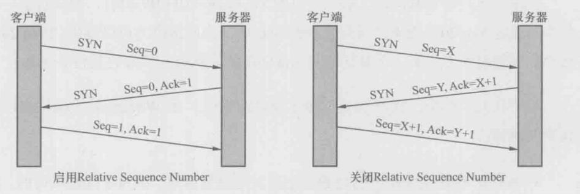

		本文分为十九个模块，分别是： **Java 基础、容器、多线程、反射、对象拷贝、Java Web 、异常、网络、设计模式、Spring/Spring MVC、Spring Boot/Spring Cloud、Hibernate、MyBatis、RabbitMQ、Kafka、Zookeeper、MySQL、Redis、JVM** ，如下图所示：


共包含 208 道面试题，本文的宗旨是为读者朋友们整理一份详实而又权威的面试清单，下面一起进入主题吧。


# Java 基础 #

## 1. JDK 和 JRE 有什么区别？

- JDK：Java Development Kit 的简称，Java 开发工具包，提供了 Java 的开发环境和运行环境。
- JRE：Java Runtime Environment 的简称，Java 运行环境，为 Java 的运行提供了所需环境。

具体来说 JDK 其实包含了 JRE，同时还包含了编译 Java 源码的编译器 Javac，还包含了很多 Java 程序调试和分析的工具。简单来说：如果你需要运行 Java 程序，只需安装 JRE 就可以了，如果你需要编写 Java 程序，需要安装 JDK。

## 2. == 和 equals 的区别是什么？

**== 解读**

对于基本类型和引用类型 == 的作用效果是不同的，如下所示：

- 基本类型：比较的是值是否相同；
- 引用类型：比较的是引用是否相同；

代码示例：

```java
String x = "string";
String y = "string";
String z = new String("string");
System.out.println(x==y); // true
System.out.println(x==z); // false
System.out.println(x.equals(y)); // true
System.out.println(x.equals(z)); // true
```

代码解读：因为 x 和 y 指向的是同一个引用，所以 == 也是 true，而 new String()方法则重写开辟了内存空间，所以 == 结果为 false，而 equals 比较的一直是值，所以结果都为 true。

**equals 解读**

equals 本质上就是 ==，只不过 String 和 Integer 等重写了 equals 方法，把它变成了值比较。看下面的代码就明白了。

首先来看默认情况下 equals 比较一个有相同值的对象，代码如下：

```java
classCat{
    publicCat(String name){
        this.name = name;
    }

    private String name;

    public String getName(){
        return name;
    }

    publicvoidsetName(String name){
        this.name = name;
    }
}

Cat c1 = new Cat("王磊");
Cat c2 = new Cat("王磊");
System.out.println(c1.equals(c2)); // false
```

输出结果出乎我们的意料，竟然是 false？这是怎么回事，看了 equals 源码就知道了，源码如下：

```java
publicbooleanequals(Object obj){
        return (this == obj);
}
```

原来 equals 本质上就是 ==。

那问题来了，两个相同值的 String 对象，为什么返回的是 true？代码如下：

```java
String s1 = new String("老王");
String s2 = new String("老王");
System.out.println(s1.equals(s2)); // true
```

同样的，当我们进入 String 的 equals 方法，找到了答案，代码如下：

```java
publicbooleanequals(Object anObject){
    if (this == anObject) {
        return true;
    }
    if (anObject instanceof String) {
        String anotherString = (String)anObject;
        int n = value.length;
        if (n == anotherString.value.length) {
            char v1[] = value;
            char v2[] = anotherString.value;
            int i = 0;
            while (n-- != 0) {
                if (v1[i] != v2[i])
                    return false;
                i++;
            }
            return true;
        }
    }
    return false;
}
```

原来是 String 重写了 Object 的 equals 方法，把引用比较改成了值比较。

**总结** ：== 对于基本类型来说是值比较，对于引用类型来说是比较的是引用；而 equals 默认情况下是引用比较，只是很多类重新了 equals 方法，比如 String、Integer 等把它变成了值比较，所以一般情况下 equals 比较的是值是否相等。

## 3. 两个对象的 hashCode() 相同，则 equals() 也一定为 true，对吗？

不对，两个对象的 hashCode() 相同，equals() 不一定 true。

代码示例：

```Java
String str1 = "通话";
String str2 = "重地";
System. out. println(String. format("str1：%d | str2：%d",  str1. hashCode(),str2. hashCode()));
System. out. println(str1. equals(str2));
```

执行的结果：

```
str1：1179395 | str2：1179395

false
```

代码解读：很显然“通话”和“重地”的 hashCode() 相同，然而 equals() 则为 false，因为在散列表中，hashCode() 相等即两个键值对的哈希值相等，然而哈希值相等，并不一定能得出键值对相等。

## 4. final 在 Java 中有什么作用？

- final 修饰的类叫最终类，该类不能被继承。
- final 修饰的方法不能被重写。
- final 修饰的变量叫常量，常量必须初始化，初始化之后值就不能被修改。

## 5. Java 中的 Math. round(-1. 5) 等于多少？

等于 -1，因为在数轴上取值时，中间值（0.5）向右取整，所以正 0.5 是往上取整，负 0.5 是直接舍弃。

## 6. String 属于基础的数据类型吗？

String 不属于基础类型，基础类型有 8 种：byte、boolean、char、short、int、float、long、double，而 String 属于对象。

## 7. Java 中操作字符串都有哪些类？它们之间有什么区别？

操作字符串的类有：String、StringBuffer、StringBuilder。

	String 和 StringBuffer、StringBuilder 的区别在于 String 声明的是不可变的对象，每次操作都会生成新的 String 对象，然后将指针指向新的 String 对象，而 StringBuffer、StringBuilder 可以在原有对象的基础上进行操作，所以在经常改变字符串内容的情况下最好不要使用 String。
	
	StringBuffer 和 StringBuilder 最大的区别在于，StringBuffer 是线程安全的，而 StringBuilder 是非线程安全的，但 StringBuilder 的性能却高于 StringBuffer，所以在单线程环境下推荐使用 StringBuilder，多线程环境下推荐使用 StringBuffer。

## 8. String str="i"与 String str=new String("i")一样吗？

不一样，因为内存的分配方式不一样。String str="i"的方式，Java 虚拟机会将其分配到常量池中；而 String str=new String("i") 则会被分到堆内存中。

## 9. 如何将字符串反转？

使用 StringBuilder 或者 stringBuffer 的 reverse() 方法。

示例代码：

```Java
// StringBuffer reverse
StringBuffer stringBuffer = new StringBuffer();
stringBuffer. append("abcdefg");
System. out. println(stringBuffer.reverse()); // gfedcba
// StringBuilder reverse
StringBuilder stringBuilder = new StringBuilder();
stringBuilder. append("abcdefg");
System. out. println(stringBuilder.reverse()); // gfedcba
```

## 10. String 类的常用方法都有那些？

- indexOf()：返回指定字符的索引。
- charAt()：返回指定索引处的字符。
- replace()：字符串替换。
- trim()：去除字符串两端空白。
- split()：分割字符串，返回一个分割后的字符串数组。
- getBytes()：返回字符串的 byte 类型数组。
- length()：返回字符串长度。
- toLowerCase()：将字符串转成小写字母。
- toUpperCase()：将字符串转成大写字符。
- substring()：截取字符串。
- equals()：字符串比较。

## 11. 抽象类必须要有抽象方法吗？

不需要，抽象类不一定非要有抽象方法。

示例代码：

```Java
abstract classCat{
    publicstaticvoidsayHi(){
        System. out. println("hi~");
    }
}
```

## 13. 抽象类能使用 final 修饰吗？

不能，定义抽象类就是让其他类继承的，如果定义为 final 该类就不能被继承，这样彼此就会产生矛盾，所以 final 不能修饰抽象类，如下图所示，编辑器也会提示错误信息：


## 14. 接口和抽象类有什么区别？

- 实现：抽象类的子类使用 extends 来继承；接口必须使用 implements 来实现接口。
- 构造函数：抽象类可以有构造函数；接口不能有。
- 实现数量：类可以实现很多个接口；但是只能继承一个抽象类。
- 访问修饰符：接口中的方法默认使用 public 修饰；抽象类中的方法可以是任意访问修饰符。

## 15. Java 中 IO 流分为几种？

按功能来分：输入流（input）、输出流（output）。

按类型来分：字节流和字符流。

字节流和字符流的区别是：字节流按 8 位传输以字节为单位输入输出数据，字符流按 16 位传输以字符为单位输入输出数据。

## 16. BIO、NIO、AIO 有什么区别？

- BIO：Block IO 同步阻塞式 IO，就是我们平常使用的传统 IO，它的特点是模式简单使用方便，并发处理能力低。
- NIO：Non IO 同步非阻塞 IO，是传统 IO 的升级，客户端和服务器端通过 Channel（通道）通讯，实现了多路复用。
- AIO：Asynchronous IO 是 NIO 的升级，也叫 NIO2，实现了异步非堵塞 IO ，异步 IO 的操作基于事件和回调机制。

## 17. Files的常用方法都有哪些？

- Files.exists()：检测文件路径是否存在。
- Files.createFile()：创建文件。
- Files.createDirectory()：创建文件夹。
- Files.delete()：删除一个文件或目录。
- Files.copy()：复制文件。
- Files.move()：移动文件。
- Files.size()：查看文件个数。
- Files.read()：读取文件。
- Files.write()：写入文件。

# 容器

## 18. Java 容器都有哪些？

Java 容器分为 Collection 和 Map 两大类，其下又有很多子类，如下所示：

- Collection
- List
  - ArrayList
  - LinkedList
  - Vector
  - Stack
- Set
  - HashSet
  - LinkedHashSet
  - TreeSet
- Map
- HashMap
  - LinkedHashMap
- TreeMap
- ConcurrentHashMap
- Hashtable

## 19. Collection 和 Collections 有什么区别？

- Collection 是一个集合接口，它提供了对集合对象进行基本操作的通用接口方法，所有集合都是它的子类，比如 List、Set 等。
- Collections 是一个包装类，包含了很多静态方法，不能被实例化，就像一个工具类，比如提供的排序方法： Collections. sort(list)。

## 20. List、Set、Map 之间的区别是什么？

List、Set、Map 的区别主要体现在两个方面：元素是否有序、是否允许元素重复。

三者之间的区别，如下表：


## 21. HashMap 和 Hashtable 有什么区别？

- 存储：HashMap 运行 key 和 value 为 null，而 Hashtable 不允许。
- 线程安全：Hashtable 是线程安全的，而 HashMap 是非线程安全的。
- 推荐使用：在 Hashtable 的类注释可以看到，Hashtable 是保留类不建议使用，推荐在单线程环境下使用 HashMap 替代，如果需要多线程使用则用 ConcurrentHashMap 替代。

#### 20. List、Set、Map 之间的区别是什么？

List、Set、Map 的区别主要体现在两个方面：元素是否有序、是否允许元素重复。

三者之间的区别，如下表：


## 21. HashMap 和 Hashtable 有什么区别？

- 存储：HashMap 运行 key 和 value 为 null，而 Hashtable 不允许。
- 线程安全：Hashtable 是线程安全的，而 HashMap 是非线程安全的。
- 推荐使用：在 Hashtable 的类注释可以看到，Hashtable 是保留类不建议使用，推荐在单线程环境下使用 HashMap 替代，如果需要多线程使用则用 ConcurrentHashMap 替代。

## 23. 说一下 HashMap 的实现原理？

HashMap 基于 Hash 算法实现的，我们通过 put(key,value)存储，get(key)来获取。当传入 key 时，HashMap 会根据 key. hashCode() 计算出 hash 值，根据 hash 值将 value 保存在 bucket 里。当计算出的 hash 值相同时，我们称之为 hash 冲突，HashMap 的做法是用链表和红黑树存储相同 hash 值的 value。当 hash 冲突的个数比较少时，使用链表否则使用红黑树。

## 24. 说一下 HashSet 的实现原理？

HashSet 是基于 HashMap 实现的，HashSet 底层使用 HashMap 来保存所有元素，因此 HashSet 的实现比较简单，相关 HashSet 的操作，基本上都是直接调用底层 HashMap 的相关方法来完成，HashSet 不允许重复的值。

## 25. ArrayList 和 LinkedList 的区别是什么？

- 数据结构实现：ArrayList 是动态数组的数据结构实现，而 LinkedList 是双向链表的数据结构实现。
- 随机访问效率：ArrayList 比 LinkedList 在随机访问的时候效率要高，因为 LinkedList 是线性的数据存储方式，所以需要移动指针从前往后依次查找。
- 增加和删除效率：在非首尾的增加和删除操作，LinkedList 要比 ArrayList 效率要高，因为 ArrayList 增删操作要影响数组内的其他数据的下标。

综合来说，在需要频繁读取集合中的元素时，更推荐使用 ArrayList，而在插入和删除操作较多时，更推荐使用 LinkedList。

## 26. 如何实现数组和 List 之间的转换？

- 数组转 List：使用 Arrays.asList(array) 进行转换。
- List 转数组：使用 List 自带的 toArray() 方法。

代码示例：

```Java
        // list to array
        List<String> list = new ArrayList<String>();
        list.add("王磊");
        list.add("的博客");
        String[] objects = (String[]) list.toArray();
        // array to list
        String[] array = new String[]{"王磊","的博客"};
        List<String> strings = Arrays.asList(array);
```

## 27. ArrayList 和 Vector 的区别是什么？

- 线程安全：Vector 使用了 Synchronized 来实现线程同步，是线程安全的，而 ArrayList 是非线程安全的。

- 性能：ArrayList 在性能方面要优于 Vector。

- 扩容：ArrayList 和 Vector 都会根据实际的需要动态的调整容量，只不过在 Vector 扩容每次会增加 1 倍，而 ArrayList 只会增加 50%。

  ```java
  private void grow(int minCapacity) {
      // overflow-conscious code
      int oldCapacity = elementData.length;
      int newCapacity = oldCapacity + (oldCapacity >> 1);
      if (newCapacity - minCapacity < 0)
          newCapacity = minCapacity;
      if (newCapacity - MAX_ARRAY_SIZE > 0)
          newCapacity = hugeCapacity(minCapacity);
      // minCapacity is usually close to size, so this is a win:
      elementData = Arrays.copyOf(elementData, newCapacity);
  }
  ```

## 28. 数组 和 List 有何区别？

- 数组可以存储基本数据类型和对象，List 只能存储对象。
- 数组 是指定固定大小的，而 List 大小是自动扩展的。
- 数组 内置方法没有 List 多，比如 addAll、removeAll、iteration 等方法只有 ArrayList 有。

## 29. 在 Queue 中 poll()和 remove()有什么区别？

- 相同点：都是返回第一个元素，并在队列中删除返回的对象。
- 不同点：如果没有元素 poll()会返回 null，而 remove()会直接抛出 NoSuchElementException 异常。

代码示例：

```Java
		Queue<String> queue = new LinkedList<String>();
        queue.offer("string"); // add
        System.out.println(queue. poll());
        System.out.println(queue. remove());
        System.out.println(queue. size());
```

## 30. 哪些集合类是线程安全的？

Vector、Hashtable、Stack 都是线程安全的，而像 HashMap 则是非线程安全的，不过在 JDK 1.5 之后随着 Java. util. concurrent 并发包的出现，它们也有了自己对应的线程安全类，比如 HashMap 对应的线程安全类就是 ConcurrentHashMap。

## 31. 迭代器 Iterator 是什么？

Iterator 接口提供遍历任何 Collection 的接口。我们可以从一个 Collection 中使用迭代器方法来获取迭代器实例。迭代器取代了 Java 集合框架中的 Enumeration，迭代器允许调用者在迭代过程中移除元素。

## 32. Iterator 怎么使用？有什么特点？

Iterator 使用代码如下：

```Java
List<String> list = new ArrayList<>();
Iterator<String> it = list.iterator();
while(it.hasNext()){
  String obj = it.next();
  System.out.println(obj);
}
```

Iterator 的特点是更加安全，因为它可以确保，在当前遍历的集合元素被更改的时候，就会抛出 ConcurrentModificationException 异常。

## 33. Iterator 和 ListIterator 有什么区别？

- Iterator 可以遍历 Set 和 List 集合，而 ListIterator 只能遍历 List。
- Iterator 只能单向遍历，而 ListIterator 可以双向遍历（向前/后遍历）。
- ListIterator 从 Iterator 接口继承，然后添加了一些额外的功能，比如添加一个元素、替换一个元素、获取前面或后面元素的索引位置。

## 34. 怎么确保一个集合不能被修改？

可以使用 Collections. unmodifiableCollection(Collection c) 方法来创建一个只读集合，这样改变集合的任何操作都会抛出 Java. lang. UnsupportedOperationException 异常。

示例代码如下：

```Java
List<String> list = new ArrayList<>();
list.add("x");
Collection<String> clist = Collections.unmodifiableCollection(list);
clist.add("y"); // 运行时此行报错
System.out.println(list.size());
```

### 多线程

## 35. 并行和并发有什么区别？

- 并行：多个处理器或多核处理器同时处理多个任务。
- 并发：多个任务在同一个 CPU 核上，按细分的时间片轮流(交替)执行，从逻辑上来看那些任务是同时执行。

如下图：


并发 = 两个队列和一台咖啡机。

并行 = 两个队列和两台咖啡机。

## 36. 线程和进程的区别？

一个程序下至少有一个进程，一个进程下至少有一个线程，一个进程下也可以有多个线程来增加程序的执行速度。

## 37. 守护线程是什么？

守护线程是指为其他线程服务的线程。在JVM中，所有非守护线程都执行完毕后，无论有没有守护线程，虚拟机都会自动退出。它独立于控制终端并且周期性地执行某种任务或等待处理某些发生的事件。在 Java 中垃圾回收线程就是特殊的守护线程。

## 38. 创建线程有哪几种方式？

创建线程有三种方式：

- 继承 Thread 重写 run 方法；
- 实现 Runnable 接口；
- 实现 Callable 接口。

## 39. 说一下 runnable 和 callable 有什么区别？

runnable 没有返回值，callable 可以拿到有返回值，callable 可以看作是 runnable 的补充。

## 40. 线程有哪些状态？

线程的状态：

- NEW 尚未启动
- RUNNABLE 正在执行中
- BLOCKED 阻塞的（被同步锁或者IO锁阻塞）
- WAITING 永久等待状态
- TIMED_WAITING 等待指定的时间重新被唤醒的状态
- TERMINATED 执行完成

## 41. sleep() 和 wait() 有什么区别？

- 类的不同：sleep() 来自 Thread，wait() 来自 Object。
- 释放锁：sleep() 不释放锁；wait() 释放锁。
- 用法不同：sleep() 时间到会自动恢复；wait() 可以使用 notify()/notifyAll()直接唤醒。

## 42. notify()和 notifyAll()有什么区别？

notifyAll()会唤醒所有的线程，notify()之后唤醒一个线程。notifyAll() 调用后，会将全部线程由等待池移到锁池，然后参与锁的竞争，竞争成功则继续执行，如果不成功则留在锁池等待锁被释放后再次参与竞争。而 notify()只会唤醒一个线程，具体唤醒哪一个线程由虚拟机控制。

## 43. 线程的 run() 和 start() 有什么区别？

start() 方法用于启动线程，run() 方法用于执行线程的运行时代码。run() 可以重复调用，而 start() 只能调用一次。

## 44. 创建线程池有哪几种方式？

线程池创建有七种方式，最核心的是最后一种：

- newSingleThreadExecutor()：它的特点在于工作线程数目被限制为 1，操作一个无界的工作队列，所以它保证了所有任务的都是被顺序执行，最多会有一个任务处于活动状态，并且不允许使用者改动线程池实例，因此可以避免其改变线程数目；
- newCachedThreadPool()：它是一种用来处理大量短时间工作任务的线程池，具有几个鲜明特点：它会试图缓存线程并重用，当无缓存线程可用时，就会创建新的工作线程；如果线程闲置的时间超过 60 秒，则被终止并移出缓存；长时间闲置时，这种线程池，不会消耗什么资源。其内部使用 SynchronousQueue 作为工作队列；
- newFixedThreadPool(int nThreads)：重用指定数目（nThreads）的线程，其背后使用的是无界的工作队列，任何时候最多有 nThreads 个工作线程是活动的。这意味着，如果任务数量超过了活动队列数目，将在工作队列中等待空闲线程出现；如果有工作线程退出，将会有新的工作线程被创建，以补足指定的数目 nThreads；
- newSingleThreadScheduledExecutor()：创建单线程池，返回 ScheduledExecutorService，可以进行定时或周期性的工作调度；
- newScheduledThreadPool(int corePoolSize)：和newSingleThreadScheduledExecutor()类似，创建的是个 ScheduledExecutorService，可以进行定时或周期性的工作调度，区别在于单一工作线程还是多个工作线程；
- newWorkStealingPool(int parallelism)：这是一个经常被人忽略的线程池，Java 8 才加入这个创建方法，其内部会构建ForkJoinPool，利用Work-Stealing算法，并行地处理任务，不保证处理顺序；
- ThreadPoolExecutor()：是最原始的线程池创建，上面1-3创建方式都是对ThreadPoolExecutor的封装。

## 45. 线程池都有哪些状态？

- RUNNING：这是最正常的状态，接受新的任务，处理等待队列中的任务。
- SHUTDOWN：不接受新的任务提交，但是会继续处理等待队列中的任务。
- STOP：不接受新的任务提交，不再处理等待队列中的任务，中断正在执行任务的线程。
- TIDYING：所有的任务都销毁了，workCount 为 0，线程池的状态在转换为 TIDYING 状态时，会执行钩子方法 terminated()。
- TERMINATED：terminated()方法结束后，线程池的状态就会变成这个。

## 46. 线程池中 submit() 和 execute() 方法有什么区别？

- execute()：只能执行 Runnable 类型的任务。
- submit()：可以执行 Runnable 和 Callable 类型的任务。

Callable 类型的任务可以获取执行的返回值，而 Runnable 执行无返回值。

## 47. 在 Java 程序中怎么保证多线程的运行安全？

- 方法一：使用安全类，比如 Java. util. concurrent 下的类。
- 方法二：使用自动锁 synchronized。
- 方法三：使用手动锁 Lock。

手动锁 Java 示例代码如下：

```Java
Lock lock = new ReentrantLock();
lock. lock();
try {
    System. out. println("获得锁");
} catch (Exception e) {
    // TODO: handle exception
} finally {
    System. out. println("释放锁");
    lock. unlock();
}
```

## 48. 多线程中 synchronized 锁升级的原理是什么？

synchronized 锁升级原理：在锁对象的对象头里面有一个 threadid 字段，在第一次访问的时候 threadid 为空，jvm 让其持有偏向锁，并将 threadid 设置为其线程 id，再次进入的时候会先判断 threadid 是否与其线程 id 一致，如果一致则可以直接使用此对象，如果不一致，则升级偏向锁为轻量级锁，通过自旋循环一定次数来获取锁，执行一定次数之后，如果还没有正常获取到要使用的对象，此时就会把锁从轻量级升级为重量级锁，此过程就构成了 synchronized 锁的升级。

锁的升级的目的：锁升级是为了减低了锁带来的性能消耗。在 Java 6 之后优化 synchronized 的实现方式，使用了偏向锁升级为轻量级锁再升级到重量级锁的方式，从而减低了锁带来的性能消耗。

### 锁的状态：

- 无锁状态
- 偏向锁状态
- 轻量级锁状态
- 重量级锁状态

四种状态会随着竞争的情况逐渐升级，而且是不可逆的过程，即不可降级。

> 要注意的是，这四种状态都不是Java语言中的锁，而是Jvm为了提高锁的获取与释放效率而做的优化(使用synchronized时)。

首先通过一个小例子来解释一下三种锁的区别：

> 假如家里只有一个碗，当我自己在家时，没有人会和我争碗，这时即为偏向锁状态

> 当我和女朋友都在家吃饭时，如果女朋友不是很饿，则她会等我吃完再用我的碗去吃饭，这就是轻量级锁状态

> 当我和女朋友都很饿的时候，这时候就会去争抢这唯一的一个碗(贫穷的我)吃饭，这就是重量级锁状态

### 偏向锁

偏向锁的由来：

> 大多数情况下，锁不存在多线程竞争，而是总是由同一线程多次获得时，为了使线程获得锁的代价更低而引入了偏向锁。

偏向锁的使用：

> 当线程进入和退出同步块时，需要经历几个测试步骤：

1. 测试对象头Mark Word(默认存储对象的HashCode,分代年龄，锁标记位)里是否存储着指向当前线程的偏向锁。
2. 若测试失败，则测试Mark Word中偏向锁标识是否设置成1(表示当前为偏向锁)
3. 没有设置则使用CAS竞争，否则尝试使用CAS将对象头的偏向锁指向当前线程

偏向锁的撤销：

> 当其他线程尝试竞争偏向锁时，就会释放锁，锁的撤销，需要等待全局安全点，分为以下几个步骤：

1. 暂停拥有偏向锁的线程，检查线程是否存活
2. 处于非活动状态，则设置为无锁状态
3. 存活，则重新偏向于其他线程或者恢复到无锁状态或者标记对象不适合作为偏向锁
4. 唤醒线程

偏向锁的升级：

> 当有第二个线程进入同步代码块时，则升级为轻量级锁

### 轻量级锁

轻量级锁的加锁：

> 如果成功使用CAS将对象头重的Mark Word替换为指向锁记录的指针，则获得锁，失败则当前线程尝试使用自旋(循环等待)来获取锁。

轻量级锁的解锁：

> 当有另一个线程与该线程同时竞争时，锁会升级为重量级锁。为了防止继续自旋，一旦升级，将无法降级。

### 重量级锁

重量级锁特点：

> 其他线程试图获取锁时，都会被阻塞，只有持有锁的线程释放锁之后才会唤醒这些线程，进行竞争。

### 三种锁的对比


通俗来讲就是：

- 偏向锁：仅有一个线程进入临界区
- 轻量级锁：多个线程交替进入临界区
- 重量级锁：多个线程同时进入临界区

## 49. 什么是死锁？

当线程 A 持有独占锁a，并尝试去获取独占锁 b 的同时，线程 B 持有独占锁 b，并尝试获取独占锁 a 的情况下，就会发生 AB 两个线程由于互相持有对方需要的锁，而发生的阻塞现象，我们称为死锁。

## 50. 怎么防止死锁？

- 尽量使用 tryLock(long timeout, TimeUnit unit)的方法(ReentrantLock、ReentrantReadWriteLock)，设置超时时间，超时可以退出防止死锁。
- 尽量使用 Java. util. concurrent 并发类代替自己手写锁。
- 尽量降低锁的使用粒度，尽量不要几个功能用同一把锁。
- 尽量减少同步的代码块。

## 51. ThreadLocal 是什么？有哪些使用场景？

ThreadLocal 为每个使用该变量的线程提供独立的变量副本，所以每一个线程都可以独立地改变自己的副本，而不会影响其它线程所对应的副本。

ThreadLocal 的经典使用场景是数据库连接和 session 管理等。

## 52. 说一下 synchronized 底层实现原理？

synchronized 是由一对 monitorenter/monitorexit 指令实现的，monitor 对象是同步的基本实现单元。在 Java 6 之前，monitor 的实现完全是依靠操作系统内部的互斥锁，因为需要进行用户态到内核态的切换，所以同步操作是一个无差别的重量级操作，性能也很低。但在 Java 6 的时候，Java 虚拟机 对此进行了大刀阔斧地改进，提供了三种不同的 monitor 实现，也就是常说的三种不同的锁：偏向锁（Biased Locking）、轻量级锁和重量级锁，大大改进了其性能。

## 53. synchronized 和 volatile 的区别是什么？

- volatile 是变量修饰符；synchronized 是修饰类、方法、代码段。
- volatile 仅能实现变量的修改可见性，不能保证原子性；而 synchronized 则可以保证变量的修改可见性和原子性。
- volatile 不会造成线程的阻塞；synchronized 可能会造成线程的阻塞。

## 54. synchronized 和 Lock 有什么区别？

- synchronized 可以给类、方法、代码块加锁；而 lock 只能给代码块加锁。
- synchronized 不需要手动获取锁和释放锁，使用简单，发生异常会自动释放锁，不会造成死锁；而 lock 需要自己加锁和释放锁，如果使用不当没有 unLock()去释放锁就会造成死锁。
- 通过 Lock 可以知道有没有成功获取锁，而 synchronized 却无法办到。

## 55. synchronized 和 ReentrantLock 区别是什么？

synchronized 早期的实现比较低效，对比 ReentrantLock，大多数场景性能都相差较大，但是在 Java 6 中对 synchronized 进行了非常多的改进。

主要区别如下：

- ReentrantLock 使用起来比较灵活，但是必须有释放锁的配合动作；
- ReentrantLock 必须手动获取与释放锁，而 synchronized 不需要手动释放和开启锁；
- ReentrantLock 只适用于代码块锁，而 synchronized 可用于修饰方法、代码块等。

## 56. 说一下 atomic 的原理？

atomic 主要利用 CAS (Compare And Swap) 和 volatile 和 native 方法来保证原子操作，从而避免 synchronized 的高开销，执行效率大为提升。

# 反射

## 57. 什么是反射？

反射是在运行状态中，对于任意一个类，都能够知道这个类的所有属性和方法；对于任意一个对象，都能够调用它的任意一个方法和属性；这种动态获取的信息以及动态调用对象的方法的功能称为 Java 语言的反射机制。

反射最重要的用途就是开发各种通用框架，比如在spring中，我们将所有的类Bean交给spring容器管理，无论是XML配置Bean还是注解配置，当我们从容器中获取Bean来依赖注入时，容器会读取配置，而配置中给的就是类的信息，spring根据这些信息，需要创建那些Bean，spring就动态的创建这些类。

JAVA反射机制是在**运行状态中**，

对于任意一个类，都能够知道这个类的所有属性和方法；

对于任意一个对象，都能够调用它的任意一个属性和方法；

这种动态获取的信息以及动态调用对象的方法的功能称为 **java语言的反射机制。**


不知道类或者对象的具体信息，应该使用反射来实现。

比如类的名称放在XML文件中，属性和属性值放在XML文件中，需要在运行时读取XML文件，动态获取类的信息。

Java在编译之后会生成一个**class文件**，反射通过**字节码文件**找到其类中的方法和属性等


## 58. 什么是 Java 序列化？什么情况下需要序列化？

Java 序列化是为了保存各种对象在内存中的状态，并且可以把保存的对象状态再读出来。

以下情况需要使用 Java 序列化：

- 想把的内存中的对象状态保存到一个文件中或者数据库中时候；
- 想用套接字在网络上传送对象的时候；
- 想通过RMI（远程方法调用）传输对象的时候。

## 59. 动态代理是什么？有哪些应用？

动态代理是运行时动态生成代理类。

动态代理的应用有 spring aop、hibernate 数据查询、测试框架的后端 mock、rpc，Java注解对象获取等。

## 60. 怎么实现动态代理？

JDK 原生动态代理和 cglib 动态代理。JDK 原生动态代理是基于接口实现的，而 cglib 是基于继承当前类的子类实现的。

1. 若目标对象实现了若干接口，spring使用JDK的java.lang.reflect.Proxy类代理。
   优点：因为有接口，所以使系统更加松耦合
   缺点：为每一个目标类创建接口
2. 若目标对象没有实现任何接口，spring使用CGLIB库生成目标对象的子类。
   优点：因为代理类与目标类是继承关系，所以不需要有接口的存在。
   缺点：因为没有使用接口，所以系统的耦合性没有使用JDK的动态代理好。

# 对象拷贝

## 61. 为什么要使用克隆？

克隆的对象可能包含一些已经修改过的属性，而 new 出来的对象的属性都还是初始化时候的值，所以当需要一个新的对象来保存当前对象的“状态”就靠克隆方法了。

## 62. 如何实现对象克隆？

- 实现 Cloneable 接口并重写 Object 类中的 clone() 方法。
- 实现 Serializable 接口，通过对象的序列化和反序列化实现克隆，可以实现真正的深度克隆。

## 63. 深拷贝和浅拷贝区别是什么？

- 浅克隆：当对象被复制时只复制它本身和其中包含的值类型的成员变量，而引用类型的成员对象并没有复制。
- 深克隆：除了对象本身被复制外，对象所包含的所有成员变量也将复制。

# Java Web

## 64. JSP 和 servlet 有什么区别？

JSP 是 servlet 技术的扩展，本质上就是 servlet 的简易方式。servlet 和 JSP 最主要的不同点在于，servlet 的应用逻辑是在 Java 文件中，并且完全从表示层中的 html 里分离开来，而 JSP 的情况是 Java 和 html 可以组合成一个扩展名为 JSP 的文件。JSP 侧重于视图，servlet 主要用于控制逻辑。

## 67. session 和 cookie 有什么区别？

- 存储位置不同：session 存储在服务器端；cookie 存储在浏览器端。
- 安全性不同：cookie 安全性一般，在浏览器存储，可以被伪造和修改。
- 容量和个数限制：cookie 有容量限制，每个站点下的 cookie 也有个数限制。
- 存储的多样性：session 可以存储在 Redis 中、数据库中、应用程序中；而 cookie 只能存储在浏览器中。

## 68. 说一下 session 的工作原理？

session 的工作原理是客户端登录完成之后，服务器会创建对应的 session，session 创建完之后，会把 session 的 id 发送给客户端，客户端再存储到浏览器中。这样客户端每次访问服务器时，都会带着 sessionid，服务器拿到 sessionid 之后，在内存找到与之对应的 session 这样就可以正常工作了。

## 69. 如果客户端禁止 cookie 能实现 session 还能用吗？

可以用，session 只是依赖 cookie 存储 sessionid，如果 cookie 被禁用了，可以使用 url 中添加 sessionid 的方式保证 session 能正常使用。

## 71. 如何避免 SQL 注入？

- 使用预处理 PreparedStatement。
- 使用正则表达式过滤掉字符中的特殊字符。

## 72. 什么是 XSS 攻击，如何避免？

XSS 攻击：即跨站脚本攻击，它是 Web 程序中常见的漏洞。原理是攻击者往 Web 页面里插入恶意的脚本代码（css 代码、Javascript 代码等），当用户浏览该页面时，嵌入其中的脚本代码会被执行，从而达到恶意攻击用户的目的，如盗取用户 cookie、破坏页面结构、重定向到其他网站等。

预防 XSS 的核心是必须对输入的数据做过滤处理。

## 73. 什么是 CSRF 攻击，如何避免？

CSRF：Cross-Site Request Forgery（中文：跨站请求伪造），可以理解为攻击者盗用了你的身份，以你的名义发送恶意请求，比如：以你名义发送邮件、发消息、购买商品，虚拟货币转账等。

防御手段：

- 验证请求来源地址；
- 关键操作添加验证码；
- 在请求地址添加 token 并验证。

# 异常

## 74. throw 和 throws 的区别？

- throw：是真实抛出一个异常。
- throws：是声明可能会抛出一个异常。

## 75. final、finally、finalize 有什么区别？

- final：是修饰符，如果修饰类，此类不能被继承；如果修饰方法和变量，则表示此方法和此变量不能在被改变，只能使用。
- finally：是 try{} catch{} finally{} 最后一部分，表示不论发生任何情况都会执行，finally 部分可以省略，但如果 finally 部分存在，则一定会执行 finally 里面的代码。
- finalize： 是 Object 类的一个方法，在垃圾收集器执行的时候会调用被回收对象的此方法。

## 76. try-catch-finally 中哪个部分可以省略？

try-catch-finally 其中 catch 和 finally 都可以被省略，但是不能同时省略，也就是说有 try 的时候，必须后面跟一个 catch 或者 finally。

## 77. try-catch-finally 中，如果 catch 中 return 了，finally 还会执行吗？

finally 一定会执行，即使是 catch 中 return 了，finally 中的 return 会等 catch 中的代码执行完之后，才会执行。

## 78. 常见的异常类有哪些？

- NullPointerException 空指针异常
- ClassNotFoundException 指定类不存在
- NumberFormatException 字符串转换为数字异常
- IndexOutOfBoundsException 数组下标越界异常
- ClassCastException 数据类型转换异常
- FileNotFoundException 文件未找到异常
- NoSuchMethodException 方法不存在异常
- IOException IO 异常
- SocketException Socket 异常

# 网络

## 79. http 响应码 301 和 302 代表的是什么？有什么区别？

301：永久重定向。

302：暂时重定向。

它们的区别是，301 对搜索引擎优化（SEO）更加有利；302 有被提示为网络拦截的风险。

## 80. forward 和 redirect 的区别？

forward 是转发 和 redirect 是重定向：

- 地址栏 url 显示：foward url 不会发生改变，redirect url 会发生改变；
- 数据共享：forward 可以共享 request 里的数据，redirect 不能共享；
- 效率：forward 比 redirect 效率高。
- forward 是服务端跳转，redirect是客户端跳转

## 81. 简述 tcp 和 udp的区别？

tcp 和 udp 是 OSI 模型中的运输层中的协议。tcp 提供可靠的通信传输，而 udp 则常被用于让广播和细节控制交给应用的通信传输。

两者的区别大致如下：

- tcp 面向连接，udp 面向非连接即发送数据前不需要建立链接；
- tcp 提供可靠的服务（数据传输），udp 无法保证；
- tcp 面向字节流，udp 面向报文；
- tcp 数据传输慢，udp 数据传输快；

## 82. tcp 为什么要三次握手，两次不行吗？为什么？

如果采用两次握手，那么只要服务器发出确认数据包就会建立连接，但由于客户端此时并未响应服务器端的请求，那此时服务器端就会一直在等待客户端，这样服务器端就白白浪费了一定的资源。若采用三次握手，服务器端没有收到来自客户端的再此确认，则就会知道客户端并没有要求建立请求，就不会浪费服务器的资源。



第一次握手：客户端向服务端发送信息。当服务端接收到信息后，服务端可以明确接收功能是正常的

第二次握手：服务端向客户端发送信息。当客户端接收到信息后，客户端可以明确发送和接收功能都是正常的

第三次握手：客户端向服务端发送信息。当服务端接收到信息后，服务端可以明确发送功能是正常的。

通过三次握手，就能明确双方的收发功能均正常，也就是说，保证了建立的连接是可靠的。而且，由上可见，三次是确保连接可靠的最少次数，再就多余。

## 83. 说一下 tcp 粘包是怎么产生的？

tcp 粘包可能发生在发送端或者接收端，分别来看两端各种产生粘包的原因：

- 发送端粘包：发送端需要等缓冲区满才发送出去，造成粘包；
- 接收方粘包：接收方不及时接收缓冲区的包，造成多个包接收。

## 84. OSI 的七层模型都有哪些？

- 物理层：利用传输介质为数据链路层提供物理连接，实现比特流的透明传输。
- 数据链路层：负责建立和管理节点间的链路。
- 网络层：通过路由选择算法，为报文或分组通过通信子网选择最适当的路径。
- 传输层：向用户提供可靠的端到端的差错和流量控制，保证报文的正确传输。
- 会话层：向两个实体的表示层提供建立和使用连接的方法。
- 表示层：处理用户信息的表示问题，如编码、数据格式转换和加密解密等。
- 应用层：直接向用户提供服务，完成用户希望在网络上完成的各种工作。

## 85. get 和 post 请求有哪些区别？

- get 请求会被浏览器主动缓存，而 post 不会。
- get 传递参数有大小限制，而 post 没有。
- post 参数传输更安全，get 的参数会明文限制在 url 上，post 不会。

# 设计模式

## 88. 说一下你熟悉的设计模式？

- 单例模式：保证被创建一次，节省系统开销。
- 工厂模式（简单工厂、抽象工厂）：解耦代码。
- 观察者模式：定义了对象之间的一对多的依赖，这样一来，当一个对象改变时，它的所有的依赖者都会收到通知并自动更新。
- 外观模式：提供一个统一的接口，用来访问子系统中的一群接口，外观定义了一个高层的接口，让子系统更容易使用。
- 模版方法模式：定义了一个算法的骨架，而将一些步骤延迟到子类中，模版方法使得子类可以在不改变算法结构的情况下，重新定义算法的步骤。
- 状态模式：允许对象在内部状态改变时改变它的行为，对象看起来好像修改了它的类。

# Spring/Spring MVC

## 90. 为什么要使用 spring？

- spring 提供 ioc 技术，容器会帮你管理依赖的对象，从而不需要自己创建和管理依赖对象了，更轻松的实现了程序的解耦。
- spring 提供了事务支持，使得事务操作变的更加方便。
- spring 提供了面向切片编程，这样可以更方便的处理某一类的问题。
- 更方便的框架集成，spring 可以很方便的集成其他框架，比如 MyBatis等。

## 91. 解释一下什么是 aop？

aop 是面向切面编程，通过预编译方式和运行期动态代理实现程序功能的统一维护的一种技术。

简单来说就是统一处理某一“切面”（类）的问题的编程思想，比如统一处理日志、异常等。

在Spring中，通过动态代理和动态字节码技术实现了AOP

## 92. 解释一下什么是 ioc？

ioc：Inversionof Control（中文：控制反转）是 spring 的核心，对于 spring 框架来说，就是由 spring 来负责控制对象的生命周期和对象间的关系。

简单来说，控制指的是当前对象对内部成员的控制权；控制反转指的是，这种控制权不由当前对象管理了，由其他（类,第三方容器）来管理。

## 93. spring 有哪些主要模块？

- spring core：框架的最基础部分，提供 ioc 和依赖注入特性。
- spring context：构建于 core 封装包基础上的 context 封装包，提供了一种框架式的对象访问方法。
- spring dao：Data Access Object 提供了JDBC的抽象层。
- spring aop：提供了面向切面的编程实现，让你可以自定义拦截器、切点等。
- spring Web：提供了针对 Web 开发的集成特性，例如文件上传，利用 servlet listeners 进行 ioc 容器初始化和针对 Web 的 ApplicationContext。
- spring Web mvc：spring 中的 mvc 封装包提供了 Web 应用的 Model-View-Controller（MVC）的实现。

## 94. spring 常用的注入方式有哪些？

- setter 属性注入
- 构造方法注入
- 注解方式注入

## 95. spring 中的 bean 是线程安全的吗？

spring 中的 bean 默认是单例模式，spring 框架并没有对单例 bean 进行多线程的封装处理。

实际上大部分时候 spring bean 无状态的（比如 dao 类），所有某种程度上来说 bean 也是安全的，但如果 bean 有状态的话（比如 view model 对象），那就要开发者自己去保证线程安全了，最简单的就是改变 bean 的作用域，把“singleton”变更为“prototype”，这样请求 bean 相当于 new Bean()了，所以就可以保证线程安全了。

- 有状态就是有数据存储功能。
- 无状态就是不会保存数据。

## 96. spring 支持几种 bean 的作用域？

spring 支持 5 种作用域，如下：

- singleton：spring ioc 容器中只存在一个 bean 实例，bean 以单例模式存在，是系统默认值；
- prototype：每次从容器调用 bean 时都会创建一个新的示例，既每次 getBean()相当于执行 new Bean()操作；
- Web 环境下的作用域：
- request：每次 http 请求都会创建一个 bean；
- session：同一个 http session 共享一个 bean 实例；
- global-session：用于 portlet 容器，因为每个 portlet 有单独的 session，globalsession 提供一个全局性的 http session。

**注意：** 使用 prototype 作用域需要慎重的思考，因为频繁创建和销毁 bean 会带来很大的性能开销。

## 97. spring 自动装配 bean 有哪些方式？

- no：默认值，表示没有自动装配，应使用显式 bean 引用进行装配。
- byName：它根据 bean 的名称注入对象依赖项。
- byType：它根据类型注入对象依赖项。
- 构造函数：通过构造函数来注入依赖项，需要设置大量的参数。
- autodetect：容器首先通过构造函数使用 autowire 装配，如果不能，则通过 byType 自动装配。

## 98. spring 事务实现方式有哪些？

- 声明式事务：声明式事务也有两种实现方式，基于 xml 配置文件的方式和注解方式（在类上添加 @Transaction 注解）。
- 编码方式：提供编码的形式管理和维护事务。

## 99. 说一下 spring 的事务隔离？

spring 有五大隔离级别，默认值为 ISOLATION_DEFAULT（使用数据库的设置），其他四个隔离级别和数据库的隔离级别一致：

ISOLATION_DEFAULT：用底层数据库的设置隔离级别，数据库设置的是什么我就用什么；

ISOLATION*READ*UNCOMMITTED：未提交读，最低隔离级别、事务未提交前，就可被其他事务读取（会出现幻读、脏读、不可重复读）；

ISOLATION*READ*COMMITTED：提交读，一个事务提交后才能被其他事务读取到（会造成幻读、不可重复读），SQL server 的默认级别；

ISOLATION*REPEATABLE*READ：可重复读，保证多次读取同一个数据时，其值都和事务开始时候的内容是一致，禁止读取到别的事务未提交的数据（会造成幻读），MySQL 的默认级别；

ISOLATION_SERIALIZABLE：序列化，代价最高最可靠的隔离级别，该隔离级别能防止脏读、不可重复读、幻读。

**脏读** ：表示一个事务能够读取另一个事务中还未提交的数据。比如，某个事务尝试插入记录 A，此时该事务还未提交，然后另一个事务尝试读取到了记录 A。

**不可重复读** ：是指在一个事务内，多次读同一数据。

**幻读** ：指同一个事务内多次查询返回的结果集不一样。比如同一个事务 A 第一次查询时候有 n 条记录，但是第二次同等条件下查询却有 n+1 条记录，这就好像产生了幻觉。发生幻读的原因也是另外一个事务新增或者删除或者修改了第一个事务结果集里面的数据，同一个记录的数据内容被修改了，所有数据行的记录就变多或者变少了。

## 100. 说一下 spring mvc 运行流程？

- spring mvc 先将请求发送给 DispatcherServlet。
- DispatcherServlet 查询一个或多个 HandlerMapping，找到处理请求的 Controller。
- DispatcherServlet 再把请求提交到对应的 Controller。
- Controller 进行业务逻辑处理后，会返回一个ModelAndView。
- Dispathcher 查询一个或多个 ViewResolver 视图解析器，找到 ModelAndView 对象指定的视图对象。
- 视图对象负责渲染返回给客户端。
- Spring的基于注释的MVC框架简化了创建RESTful Web服务的过程。传统的Spring MVC控制器和RESTful Web服务控制器之间的关键区别在于: 创建HTTP响应主体的方式。虽然传统的MVC控制器依赖于View技术，但RESTful Web服务控制器只返回对象，对象数据作为JSON / XML直接写入HTTP响应。

## 101. spring mvc 有哪些组件？

- 前置控制器 DispatcherServlet。
- 映射控制器 HandlerMapping。
- 处理器 Controller。
- 模型和视图 ModelAndView。
- 视图解析器 ViewResolver。

## 102. @RequestMapping 的作用是什么？

将 http 请求映射到相应的类/方法上。

## 103. @Autowired 的作用是什么？

@Autowired 它可以对类成员变量、方法及构造函数进行标注，完成自动装配的工作，通过@Autowired 的使用来消除 set/get 方法。

# Spring Boot/Spring Cloud

## 104. 什么是 spring boot？

spring boot 是为 spring 服务的，是用来简化新 spring 应用的初始搭建以及开发过程的。

## 105. 为什么要用 spring boot？

- 配置简单
- 独立运行
- 自动装配
- 无代码生成和 xml 配置
- 提供应用监控
- 易上手
- 提升开发效率

## 106. spring boot 核心配置文件是什么？

spring boot 核心的两个配置文件：

- bootstrap (. yml 或者 . properties)：boostrap 由父 ApplicationContext 加载的，比 applicaton 优先加载，且 boostrap 里面的属性不能被覆盖；
- application (. yml 或者 . properties)：用于 spring boot 项目的自动化配置。

## 107. spring boot 配置文件有哪几种类型？它们有什么区别？

配置文件有 . properties 格式和 . yml 格式，它们主要的区别是书法风格不同。

. properties 配置如下：

```
spring. RabbitMQ. port=5672
```

. yml 配置如下：

```
spring:
    RabbitMQ:
        port: 5672
```

. yml 格式不支持 @PropertySource 注解导入。

## 108. spring boot 有哪些方式可以实现热部署？

- 使用 devtools 启动热部署，添加 devtools 库，在配置文件中把 spring. devtools. restart. enabled 设置为 true；
- 使用 Intellij Idea 编辑器，勾上自动编译或手动重新编译。

## 109. jpa 和 hibernate 有什么区别？

jpa 全称 Java Persistence API，是 Java 持久化接口规范，hibernate 属于 jpa 的具体实现。

## 110. 什么是 spring cloud？

spring cloud 是一系列框架的有序集合。它利用 spring boot 的开发便利性巧妙地简化了分布式系统基础设施的开发，如服务发现注册、配置中心、消息总线、负载均衡、断路器、数据监控等，都可以用 spring boot 的开发风格做到一键启动和部署。

## 111. spring cloud 断路器的作用是什么？

在分布式架构中，断路器模式的作用也是类似的，当某个服务单元发生故障（类似用电器发生短路）之后，通过断路器的故障监控（类似熔断保险丝），向调用方返回一个错误响应，而不是长时间的等待。这样就不会使得线程因调用故障服务被长时间占用不释放，避免了故障在分布式系统中的蔓延。

## 112. spring cloud 的核心组件有哪些？

- Eureka：服务注册于发现。
- Feign：基于动态代理机制，根据注解和选择的机器，拼接请求 url 地址，发起请求。
- Ribbon：实现负载均衡，从一个服务的多台机器中选择一台。
- Hystrix：提供线程池，不同的服务走不同的线程池，实现了不同服务调用的隔离，避免了服务雪崩的问题。
- Zuul：网关管理，由 Zuul 网关转发请求给对应的服务。

# MyBatis

## 125. MyBatis 中 #{}和 ${}的区别是什么？

`\#{}`是预编译处理，`${}`是字符替换。 在使用 `#{}`时，MyBatis 会将 SQL 中的 `#{}`替换成“?”，配合 PreparedStatement 的 set 方法赋值，这样可以有效的防止 SQL 注入，保证程序的运行安全。

## 126. MyBatis 有几种分页方式？

分页方式：逻辑分页和物理分页。

**逻辑分页：** 使用 MyBatis 自带的 RowBounds 进行分页，它是一次性查询很多数据，然后在数据中再进行检索。

**物理分页：** 自己手写 SQL 分页或使用分页插件 PageHelper，去数据库查询指定条数的分页数据的形式。

## 127. RowBounds 是一次性查询全部结果吗？为什么？

RowBounds 表面是在“所有”数据中检索数据，其实并非是一次性查询出所有数据，因为 MyBatis 是对 jdbc 的封装，在 jdbc 驱动中有一个 Fetch Size 的配置，它规定了每次最多从数据库查询多少条数据，假如你要查询更多数据，它会在你执行 next()的时候，去查询更多的数据。就好比你去自动取款机取 10000 元，但取款机每次最多能取 2500 元，所以你要取 4 次才能把钱取完。只是对于 jdbc 来说，当你调用 next()的时候会自动帮你完成查询工作。这样做的好处可以有效的防止内存溢出。

## 128. MyBatis 逻辑分页和物理分页的区别是什么？

- 逻辑分页是一次性查询很多数据，然后再在结果中检索分页的数据。这样做弊端是需要消耗大量的内存、有内存溢出的风险、对数据库压力较大。
- 物理分页是从数据库查询指定条数的数据，弥补了一次性全部查出的所有数据的种种缺点，比如需要大量的内存，对数据库查询压力较大等问题。

## 129. MyBatis 是否支持延迟加载？延迟加载的原理是什么？

MyBatis 支持延迟加载，设置 lazyLoadingEnabled=true 即可。

延迟加载的原理的是调用的时候触发加载，而不是在初始化的时候就加载信息。比如调用 a. getB(). getName()，这个时候发现 a. getB() 的值为 null，此时会单独触发事先保存好的关联 B 对象的 SQL，先查询出来 B，然后再调用 a. setB(b)，而这时候再调用 a. getB(). getName() 就有值了，这就是延迟加载的基本原理。配置1对多的时候

## 130. 说一下 MyBatis 的一级缓存和二级缓存？

- 一级缓存：基于 PerpetualCache 的 HashMap 本地缓存，它的声明周期是和 SQLSession 一致的，有多个 SQLSession 或者分布式的环境中数据库操作，可能会出现脏数据。当 Session flush 或 close 之后，该 Session 中的所有 Cache 就将清空，默认一级缓存是开启的。SQLSession 默认是和线程绑定的，一个线程有一个sql
- 二级缓存：也是基于 PerpetualCache 的 HashMap 本地缓存，不同在于其存储作用域为 Mapper 级别的，如果多个SQLSession之间需要共享缓存，则需要使用到二级缓存，并且二级缓存可自定义存储源，如 Ehcache。默认不打开二级缓存，要开启二级缓存，使用二级缓存属性类需要实现 Serializable 序列化接口(可用来保存对象的状态)。

开启二级缓存数据查询流程：二级缓存 -> 一级缓存 -> 数据库。

缓存更新机制：当某一个作用域(一级缓存 Session/二级缓存 Mapper)进行了C/U/D 操作后，默认该作用域下所有 select 中的缓存将被 clear。

## 131. MyBatis 和 hibernate 的区别有哪些？

- 灵活性：MyBatis 更加灵活，自己可以写 SQL 语句，使用起来比较方便。
- 可移植性：MyBatis 有很多自己写的 SQL，因为每个数据库的 SQL 可以不相同，所以可移植性比较差。
- 学习和使用门槛：MyBatis 入门比较简单，使用门槛也更低。
- 二级缓存：hibernate 拥有更好的二级缓存，它的二级缓存可以自行更换为第三方的二级缓存。

## 132. MyBatis 有哪些执行器（Executor）？

MyBatis 有三种基本的Executor执行器：

- SimpleExecutor：每执行一次 update 或 select 就开启一个 Statement 对象，用完立刻关闭 Statement 对象；
- ReuseExecutor：执行 update 或 select，以 SQL 作为 key 查找 Statement 对象，存在就使用，不存在就创建，用完后不关闭 Statement 对象，而是放置于 Map 内供下一次使用。简言之，就是重复使用 Statement 对象；
- BatchExecutor：执行 update（没有 select，jdbc 批处理不支持 select），将所有 SQL 都添加到批处理中（addBatch()），等待统一执行（executeBatch()），它缓存了多个 Statement 对象，每个 Statement 对象都是 addBatch()完毕后，等待逐一执行 executeBatch()批处理，与 jdbc 批处理相同。

## 133. MyBatis 分页插件的实现原理是什么？

分页插件的基本原理是使用 MyBatis 提供的插件接口，实现自定义插件，在插件的拦截方法内拦截待执行的 SQL，然后重写 SQL，根据 dialect 方言，添加对应的物理分页语句和物理分页参数。

## 134. MyBatis 如何编写一个自定义插件？

**自定义插件实现原理**

MyBatis 自定义插件针对 MyBatis 四大对象（Executor、StatementHandler、ParameterHandler、ResultSetHandler）进行拦截：

- Executor：拦截内部执行器，它负责调用 StatementHandler 操作数据库，并把结果集通过 ResultSetHandler 进行自动映射，另外它还处理了二级缓存的操作；
- StatementHandler：拦截 SQL 语法构建的处理，它是 MyBatis 直接和数据库执行 SQL 脚本的对象，另外它也实现了 MyBatis 的一级缓存；
- ParameterHandler：拦截参数的处理；
- ResultSetHandler：拦截结果集的处理。

**自定义插件实现关键**

MyBatis 插件要实现 Interceptor 接口，接口包含的方法，如下：

```Java
public interfaceInterceptor{   
   Object intercept(Invocation invocation)throws Throwable;       
   Object plugin(Object target);    
   voidsetProperties(Properties properties);
}
```

- setProperties 方法是在 MyBatis 进行配置插件的时候可以配置自定义相关属性，即：接口实现对象的参数配置；
- plugin 方法是插件用于封装目标对象的，通过该方法我们可以返回目标对象本身，也可以返回一个它的代理，可以决定是否要进行拦截进而决定要返回一个什么样的目标对象，官方提供了示例：return Plugin. wrap(target, this)；
- intercept 方法就是要进行拦截的时候要执行的方法。

**自定义插件实现示例**

官方插件实现：

```Java
@Intercepts({@Signature(type = Executor. class, method= "query",
        args = {MappedStatement. class, Object. class, RowBounds. class, ResultHandler. class})})
publicclassTestInterceptorimplementsInterceptor{
   public Object intercept(Invocation invocation)throws Throwable {
     Object target = invocation. getTarget(); //被代理对象
     Method method = invocation. getMethod(); //代理方法
     Object[] args = invocation. getArgs(); //方法参数
     // do something . . . . . .  方法拦截前执行代码块
     Object result = invocation. proceed();
     // do something . . . . . . . 方法拦截后执行代码块
     return result;
   }
   public Object plugin(Object target){
     return Plugin. wrap(target, this);
   }
}
```

# Kafka

## 155. 什么情况会导致 kafka 运行变慢？

- cpu 性能瓶颈
- 磁盘读写瓶颈
- 网络瓶颈

## 156. 使用 kafka 集群需要注意什么？

- 集群的数量不是越多越好，最好不要超过 7 个，因为节点越多，消息复制需要的时间就越长，整个群组的吞吐量就越低。
- 集群数量最好是单数，因为超过一半故障集群就不能用了，设置为单数容错率更高

# Zookeeper

## 157. zookeeper 是什么？

zookeeper 是一个分布式的，开放源码的分布式应用程序协调服务，是 google chubby 的开源实现，是 hadoop 和 hbase 的重要组件。它是一个为分布式应用提供一致性服务的软件，提供的功能包括：配置维护、域名服务、分布式同步、组服务等。

## 158. zookeeper 都有哪些功能？

- 集群管理：监控节点存活状态、运行请求等。
- 主节点选举：主节点挂掉了之后可以从备用的节点开始新一轮选主，主节点选举说的就是这个选举的过程，使用 zookeeper 可以协助完成这个过程。
- 分布式锁：zookeeper 提供两种锁：独占锁、共享锁。独占锁即一次只能有一个线程使用资源，共享锁是读锁共享，读写互斥，即可以有多线线程同时读同一个资源，如果要使用写锁也只能有一个线程使用。zookeeper可以对分布式锁进行控制。
- 命名服务：在分布式系统中，通过使用命名服务，客户端应用能够根据指定名字来获取资源或服务的地址，提供者等信息。

## 159. zookeeper 有几种部署模式？

zookeeper 有三种部署模式：

- 单机部署：一台集群上运行；
- 集群部署：多台集群运行；
- 伪集群部署：一台集群启动多个 zookeeper 实例运行。

## 160. zookeeper 怎么保证主从节点的状态同步？

zookeeper 的核心是原子广播，这个机制保证了各个 server 之间的同步。实现这个机制的协议叫做 zab 协议。 zab 协议有两种模式，分别是恢复模式（选主）和广播模式（同步）。当服务启动或者在领导者崩溃后，zab 就进入了恢复模式，当领导者被选举出来，且大多数 server 完成了和 leader 的状态同步以后，恢复模式就结束了。状态同步保证了 leader 和 server 具有相同的系统状态。

## 161. 集群中为什么要有主节点？

在分布式环境中，有些业务逻辑只需要集群中的某一台机器进行执行，其他的机器可以共享这个结果，这样可以大大减少重复计算，提高性能，所以就需要主节点。

## 162. 集群中有 3 台服务器，其中一个节点宕机，这个时候 zookeeper 还可以使用吗？

可以继续使用，单数服务器只要没超过一半的服务器宕机就可以继续使用。

## 163. 说一下 zookeeper 的通知机制？

客户端端会对某个 znode 建立一个 watcher 事件，当该 znode 发生变化时，这些客户端会收到 zookeeper 的通知，然后客户端可以根据 znode 变化来做出业务上的改变。

# MySQL

## 164. 数据库的三范式是什么？

- 第一范式：强调的是列的原子性，即数据库表的每一列都是不可分割的原子数据项。
- 第二范式：要求实体的属性完全依赖于主关键字。所谓完全依赖是指不能存在仅依赖主关键字一部分的属性。
- 第三范式：任何非主属性不依赖于其它非主属性。

## 165. 一张自增表里面总共有 7 条数据，删除了最后 2 条数据，重启 MySQL 数据库，又插入了一条数据，此时 id 是几？

- 表类型如果是 MyISAM ，那 id 就是 8。
- 表类型如果是 InnoDB，那 id 就是 6。

InnoDB 表只会把自增主键的最大 id 记录在内存中，所以重启之后会导致最大 id 丢失。

## 166. 如何获取当前数据库版本？

使用 select version() 获取当前 MySQL 数据库版本。