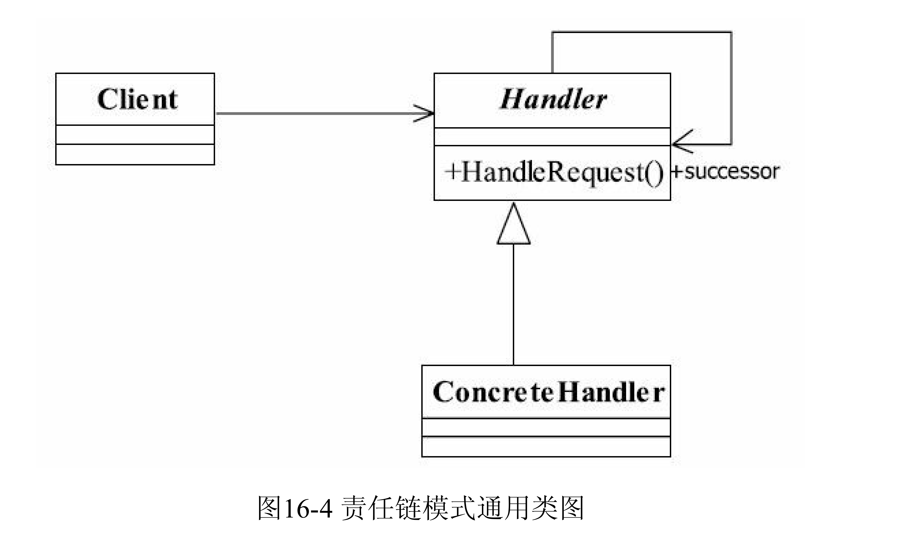

## 第一部分 6大设计原则

### 第1章 单一职责原则

用户信息抽取成BO（Business Object， 业务对象），行为抽取为Biz（Business Logic， 业务逻辑）

单一职责原则的定义是： 应该有且仅有一个原因引起类的变更。

### 第2章 里氏替换原则

通俗点讲， 只要父类能出现的地方子类就可以出现， 而且替换为子类也不会产生任何错误或异常， 使用者可能根本就不需要知道是父类还是子类。 但是， 反过来就不行了， 有子类出现的地方， 父类未必就能适应 。

1.子类必须完全实现父类的方法  

2.子类可以有自己的个性  

3.覆盖或实现父类的方法时输入参数可以被放大  

4.覆写或实现父类的方法时输出结果可以被缩小  

### 第3章 依赖倒置原则

简单的说是指面向接口编程。

### 第4章 接口隔离原则

建立单一接口， 不要建立臃肿庞大的接口。 

再通俗一点讲： 接口尽量细化， 同时接口中的方法尽量少。 看到这里大家有可能要疑惑了， 这与单一职责原则不是相同的吗？ 错， 接口隔离原则与单一职责的审视角度是不相同的， 单一职责要求的是类和接口职责单一， 注重的是职责， 这是业务逻辑上的划分， 而接口隔离原则要求接口的方法尽量少。 例如一个接口的职责可能包含10个方法， 这10个方法都放在一个接口中， 并且提供给多个模块访问， 各个模块按照规定的权限来访问， 在系统外通过文档约束“不使用的方法不要访问”， 按照单一职责原则是允许的， 按照接口隔离原则是不允许的，因为它要求“尽量使用多个专门的接口”。 专门的接口指什么？ 就是指提供给每个模块的都应该是单一接口， 提供给几个模块就应该有几个接口， 而不是建立一个庞大的臃肿的接口， 容纳所有的客户端访问。

● 一个接口只服务于一个子模块或业务逻辑；
● 通过业务逻辑压缩接口中的public方法， 接口时常去回顾， 尽量让接口达到“满身筋骨
肉”， 而不是“肥嘟嘟”的一大堆方法；
● 已经被污染了的接口， 尽量去修改， 若变更的风险较大， 则采用适配器模式进行转化
处理；  

### 第 5 章 迪米特原则

迪米特法则（Law of Demeter， LoD） 也称为最少知识原则（Least KnowledgePrinciple， LKP） ， 虽然名字不同， 但描述的是同一个规则： 一个对象应该对其他对象有最少的了解。 通俗地讲， 一个类应该对自己需要耦合或调用的类知道得最少， 你（被耦合或调用的类） 的内部是如何复杂都和我没关系， 那是你的事情， 我就知道你提供的这么多public方法， 我就调用这么多， 其他的我一概不关心。  

### 第 6 章 开闭原则

软件实体应该对扩展开放， 对修改关闭， 其含义是说一个软件实体应该通过扩展来实现变化， 而不是通过修改已有的代码来实现变化。  

## 第二部分 23种设计模式

### 第 7 章 单例模式

### 第 8 章 工厂模式

定义一个用于创建对象的接口， 让子类决定实例化哪一个类。 工厂方法使一个类的实例化延迟到其子类。  

可以缩小为简单工厂，或者升级为多个工厂  ，替代单例模式，延迟初始化

### 第 9 章 抽象工厂模式

为创建一组相关或相互依赖的对象提供一个接口， 而且无须指定它们的具体类  

### 第 10 章 模板方式模式

Define the skeleton of an algorithm in an operation,deferring some steps to subclasses.Template
Method lets subclasses redefine certain steps of an algorithm without changing the algorithm's
structure.（定义一个操作中的算法的框架， 而将一些步骤延迟到子类中。 使得子类可以不改变一个算法的结构即可重定义该算法的某些特定步骤。 ）  

父类建立框架，子类在重写了父类部分的方法后， 再调用从父类继承的方法， 产生不同的结果（而这正是模板方法模式） 。 这是不是也可以理解为父类调用了子类的方法呢？ 你修改了子类， 影响了父类行为的结果， 曲线救国的方式实现了父类依赖子类的场景， 模板方法模式就是这种效果。

### 第 11 章 建造者模式

将一个复杂对象的构建与它的表示分离， 使得同样的构建过程可以创建不同的表示。  

建造者模式关注的是零件类型和装配工艺（顺序） ， 这是它与工厂方法模式最大不同的地方， 虽然同为创建类模式， 但是注重点不同。

### 第 12 章 代理模式

代理模式（Proxy Pattern） 是一个使用率非常高的模式， 其定义如下：
Provide a surrogate or placeholder for another object to control access to it.（为其他对象提供一种代理以控制对这个对象的访问。 ）  

### 第 13 章 原型模式

Specify the kinds of objects to create using a prototypical instance,and create new objects bycopying this prototype.（用原型实例指定创建对象的种类， 并且通过拷贝这些原型创建新的对象。 ）  

● 性能优良
原型模式是在内存二进制流的拷贝， 要比直接new一个对象性能好很多， 特别是要在一个循环体内产生大量的对象时， 原型模式可以更好地体现其优点。
● 逃避构造函数的约束
这既是它的优点也是缺点， 直接在内存中拷贝， 构造函数是不会执行的（参见13.4节） 。 优点就是减少了约束， 缺点也是减少了约束， 需要大家在实际应用时考虑 。

Object类提供的方法clone只是拷贝本对象， 其对象内部的数组、 引用对象等都不拷贝， 还是指向原生对象的内部元素地址， 其他的原始类型比如int、 long、 char等都会被拷贝 ，这种拷贝就叫做浅拷贝。

### 第 14 章 中介者模式

中介者模式的定义为： Define an object that encapsulates how a set of objectsinteract.Mediator promotes loose coupling by keeping objects from referring to each otherexplicitly,and it lets you vary their interaction independently.（用一个中介对象封装一系列的对象交互， 中介者使各对象不需要显示地相互作用， 从而使其耦合松散， 而且可以独立地改变它们之间的交互。 ）  

从类图中看， 中介者模式由以下几部分组成：
● Mediator 抽象中介者角色
抽象中介者角色定义统一的接口， 用于各同事角色之间的通信。
● Concrete Mediator 具体中介者角色
具体中介者角色通过协调各同事角色实现协作行为， 因此它必须依赖于各个同事角色。
● Colleague 同事角色
每一个同事角色都知道中介者角色， 而且与其他的同事角色通信的时候， 一定要通过中介者角色协作。 每个同事类的行为分为两种： 一种是同事本身的行为， 比如改变对象本身的状态， 处理自己的行为等， 这种行为叫做自发行为（Self-Method） ， 与其他的同事类或中介者没有任何的依赖； 第二种是必须依赖中介者才能完成的行为， 叫做依赖方法（DepMethod） 。  

#### 14.3.1 中介者模式的优点

中介者模式的优点就是减少类间的依赖， 把原有的一对多的依赖变成了一对一的依赖，
同事类只依赖中介者， 减少了依赖， 当然同时也降低了类间的耦合。

#### 14.3.2 中介者模式的缺点

中介者模式的缺点就是中介者会膨胀得很大， 而且逻辑复杂， 原本N个对象直接的相互
依赖关系转换为中介者和同事类的依赖关系， 同事类越多， 中介者的逻辑就越复杂。  

### 第 15 章 命令模式

命令模式是一个高内聚的模式， 其定义为： Encapsulate a request as an object,therebyletting you parameterize clients with different requests,queue or log requests,and support undoableoperations.（将一个请求封装成一个对象， 从而让你使用不同的请求把客户端参数化， 对请求排队或者记录请求日志， 可以提供命令的撤销和恢复功能。 ）
命令模式的通用类图如图15-4所示。  

在该类图中， 我们看到三个角色：
● Receive接收者角色
该角色就是干活的角色， 命令传递到这里是应该被执行的， 具体到我们上面的例子中就
是Group的三个实现类。
● Command命令角色
需要执行的所有命令都在这里声明。
● Invoker调用者角色
接收到命令， 并执行命令。 在例子中， 我（项目经理） 就是这个角色。  

#### 15.3.1 命令模式的优点

● 类间解耦
调用者角色与接收者角色之间没有任何依赖关系， 调用者实现功能时只需调用Command
抽象类的execute方法就可以， 不需要了解到底是哪个接收者执行。
● 可扩展性
Command的子类可以非常容易地扩展， 而调用者Invoker和高层次的模块Client不产生严
重的代码耦合。
● 命令模式结合其他模式会更优秀
命令模式可以结合责任链模式， 实现命令族解析任务； 结合模板方法模式， 则可以减少
Command子类的膨胀问题。

#### 15.3.2 命令模式的缺点

命令模式也是有缺点的， 请看Command的子类： 如果有N个命令， 问题就出来
了， Command的子类就可不是几个， 而是N个， 这个类膨胀得非常大， 这个就需要读者在项
目中慎重考虑使用。  

### 第 16 章 责任链模式

责任链模式定义如下：
Avoid coupling the sender of a request to its receiver by giving more than one object a chance to
handle the request.Chain the receiving objects and pass the request along the chain until an object
handles it.（使多个对象都有机会处理请求， 从而避免了请求的发送者和接受者之间的耦合关系。 将这些对象连成一条链， 并沿着这条链传递该请求， 直到有对象处理它为止。 ）
责任链模式的重点是在“链”上， 由一条链去处理相似的请求在链中决定谁来处理这个请求， 并返回相应的结果， 其通用类图如图16-4所示。  

