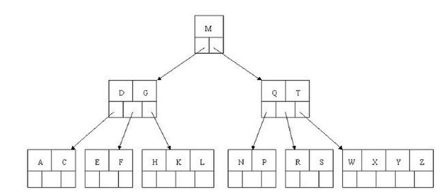

#  java基础

## hashMap

**问题**

hashMap数据结构，负载因子作用，冲突解决办法，扩容原理，hashcode的生成，map中哈希值计算（(h = key.hashCode()) ^ (h >>> 16)）， 散列函数，简单说下红黑树的特性，与二叉树，二叉查找树，二叉平衡树

数据结构：数组+链表+红黑树

**插入**

简述下put的逻辑，它主要分为以下几个步骤:

1. 首先判断是否初始化，如果未初始化则初始化数组,初始容量为16
2. 通过hash&(n-1)获取数组下标，如果该位置为空，表示未碰撞，直接插入数据
3. 发生碰撞且存在相同的key，则在后面处理中直接进行覆盖
4. 碰撞后发现为树结构，则直接挂载到红黑树上
5. 碰撞后发现为链表结构，则进行尾插入，当链表容量大于等于8的时候转换为树节点
6. 发现在链表中进行碰撞了，则在后面处理直接覆盖
7. 发现之前存在相同的key,只直接用新值替换旧值
8. map的容量(存储元素的数量)大于阈值则进行扩容，扩容为之前容量的2倍

**扩容**

resize()方法中，如果发现当前数组未初始化，则会初始化数组。如果已经初始化，则会将数组容量扩容为之前的两倍，同时进行rehash(将旧数组的数据移动到新的数组)。

1. 如果旧数组中不存在数据碰撞(未挂载链表或者红黑树),那么直接将元素赋值到新数组中，其中`index=e.hash & (newCap - 1)`。

2. 如果存在碰撞，且节点类型是树节点，则进行树节点拆分(挂载到扩容后的数组中或者转为链表)

3. 如果存在碰撞，且节点是链表，则处理链表的情况,**rehash过程会保留节点原始顺序(JDK7中不会保留，这也是导致jdk7中多线程出现死循环的原因)**

4. 判断元素在扩容后是否还处于原有的位置，这里通过`(e.hash & oldCap) == 0`判断,oldCap表示扩容前数组的大小。

5. 发现元素不是在原有位置，更新hiTail和hiHead的指向关系

6. 将扩容后未改变index的元素复制到新数组

7. 将扩容后改变了index位置的元素复制到新数组，新数组的下标是 `j + oldCap`。

   

## Java集合类

1. 从集合开始，介绍下常用的集合类，哪些是有序的，哪些是无序的

   首先搞清楚有序、无序及排序性质的差别。
   集合的有序、无序是指插入元素时，保持插入的顺序性，也就是先插入的元素优先放入集合的前面部分。
   而排序是指插入元素后，集合中的元素是否自动排序。（例如升序排序）

   HashMap、 HashSet、 HashTable 等 基于哈希存储方式的集合是无序的。其它的集合都是有序的。

   而TreeMap TreeSet 等集合是排序的，底层结构是红黑树。

2. hashmap是如何寻址的，哈希碰撞后是如何存储数据的，1.8之后变成红黑树，说下红黑树的原理，红黑树有什么好处

3. concurrentHashMap是怎么实现线程安全的，一个里面会有几个段segment，jdk1.8后有优化么，分段锁有什么坏处

   多线程JUC

4. reentrantLock实现原理，简单说下aqs

5. synchronized实现原理，monitor对象什么时候生成的，知道monitor的monitorenter和monitorexist这两个是怎么保证同步的，或者说，这两个操作计算机底层是如何实现的

## java三大特性

**	封装**可以隐藏实现细节，使得代码模块化；**继承**可以扩展已存在的代码模块（类）；它们的目的都是为了——代码重用。而**多态**则是为了实现另一个目的——接口重用！多态的作用，就是为了类在继承和派生的时候，保证使用“家谱”中任一类的实例的某一属性时的正确调用

# 项目问题

1、说说*的架构
		整体业务：****

​		技术架构：******

2、我在***中做什么，遇到什么难点，怎么解决？

3、自我介绍

mysql事务隔离级别:清楚各个级别
mysql索引：了解索引底层数据结构，了解失效场景
mysql引擎：了解主流，不深
mysql优化：没了解过
jvm内存管理：了解，概念模糊
运行时数据区：了解，不深入
回收算法：了解，不深入
gc root知道一些，但没有很清晰
es：简单用过，不熟悉
hashmap：了解底层数据结构
concurrentHashmap：清楚线程安全实现原理
多线程：没用过线程池
线程状态：模糊
AQS：了解，比较浅
aop实现：了解jdk动态代理和cglib动态代理
linux命令：只知道基础命令
docker：不熟悉
消息中间件：没用过消息中间件
表达能力较差，比较拘谨
离职：不太喜欢外包公司，待遇有点差

JVM、集合、并发、设计模式、spring

\1.  2018年毕业，离职之前13.5k；
\2.  能够清晰说出自己负责的项目的技术架构和业务流程；
\3.  做过压测，能够明白压测过程中暴露的性能问题，有相关的优化思路，对于优化之后仍存在的瓶颈有自己的理解；
\4.  自己有技术博客，但上面内容深度比较浅；
\5.  能够简单说出HashMap的扩容过程；
\6. 可以自己实现出阻塞队列；
\7. 能够说出MySQL索引的数据结构，以及B+树的特点，能够说出B树和B+树的区别；
\8. 有SQL优化相关经验，能够说出优化SQL时对索引的理解；
\9. 无法说出Spring Boot Fat Jar启动过程，无法说出Spring容器初始化过程，对Bean的生命周期了解的很少，甚至说Spring Boot启动时把Java代码当场编译；
\10. 能够说出redis常见的数据结构和功能，知道Redis 6.0的多线程特性但理解错误；
\11. 能够说出类加载过程中的双亲委派机制但不了解原因；
12.了解常见的XSS、SQL注入等安全事件，但不了解预编译的概念，不知道Mybatis XML中#和$的区别；
13.有排查过GC相关问题，排查过young GC带来的事故，但无法说出观察GC情况的命令或手段；
\14. 根据其已有的项目经验来看，对应日常开发应该没问题。

## 二叉查找树

二叉平衡树（AVL）有以下规则：

- 规则1：每个节点最多只有两个子节点（二叉）
- 规则2：每个节点的值比它的左子树所有的节点大，比它的右子树所有节点小（有序）

**BST 的操作过程：**

- **查找操作：**任何一个数据的查找过程都需要从根结点出发，沿某一个路径朝叶子结点前进，因此查找中数据比较次数与树的形态密切相关。

当树中每个结点左、右子树高度大致相同时，树高为logN，则平均查找长度与logN成正比，查找的平均时间复杂度在O(logN)数量级上。

当树形结构为一个单子树时，此时树高n，则平均查找长度为(n+1)/2，查找的平均时间复杂度在O(N)数量级上。

- **插入操作：**先通过查找方法找到合适的位置，然后将新结点插入到树的叶子上，完全不需要改变树中原有结点的[组织结构](https://www.zhihu.com/search?q=组织结构&search_source=Entity&hybrid_search_source=Entity&hybrid_search_extra={"sourceType"%3A"answer"%2C"sourceId"%3A2266839299})。

插入一个节点的时间与查找一个插入合适的位置的时间完全相同。

- **删除代价：**当删除一个节点A，首先需要定位到这个节点A，这个过程需要一个查找的时间。然后根据树的形态分析，如果被删除结点的左、右子树只有一个存在，则改变形态的代价仅为O(1)。如果被删除结点的左、右子树均存在，只需要将A节点的左孩子的最末端的右子树或者A节点的右孩子的最末端的左子树结点与A互换，最后删除该节点即可。

删除操作的时间复杂度最大不会超过O(logN)。

**BST效率总结：**

- 查找最好时间复杂度O(logN)，最坏时间复杂度O(N)。
- 插入、删除操作算法简单，时间复杂度与查找差不多。

## 平衡树

平衡树(Balance Tree，BT) 指的是，任意节点的子树的高度差都小于等于1。常见的符合平衡树的有，[B树](https://baike.baidu.com/item/B树/5411672)（多路平衡搜索树）、AVL树（二叉平衡搜索树）等。

## 平衡二叉树

二叉平衡树（AVL）有以下规则：

- 规则1：每个节点最多只有两个子节点（二叉）
- 规则2：每个节点的值比它的左子树所有的节点大，比它的右子树所有节点小（有序）
- 规则3：每个节点左子树的高度与右子树高度之差的绝对值不超过1

**AVL 的操作过程：**

- **查找操作：**AVL是严格平衡的BST（平衡因子不超过1）。查找过程与BST一样，只是AVL不会出现最差情况的BST(单支树)。因此查找效率最好，最坏情况都是O(logN)数量级的。
- **插入操作：**AVL插入与BST思路一样，不同的是AVL必须要保证严格平衡(`height<=1`)，每一次插入数据使得AVL中某些结点的平衡因子超过1就必须进行旋转操作。事实上，AVL的每一次插入结点操作最多只需要旋转1次(单旋转或双旋转)。因此，总体上插入操作的代价仍然在O(logN)级别上(插入结点需要首先查找插入的位置)。
- **删除操作：**AVL删除结点的算法与BST思路一样，但是删除之后必须检查从删除结点开始到根结点路径上的所有结点的平衡因子。因此删除的代价稍微要大一些。每一次删除操作最多需要O(logN)次旋转。因此，删除操作的时间复杂度为O(logN)+O(logN)=O(2logN)。

**AVL 效率总结：**

- 查找的时间复杂度维持在O(logN)，不会出现最差情况。
- AVL树在执行每个插入操作时最多需要1次旋转(单旋转或双旋转)，其时间复杂度在O(logN)左右。
- AVL树在执行删除时代价稍大，执行每个删除操作的时间复杂度需要O(2logN)。

## 红黑树

红黑树的规则：

- 规则1: 每个节点不是黑色就是红色
- 规则2： 根节点为黑色
- 规则3：红色节点的父节点和子节点不能为红色
- 规则4：所有的叶子节点都是黑色（空节点视为叶子节点NIL）
- 规则5：每个节点到叶子节点的每个路径黑色节点的个数都相等

虽然平衡树解决了二叉查找树退化为近似链表的缺点，能够把查找时间控制在 O(logn)，不过却不是最佳的，因为平衡树要求**每个节点的左子树和右子树的高度差至多等于1**，这个要求实在是太严了，导致每次进行插入/删除节点的时候，几乎都会破坏平衡树的第二个规则，进而我们都需要通过**左旋**和**右旋**来进行调整，使之再次成为一颗符合要求的平衡树。

显然，如果在那种插入、删除很频繁的场景中，平衡树需要频繁着进行调整，这会使平衡树的性能大打折扣，为了解决这个问题，于是有了**红黑树**。

**RBT 的操作过程：**

- **查找操作：**由于红黑树的性质(最长路径长度不超过最短路径长度的2倍)，可以说明红黑树虽然不像AVL一样是严格平衡的，但平衡性能还是要比BST要好。其查找代价基本维持在O(logN)左右，但在最差情况下(最长路径是最短路径的2倍少1)，比AVL要略逊色一点。
- **插入操作：**RBT插入结点时，需要旋转操作和变色操作。但由于只需要保证RBT基本平衡就可以了。因此插入结点最多只需要2次旋转，这一点和AVL的插入操作一样。虽然变色操作需要O(logN)，但是变色操作十分简单，代价很小。
- **删除代价：**RBT的删除操作代价要比AVL要好的多，删除一个结点最多只需要3次旋转操作。

**RBT 效率总结：**

- 查找效率最好情况下时间复杂度为O(logN)，但在最坏情况下比AVL要差一些，但也远远好于BST。
- 插入和删除操作改变树的平衡性的概率要远远小于AVL（RBT不是高度平衡的）。因此需要的旋转操作的可能性要小，而且一旦需要旋转，插入一个结点最多只需要旋转2次，删除最多只需要旋转3次(小于AVL的删除操作所需要的旋转次数)。虽然变色操作的时间复杂度在O(logN)，但是实际上，这种操作由于简单所需要的代价很小。

## B树(B-tree)

注意:之前有看到有很多文章把B树和B-tree理解成了两种不同类别的树，其实这两个是同一种树;

- **概念：**

B树和平衡二叉树稍有不同的是B树属于多叉树又名平衡多路查找树（查找路径不只两个），数据库索引技术里大量使用者B树和B+树的数据结构，让我们来看看他有什么特点;

- **规则：**

（1）排序方式：所有节点关键字是按递增次序排列，并遵循左小右大原则；

（2）子节点数：非叶节点的子节点数>1，且<=M ，且M>=2，空树除外（注：M阶代表一个树节点最多有多少个查找路径，M=M路,当M=2则是2叉树,M=3则是3叉）；

（3）关键字数：枝节点的关键字数量大于等于ceil(m/2)-1个且小于等于M-1个（注：ceil()是个朝正无穷方向取整的函数 如ceil(1.1)结果为2);

（4）所有叶子节点均在同一层、叶子节点除了包含了关键字和关键字记录的指针外也有指向其子节点的指针只不过其指针地址都为null对应下图最后一层节点的空格子;

最后我们用一个图和一个实际的例子来理解B树（这里为了理解方便我就直接用实际字母的大小来排列C>B>A）

- **B树的查询流程：**

如上图我要从上图中找到E字母，查找流程如下

（1）获取根节点的关键字进行比较，当前根节点关键字为M，E<M（26个字母顺序），所以往找到指向左边的子节点（二分法规则，左小右大，左边放小于当前节点值的子节点、右边放大于当前节点值的子节点）；

（2）拿到关键字D和G，D<E<G 所以直接找到D和G中间的节点；

（3）拿到E和F，因为E=E 所以直接返回关键字和指针信息（如果树结构里面没有包含所要查找的节点则返回null）；

## **B+树**

- **概念**

B+树是B树的一个升级版，相对于B树来说B+树更充分的利用了节点的空间，让查询速度更加稳定，其速度完全接近于二分法查找。为什么说B+树查找的效率要比B树更高、更稳定；我们先看看两者的区别

- **规则**

（1）B+跟B树不同B+树的**非叶子**节点不保存关键字记录的指针，只进行数据索引，这样使得B+树每个**非叶子**节点所能保存的关键字大大增加；

（2）B+树**叶子**节点保存了父节点的所有关键字记录的指针，所有数据地址必须要到叶子节点才能获取到。所以每次数据查询的次数都一样；

（3）B+树叶子节点的关键字从小到大有序排列，左边结尾数据都会保存右边节点开始数据的指针。

（4）非叶子节点的子节点数=关键字数（来源百度百科）（根据各种资料 这里有两种算法的实现方式，另一种为非叶节点的关键字数=子节点数-1（来源维基百科)，虽然他们数据排列结构不一样，但其原理还是一样的Mysql 的B+树是用第一种方式实现）;

**（百度百科算法结构示意图）**

**（维基百科算法结构示意图）**

- **特点**

1、B+**树的层级更少**：相较于B树B+每个**非叶子**节点存储的关键字数更多，树的层级更少所以查询数据更快；

2、B+**树查询速度更稳定**：B+所有关键字数据地址都存在**叶子**节点上，所以每次查找的次数都相同所以查询速度要比B树更稳定;

3、B+**树天然具备排序功能：**B+树所有的**叶子**节点数据构成了一个有序链表，在查询大小区间的数据时候更方便，数据紧密性很高，缓存的命中率也会比B树高。

4、B+**树全节点遍历更快：**B+树遍历整棵树只需要遍历所有的**叶子**节点即可，，而不需要像B树一样需要对每一层进行遍历，这有利于数据库做全表扫描。

**B树**相对于**B+树**的优点是，如果经常访问的数据离根节点很近，而**B树**的**非叶子**节点本身存有关键字其数据的地址，所以这种数据检索的时候会要比**B+树**快。

Java集合类

1. 从集合开始，介绍下常用的集合类，哪些是有序的，哪些是无序的

2. hashmap是如何寻址的，哈希碰撞后是如何存储数据的，1.8之后变成红黑树，说下红黑树的原理，红黑树有什么好处

3. concurrentHashMap是怎么实现线程安全的，一个里面会有几个段segment，jdk1.8后有优化么，分段锁有什么坏处

   多线程JUC

4. reentrantLock实现原理，简单说下aqs

5. synchronized实现原理，monitor对象什么时候生成的，知道monitor的monitorenter和monitorexist这两个是怎么保证同步的，或者说，这两个操作计算机底层是如何实现的

   

